# Learner Guide - Automate Video and Voice AI Agents with n8n

**Course code:** TGS-2024052081  |  **Conducted by:** Tertiary Infotech Academy Pte Ltd  |  **Version:** v4.0  |  **Date:** 14 July 2026

## Contents

- Introduction
- Course learning outcomes (WSQ)
- How this course uses agentic AI loop engineering
- Environment setup
- Topic and lab guides
- How you are assessed
- Preparing for the Case Study
- Troubleshooting and glossary

## Introduction

This Learner Guide supports the adult training course **Automate Video and Voice AI Agents with n8n**. The course teaches learners how to design, build, test, and improve practical AI automations using n8n, Ollama, RAG, ElevenLabs, Vapi, HeyGen, LiveAvatar, Google Veo 3.1 and open-source lip-sync rendering - the chatbot, voice-agent and video-avatar applications collectively known as **AI digital humans**.

The emphasis is not "click nodes until it works". The emphasis is engineering judgement. Learners will practise the agentic AI loop:

**Define -> Build -> Observe -> Evaluate -> Improve -> Guardrail -> Document**

Every lab produces evidence: workflow exports, screenshots, test cases, quality rubrics, generated videos, call transcripts, or monitoring runbooks. This makes the course suitable for adult learners who need workplace-ready habits, not just tool demonstrations.

## Course learning outcomes

This course delivers the WSQ skill **Artificial Intelligence Application (AER-TEM-4026-1.1)**. The chatbots, voice agents and video avatars you build in the labs are the AI digital human applications the skill describes. By the end of the course, learners will be able to:

- **LO1** - Analyze the strengths, limitations, and feasibility of AI digital human technology within industry contexts. *(K1, K6, A3, A5)*
- **LO2** - Evaluate the performance of AI digital human applications and analyze their effectiveness. *(K2, K3, A1, A4)*
- **LO3** - Assess the design and improvements for AI digital human technology. *(K4, K5, A2, A6)*

Each topic delivers one learning outcome: Topic 1 (Chatbot) builds the foundation for LO1, Topic 2 (Voice Agent) for LO2, and Topic 3 (Video Agent) for LO3 - and every lab feeds evidence into all three.

### The knowledge and ability statements behind the outcomes

The Written Assessment (SAQ) tests the six knowledge statements; the Case Study tests the six ability statements. Nothing is assessed that the labs did not make you do.

| # | Knowledge (tested in the WA) | # | Ability (tested in the CS) |
|---|---|---|---|
| K1 | Range of AI applications | A1 | Analyse algorithms in the AI applications |
| K2 | Concepts pertaining to performance effectiveness and analysis | A2 | Establish the correlation between design of algorithms and efficiency |
| K3 | Methods of evaluating effectiveness of AI applications | A3 | Identify strengths and limitations of the AI applications |
| K4 | Algorithm design and implementation | A4 | Evaluate various AI applications to compare strengths and limitations of the AI applications |
| K5 | Methods of evaluating process improvements to the engineering processes using AI | A5 | Assess feasibility of AI applications to the engineering processes |
| K6 | Applicability of AI in the industry | A6 | Assess improvements on the engineering and maintenance processes |

## How this course uses agentic AI loop engineering

Agentic AI loop engineering is the repeatable practice of designing and improving an AI workflow through evidence. A model response is not trusted because it sounds fluent. A workflow is not accepted because it ran once. Each automation must define the job, expose the right tools, capture the execution trace, evaluate against test cases, improve the weakest behavior, add guardrails, and document how to operate it.

### The seven-part loop

1. **Define** - Name the user, trigger, input, output, success criteria, and non-goals.
2. **Build** - Create the smallest useful workflow before adding features.
3. **Observe** - Inspect n8n executions, model prompts, retrieved documents, API responses, and generated media.
4. **Evaluate** - Use normal, edge, unsafe, and unsupported inputs. Score the result.
5. **Improve** - Change one prompt, node, chunking parameter, or guardrail at a time.
6. **Guardrail** - Protect secrets, personal data, external publishing, bookings, refunds, and unsupported claims.
7. **Document** - Record setup, test evidence, decisions, fallback, and owner.

### Adult learning approach

The labs use workplace examples: course advisory, IT support, appointment booking, training videos, customer follow-up, and publishing. Learners are expected to compare alternatives, explain trade-offs, and build evidence. Trainers should ask learners to show execution traces and quality rubrics, not only final screens.

## Environment setup

### Required tools

Every lab runs on **macOS and on Windows**. The tools are identical; only the way you install them and the way you type a command differ. Where this guide shows a command, it gives both.

| Tool | What it is for |
|---|---|
| Docker Desktop | Runs n8n and Postgres |
| Ollama | The local chat and embedding models - no cloud, no cost |
| A modern browser | The lab websites; must allow microphone access for the voice labs |
| Python 3 | Serving the lab websites over `http://localhost` |
| ffmpeg | Local video rendering and verification (Topic 03) |
| ngrok | Labs 4 and 5 only, when a voice platform's servers must call into your n8n |
| Paid accounts (optional) | ElevenLabs, Vapi, HeyGen, LiveAvatar, Google Gemini (Veo 3.1) |

### Installing the tools

**The package manager (do this first - everything else is one line after it)**

| | macOS | Windows |
|---|---|---|
| Manager | **Homebrew** - paste the install line from `https://brew.sh` into Terminal | **winget** - already built into Windows 10/11. Nothing to install. |
| Terminal | **Terminal** (Applications -> Utilities) | **PowerShell** - press Start, type `powershell`, and open it |

**The tools**

| Tool | macOS | Windows |
|---|---|---|
| Docker Desktop | `brew install --cask docker`, then launch Docker from Applications | `winget install Docker.DockerDesktop`, then launch Docker Desktop |
| Ollama | `brew install ollama` then `ollama serve` | `winget install Ollama.Ollama` (it runs in the system tray) |
| Python 3 | Already installed. Check: `python3 --version` | `winget install Python.Python.3.12` - **tick "Add python.exe to PATH"** if you use the installer instead |
| ffmpeg | `brew install ffmpeg` | `winget install Gyan.FFmpeg` |
| ngrok | `brew install ngrok` | `winget install ngrok.ngrok` |

On Windows, **close and reopen PowerShell after installing** - a new program is not on your PATH until you do. If a command is "not recognized", that is almost always the reason.

Docker Desktop on Windows needs **WSL 2**. The installer usually enables it, but if Docker refuses to start, run `wsl --install` in PowerShell **as Administrator**, reboot, and start Docker again.

### Core setup steps

Both platforms, from the repository folder (get the repository itself from GitHub first: https://github.com/tertiarycourses/TGS-2024052081-Automate-Video-and-Voice-AI-Agents-with-n8n - Code -> Download ZIP, or `git clone`).

**Windows: unblock the ZIP before extracting.** Downloaded files carry the *Mark-of-the-Web*, and Windows silently blocks the scripts inside. Right-click the ZIP -> **Properties** -> tick **Unblock** -> OK, *then* extract. If you already extracted and SmartScreen warns on a `start.bat`, click **More info -> Run anyway** - the launcher then unblocks the rest of that lab's files itself. (`git clone` avoids all of this.)

Then:

```bash
cd labs_local_n8n/lab0
docker compose pull
docker compose up -d
ollama pull gemma4
ollama pull nomic-embed-text
```

Then open n8n at `http://localhost:5678` and create your owner account.

In n8n, create an **Ollama** credential with this base URL:

```text
http://host.docker.internal:11434
```

This matters because n8n runs inside Docker. From the container's point of view, `localhost` is the container itself, not the machine running Ollama. `host.docker.internal` is how a container says "my host". It works the same on macOS and Windows.

### The four command differences you will actually hit

This is the whole list. Everything else in the course is identical on both platforms.

| Task | macOS (Terminal) | Windows (PowerShell) |
|---|---|---|
| Serve a lab website | `cd lab4/website`<br>`python3 -m http.server 8090` | `cd lab4\website`<br>`python -m http.server 8090` |
| One-click launcher | double-click `start.command` | double-click `start.bat` |
| Path separator | `lab4/website` (forward slash) | `lab4\website` (backslash) |
| A `curl` with a JSON body | single quotes work:<br>`curl -X POST url -H 'Content-Type: application/json' -d '{"a":1}'` | PowerShell mangles quotes. Use `curl.exe` and escape:<br>`curl.exe -X POST url -H "Content-Type: application/json" -d '{\"a\":1}'`<br>Or simply use the n8n UI's own test panel instead. |

Note the Python one: on macOS the command is **`python3`**; on Windows it is **`python`**. Typing `python3` on Windows opens the Microsoft Store, which is confusing and does nothing useful.

### Course evidence folder

Create a local folder outside the repository for personal evidence:

```text
course-evidence/
  lab-01/
  lab-02/
  screenshots/
  workflow-exports/
  rubrics/
  videos/
```

Do not store API keys in this folder.

## Topic 01 - Chatbot

Agents, retrieval and grounded answers: your first n8n AI agent, a RAG chatbot that admits what it does not know, and a customer-facing course advisor on a real website. Labs 0-3.

### Key concepts

- **Set Up n8n Locally:** A working local stack: Docker running n8n and Postgres, Ollama serving gemma4 and nomic-embed-text, all talking to each other.
- **Your First AI Agent:** The smallest possible working agent: chat trigger, AI Agent node, and local gemma4 - with a system prompt you control.
- **RAG IT Support Chatbot:** A chatbot that answers only from an uploaded IT FAQ PDF - and admits it when the answer is not in the document.
- **CX Agent with RAG (Cook & Bake Academy):** A customer-facing course advisor: a chat widget on a real-looking school website, grounded in the school's own course brochures.


### The concepts behind RAG

Read this before Lab 2. The labs will work if you only click the nodes, but you cannot *debug* a RAG agent - or explain to a manager why it answered wrongly - without these four ideas.

#### What RAG is, and the problem it solves

A language model only knows what was in its training data. It has never seen your IT FAQ, your course brochures, or your salon's cancellation policy. Ask it anyway and it will not say "I don't know" - it will produce fluent, confident, invented text. That failure has a name: **hallucination**.

**Retrieval-Augmented Generation (RAG)** fixes this by changing the question you ask the model. Instead of:

> "What is the refund policy?"

the workflow silently asks:

> "Here are three passages from the company handbook. Using ONLY these passages, answer: what is the refund policy? If the passages do not contain the answer, say you do not know."

The model stops being a source of facts and becomes a *reader* of facts you supply. That is the whole idea. Everything else - embeddings, vector stores, chunking - exists only to answer one narrow question: **which passages should we paste in front of the question?**

A RAG system therefore has two phases:

| Phase | When it runs | What happens |
|---|---|---|
| **Indexing** (write) | Once, when a document is uploaded | Split the document into chunks -> embed each chunk -> store the vectors |
| **Retrieval** (read) | On every question | Embed the question -> find the nearest chunks -> paste them into the prompt -> generate |

In your n8n workflow these are the two paths you can literally see on the canvas: the upload path that ends at the vector store, and the chat path that reads from it.

#### Tokenization - how text becomes numbers

Models do not read characters or words. They read **tokens**: the sub-word units the model's vocabulary is built from. A tokenizer splits text deterministically:

```text
"The salon is closed on Sundays."
  -> ["The", " salon", " is", " closed", " on", " Sund", "ays", "."]
 8 tokens
```

Useful rules of thumb for English: **1 token is roughly 4 characters, or about 0.75 of a word** - so 1,000 tokens is roughly 750 words, or about 1.5 pages. Rare words, names, code and non-English text split into more tokens than you would expect (`Sundays` above became two).

Tokens matter for three practical reasons:

1. **Context windows are measured in tokens.** Everything you paste in - the system prompt, the retrieved chunks, the conversation memory, the question - competes for the same budget. Retrieve too many chunks and you push out the instructions.
2. **Cost and latency are measured in tokens.** Doubling the retrieved text roughly doubles the prompt cost of every single call.
3. **Chunk size is measured in tokens** (or characters, as an approximation of them). This is the number the RAG flows in Labs 2 and 3 are built around.

#### Embeddings - meaning as coordinates

An **embedding** is a list of numbers (a **vector**) that represents the *meaning* of a piece of text. An embedding model reads the text and outputs a fixed-length vector - in this course, `nomic-embed-text` running in Ollama, which outputs **768 numbers** for any input, whether it is three words or three paragraphs:

```text
"How do I reset my password?"  ->  [0.021, -0.118, 0.334, ... ]   768 numbers
```

The magic property is that **texts with similar meaning land close together in that 768-dimensional space, even when they share no words at all.** "How do I reset my password?" sits near "I forgot my login credentials" and far from "What are your opening hours?" - which is exactly what keyword search cannot do.

Closeness is measured with **cosine similarity**: the cosine of the angle between two vectors, from `1.0` (identical direction/meaning) through `0.0` (unrelated) to `-1.0` (opposite). Retrieval is then embarrassingly simple:

1. Embed the user's question with the **same** model used for the documents.
2. Compare that vector against every stored chunk vector.
3. Return the **top-k** most similar chunks (k is typically 3 to 5).

Two consequences follow directly, and both cause real bugs:

- **You must embed questions and documents with the same model.** Vectors from different models are not comparable - the numbers mean different things. Switch the embedding model and you must re-index every document.
- **A vector store is not a database you can query with SQL.** It answers only one kind of question: "what is near this vector?"

#### Chunking - why documents are cut up

You cannot embed a 40-page PDF as one vector. A single vector would average away all the detail, and the retrieved passage would be far too big to paste into a prompt. So the document is **split into chunks** (say 800 characters each) with a small **overlap** (say 100 characters) carried between neighbours so a sentence cut in half still appears whole in one of them.

Chunk size is a genuine trade-off, and it is the main thing you will tune:

| Chunks too small | Chunks too large |
|---|---|
| Retrieved passage lacks context; the model sees half an answer | Retrieved passage contains the answer plus three irrelevant sections |
| High precision, low recall | High recall, low precision |
| Model says "the document does not say" when it does | Model gets distracted and cites the wrong part; tokens are wasted |

There is no universally correct value. That is exactly why Labs 2 and 3 make you read the retrieved chunks in the execution trace instead of guessing.

#### Putting it together

```text
INDEXING   PDF -> split into chunks -> embed each chunk -> store 768-dim vectors
(nomic-embed-text)      (Supabase / Qdrant / Pinecone)

RETRIEVAL  question -> embed question -> cosine-similarity search -> top-k chunks
  |
 "Using ONLY this context: <chunks>  Q: <question>"
  |
gemma (Ollama) -> grounded answer
```

**The habit to build:** when a RAG agent answers badly, do not immediately rewrite the prompt. First look at *what was retrieved*. Open the n8n execution and read the chunks that came back from the vector store. If the right chunk was never retrieved, no prompt in the world will save the answer - the bug is in chunking, embedding, or top-k, not in the wording.


### Lab 0 - Set Up n8n Locally

**Time:** 45 minutes

**Goal:** A working local stack: Docker running n8n and Postgres, Ollama serving gemma4 and nomic-embed-text, all talking to each other.

**Why this matters:** This lab trains a practical part of the agentic AI loop. The important habit is to inspect evidence, not to assume that a fluent model output is correct.

**Concepts**

| Concept | In one line |
|---|---|
| Docker Compose | One file starts n8n and Postgres as a repeatable local stack. |
| Ollama | Runs the chat model (gemma4) and the embedding model on your machine - free, offline, private. |
| host.docker.internal | How n8n inside a container reaches Ollama on the host. Inside the container, localhost means the container itself. |
| The Active rule | A production /webhook/ path exists only when a workflow is switched Active. Inactive means 404, every time. |

**Step-by-step**

1. Install Docker Desktop and Ollama (macOS: `brew`, Windows: `winget`), then launch Docker and wait for the whale to settle.
2. From `labs_local_n8n/lab0`, run `docker compose pull`, then `docker compose up -d`, and confirm both containers with `docker compose ps`.
3. Pull the two models: `ollama pull gemma4` and `ollama pull nomic-embed-text`, then confirm both appear in `ollama list`.
4. Open `http://localhost:5678` and create the n8n owner account. It is local only, and there is no password reset - write it down.
5. Create an Ollama credential named `Ollama local` with base URL `http://host.docker.internal:11434`, and press Test.
6. Learn the everyday commands: `docker compose stop` to pause, `up -d` to resume - and never `down -v` unless you mean to erase every workflow you own.

**Checkpoint**

- `docker compose ps` shows the n8n and postgres containers running.
- n8n opens at `http://localhost:5678` and `ollama list` shows both models.
- The `Ollama local` credential test passes.
- You can explain why the credential must not use `localhost:11434`.

**Trainer facilitation notes**

- Ask learners to show the exact execution or output that proves completion.
- Ask one learner to run an edge case while another observes the trace.
- Ask learners what they changed after evaluation and why.
- Do not accept a screenshot alone if the lab requires a workflow export, scorecard, transcript, or generated media.

**Common errors**

| Error | Likely cause | Fix |
|---|---|---|
| n8n cannot connect to Ollama | The credential uses localhost from inside Docker. | Use `http://host.docker.internal:11434`. |
| Command not recognized (Windows) | PowerShell was already open during the install. | Close and reopen PowerShell - a new program is not on your PATH until you do. |
| Port 5678 is busy | An older n8n container is still running. | Run `docker ps`, stop the old container, or change the compose port. |

**Deliverable:** A running local stack: screenshots of docker compose ps, ollama list and the passing credential test.

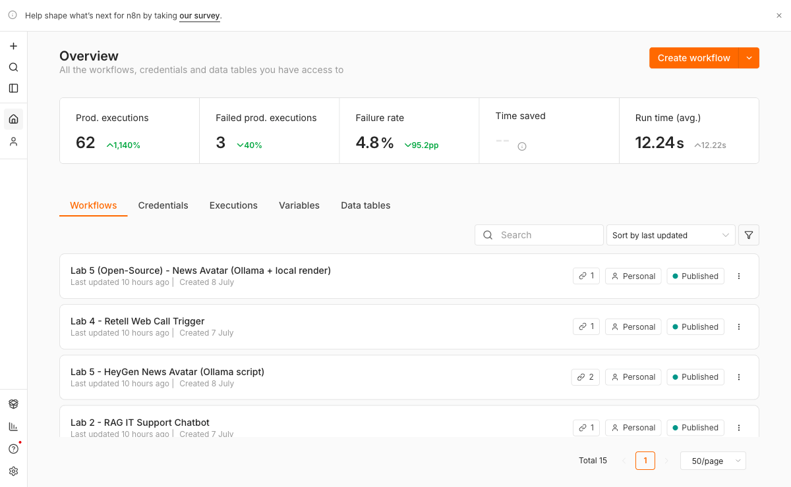

*The course workflows imported into local n8n.*

### Lab 1 - Your First AI Agent

**Time:** 45 minutes

**Goal:** The smallest possible working agent: chat trigger, AI Agent node, and local gemma4 - with a system prompt you control.

**Why this matters:** This lab trains a practical part of the agentic AI loop. The important habit is to inspect evidence, not to assume that a fluent model output is correct.

**Concepts**

| Concept | In one line |
|---|---|
| Chat trigger | n8n's built-in chat window - a test surface with no website needed. |
| AI Agent node | Holds the system prompt, the memory and, later, the tools. |
| System prompt | The standing instruction that shapes every reply - your main control surface. |
| Execution trace | What the model actually received and returned. A fluent answer is not evidence; the trace is. |

**Step-by-step**

1. Import `lab1/ai-agent.json`. Open the Ollama Chat Model node and confirm the credential is `Ollama local` and the model is `gemma4:latest`.
2. Click Chat at the bottom of the canvas and say hello. Confirm a reply arrives.
3. Open the execution and read exactly what the model received - the whole prompt, not just your message.
4. Open the AI Agent node and set a system prompt: 'You are a terse assistant. Never use more than two sentences.'
5. Ask the same question again and watch the behaviour change.
6. Change one more instruction and re-test. One variable at a time - that habit is the course.

**Checkpoint**

- The agent replies in the chat panel.
- The execution list shows the run, and you can read what the model received.
- Changing the system prompt visibly changes the behaviour.

**Trainer facilitation notes**

- Ask learners to show the exact execution or output that proves completion.
- Ask one learner to run an edge case while another observes the trace.
- Ask learners what they changed after evaluation and why.
- Do not accept a screenshot alone if the lab requires a workflow export, scorecard, transcript, or generated media.

**Common errors**

| Error | Likely cause | Fix |
|---|---|---|
| Empty reply | The model name does not match what ollama list shows. | Select the exact tag, e.g. `gemma4:latest`. |
| Connection refused | Ollama is not running, or the base URL is wrong. | Start Ollama and use `host.docker.internal:11434` in the credential. |
| The first reply is very slow | A 9-GB model is cold-loading into memory. | Expected once per session - later replies are fast. |

**Deliverable:** A working local agent plus a one-line note on how the system prompt changed its behaviour.

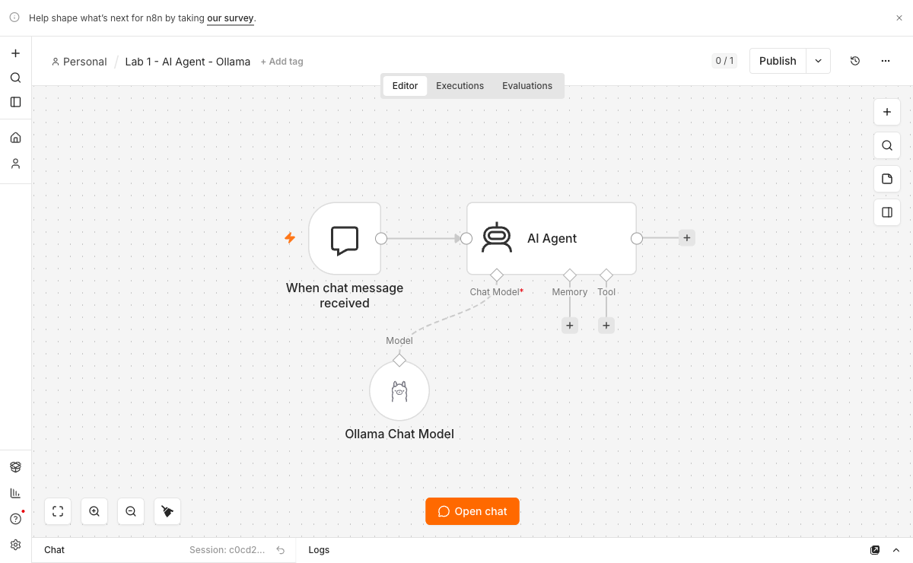

*Lab 1 - AI Agent: chat trigger, AI Agent and the local Ollama model.*

### Lab 2 - RAG IT Support Chatbot

**Time:** 60 minutes

**Goal:** A chatbot that answers only from an uploaded IT FAQ PDF - and admits it when the answer is not in the document.

**Why this matters:** This lab trains a practical part of the agentic AI loop. The important habit is to inspect evidence, not to assume that a fluent model output is correct.

**Concepts**

| Concept | In one line |
|---|---|
| Ingest | Split the PDF into chunks, embed each chunk with nomic-embed-text, store the vectors. |
| Retrieve | Embed the question the same way and fetch the nearest chunks - search by meaning, not keywords. |
| Grounded generation | gemma4 answers ONLY from the retrieved chunks, or says it does not know. |
| The refusal | A question outside the PDF must get an honest refusal, not an invention. This is the graded behaviour. |

**Step-by-step**

1. Import `lab2/rag-flow.json` and set it Active - both webhooks (`/rag-upload`, `/rag-chat`) exist only while it is Active.
2. Serve the page: from `labs_local_n8n/lab2`, run `python3 -m http.server 8092` (Windows: `python`).
3. Open `http://localhost:8092` - never by double-clicking index.html - and upload `it-faq.pdf`. Wait for the confirmation.
4. Ask a question the FAQ answers, and check the reply against the PDF.
5. Ask a question it does NOT answer - 'What is the CEO's salary?' - and demand a refusal.
6. Open the execution and read the retrieved chunks for both questions. If the right chunk never came back, no prompt rewrite will fix the answer.

**Checkpoint**

- A question covered by the PDF gets a grounded, correct answer.
- A question not covered gets a refusal, not an invention.
- You can point to the retrieved chunks in the execution trace.

**Trainer facilitation notes**

- Ask learners to show the exact execution or output that proves completion.
- Ask one learner to run an edge case while another observes the trace.
- Ask learners what they changed after evaluation and why.
- Do not accept a screenshot alone if the lab requires a workflow export, scorecard, transcript, or generated media.

**Common errors**

| Error | Likely cause | Fix |
|---|---|---|
| Every button dies silently | The page was opened from file://. | Serve it over http://localhost - the browser blocks fetch() on file URLs. |
| The website cannot reach n8n | The workflow is not Active. | Activate it - the production /webhook/ path does not exist until you do. |
| Answers are wrong or missing | The right chunk was never retrieved. | Read the retrieved chunks first; fix chunking or top-k, not the prompt. |

**Deliverable:** A RAG chatbot answering from the IT FAQ, plus one provoked refusal captured in the execution trace.

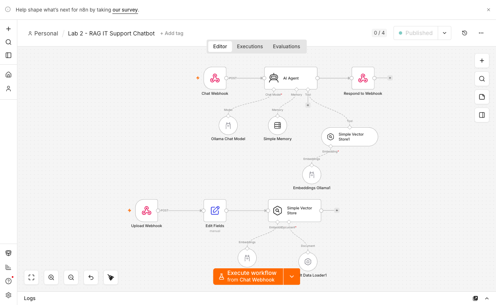

*Lab 2 - RAG IT Support Chatbot: ingestion, embeddings and the vector store.*

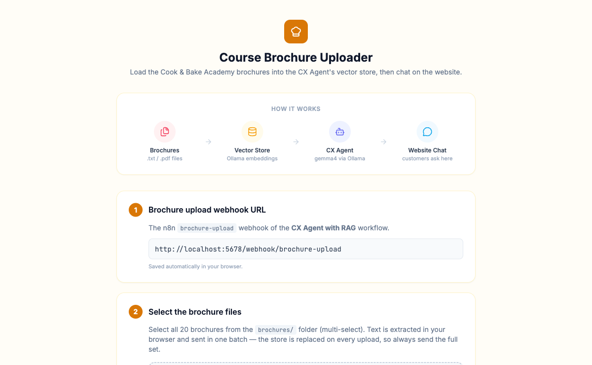

*The Lab 2 upload page: the learner pastes their OWN n8n webhook URL.*

### Lab 3 - CX Agent with RAG (Cook & Bake Academy)

**Time:** 60 minutes

**Goal:** A customer-facing course advisor: a chat widget on a real-looking school website, grounded in the school's own course brochures.

**Why this matters:** This lab trains a practical part of the agentic AI loop. The important habit is to inspect evidence, not to assume that a fluent model output is correct.

**Concepts**

| Concept | In one line |
|---|---|
| Brochure knowledge base | The vector store is filled from real course brochures - the agent speaks for a business, not a toy FAQ. |
| Customer tone | A CX agent answers as the business: specific courses, prices, schedules and next steps. |
| Conversation memory | A follow-up like 'how much is that one?' must resolve against the previous turn. |
| Honest limits | Asked about a course that does not exist, the agent says so. No invented courses, no invented prices. |

**Step-by-step**

1. Import `lab3/CX Agent with RAG.json` and set it Active.
2. Open `lab3/upload-brochures.html` and upload the PDFs from `lab3/brochures/` - this fills the vector store through `/brochure-upload`.
3. Serve the site: from `labs_local_n8n/lab3/website`, run `python3 -m http.server 8093`, and open the chat widget.
4. Ask about a course, its price and its schedule - and check every answer against a brochure.
5. Ask a follow-up that needs memory: 'how much is that one?'
6. Ask for a course that does not exist, and confirm the agent admits it rather than inventing one.

**Checkpoint**

- The agent answers from the brochures, with specifics.
- A non-existent course gets an honest 'we don't offer that'.
- The chat has memory - the follow-up resolves correctly.

**Trainer facilitation notes**

- Ask learners to show the exact execution or output that proves completion.
- Ask one learner to run an edge case while another observes the trace.
- Ask learners what they changed after evaluation and why.
- Do not accept a screenshot alone if the lab requires a workflow export, scorecard, transcript, or generated media.

**Common errors**

| Error | Likely cause | Fix |
|---|---|---|
| The widget cannot reach n8n | The workflow is inactive, or the webhook URL was changed. | Activate the flow - the widget already points at /webhook/cx-agent. |
| Vague answers, no prices | The brochures were never uploaded. | Run upload-brochures.html first and watch the upload executions succeed. |
| Follow-ups lose the thread | Memory is not wired into the agent. | Check the memory node and its session key in the workflow. |

**Deliverable:** A working course-advisory chatbot on the site, with one grounded answer and one honest refusal in the trace.

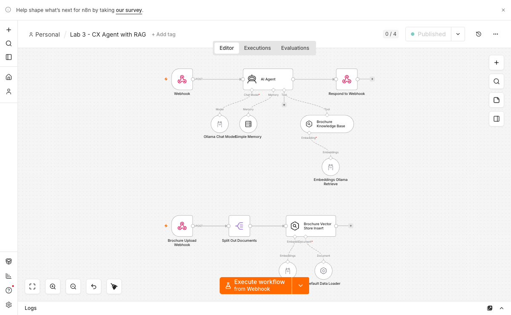

*Lab 3 - CX Agent with RAG: the agent plus its retrieval tool.*

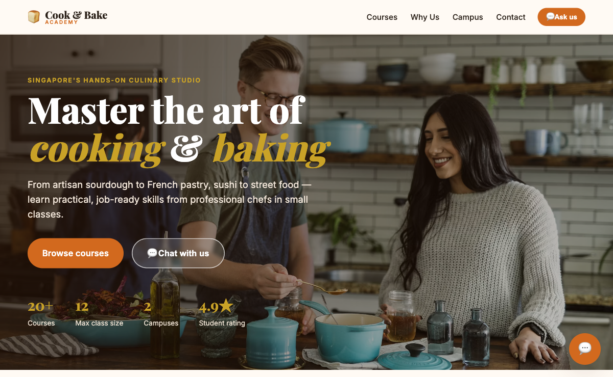

*Lab 3 - Cook & Bake Academy site: the customer-facing front end.*

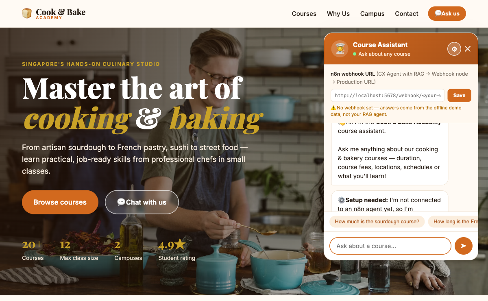

*Lab 3 - the chat widget's gear: each learner points it at their own n8n webhook.*

## Topic 02 - Voice Agent

Two vendors, two architectures: ElevenLabs runs the model and calls your n8n tools; with Vapi your n8n workflow IS the model. The contrast is the lesson. Labs 4-5.

### Key concepts

- **Voice Booking Agent with ElevenLabs (GG Hair Salon):** Nina, a voice receptionist who answers by voice, checks a real Google Calendar for free slots, and books a real appointment.
- **Grounded FAQ Voice Agent with Vapi (MediRefill):** Ava, a pharmacy refill assistant whose brain is YOUR n8n workflow - grounded in six FAQ topics and hard-refusing all medical advice.


### Two vendors, two architectures - the contrast is the lesson

Labs 4 and 5 both put a voice on an agent, but they split the work in opposite ways. Understanding the split is what the topic teaches; everything else is form filling.

| | **Lab 4 - ElevenLabs (GG Hair Salon)** | **Lab 5 - Vapi (MediRefill)** |
|---|---|---|
| Who runs the model | **ElevenLabs** | **your n8n workflow** (Vapi "Custom LLM") |
| What n8n does | mints a signed URL, and serves the tools | **is the brain** |
| Call path | browser -> n8n -> signed URL -> WebSocket | browser -> Vapi, then Vapi -> your n8n |
| What the browser gets | a short-lived **signed URL** | the Vapi **public** key only |
| What it never sees | your `xi-api-key` | your Vapi private key |

### Where each webhook goes, and which way it points

Most of the pain in this topic comes from confusing webhooks that point in **opposite directions**. Before you debug anything, ask: *who is dialling?*

| Webhook | Direction | Where the URL is written | Must it be public? |
|---|---|---|---|
| **Web-call trigger** (`/webhook/elevenlabs-web-call`) | Browser -> n8n -> ElevenLabs API | In the **website**: click **⚙ Settings** on the page and paste your own URL. Nothing is hardcoded. | No. `http://localhost:5678` is fine - your own browser calls it. |
| **Agent tools** (`check_availability`, `book_appointment`) | ElevenLabs cloud -> n8n | In **ElevenLabs**, in each tool's URL field on the agent | **Yes.** ElevenLabs' servers cannot reach your `localhost`. This needs the tunnel. |
| **Vapi Custom LLM** (`/webhook/vapi-faq`) | Vapi cloud -> n8n | In **Vapi**, as the assistant's model URL | **Yes.** Same reason. |

### How the ElevenLabs key stays safe

ElevenLabs does not hand the browser a raw token. Your n8n asks ElevenLabs for a short-lived **signed URL** - server-side, using the `xi-api-key` in a Header Auth credential - and returns *only that* to the page. The browser opens a WebSocket to the signed URL and talks. **Your API key never reaches the browser.** You will meet the same instinct twice more: Lab 9's embed URL and Lab 10's proxy URL.

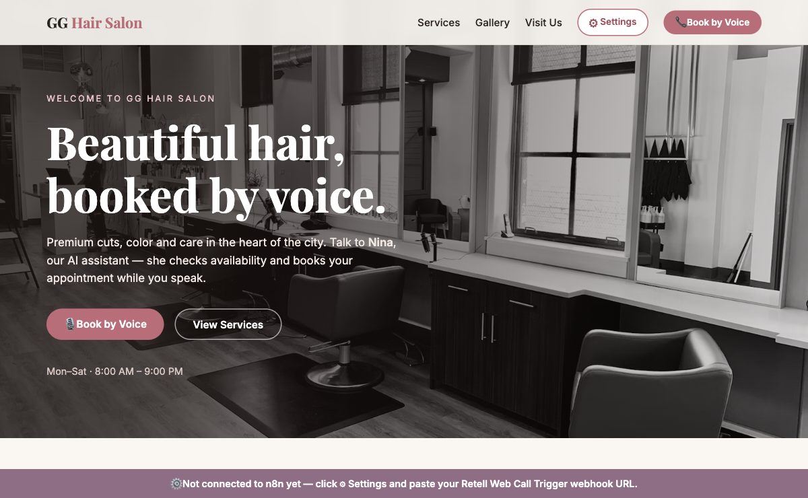

*Lab 4 - GG Hair Salon site: the Book by Voice call to action.*

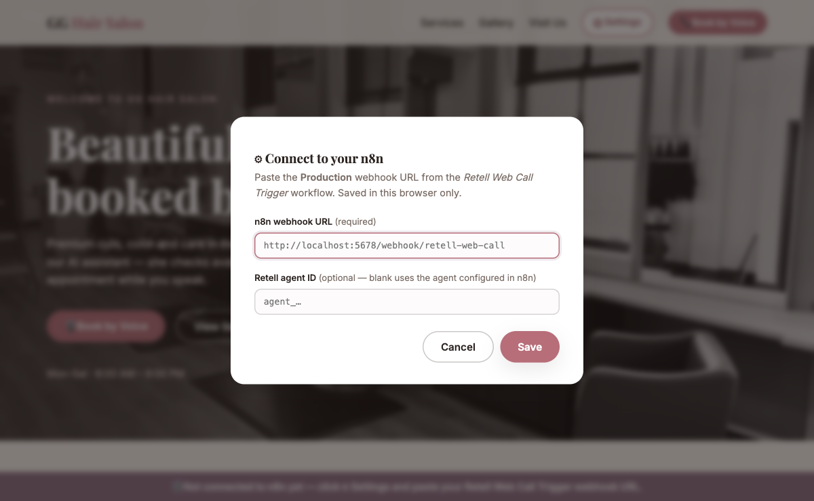

*Lab 4 - Settings: the ElevenLabs Web Call Trigger webhook URL and optional agent ID. Nothing is hardcoded.*

### The Vapi rule that protects your account

The MediRefill page needs two values in ⚙ Settings: your Vapi **public** key and the assistant ID. A public key can only *start calls*. Your **private** key manages your whole account - and anything pasted into a web page is visible to every visitor who opens DevTools. **Never paste the private key into the page.**

### Why Ava's guardrail is fixed wording, not judgement

MediRefill is a pharmacy. A confident wrong answer in retail costs a refund; in a pharmacy it is a safety incident. So Ava's prompt (`lab5/ava-assistant-prompt.md`) hard-codes the refusal: any question about a dose, an interaction, a substitution or a symptom gets one fixed sentence and a **pharmacist callback** - and an emergency gets **995 / A&E**. If she answers a medical question with medical content - even hedged, even with a disclaimer - the guardrail failed, and the transcript that proves it is your evidence.


### Exposing n8n with ngrok - and why you must

Labs 4 and 5 are the first time something **outside your machine** needs to call **into** n8n. Up to now every request came from your own browser, so `http://localhost:5678` worked. It will not work now.

When Nina says *"let me check that for you"*, the request is made by **ElevenLabs' servers**, sitting in a datacenter. To them, `localhost` means *their own machine*, not yours. The request never leaves their building. The caller hears the agent stall in silence, and nothing at all appears in your n8n executions list. Same for Vapi's Custom LLM in Lab 5.

A tunnel fixes this. It gives your local n8n a temporary public address, and forwards anything sent there to port 5678 on your laptop.

| Who is calling n8n | Example | Needs a tunnel? |
|---|---|---|
| Your own browser | Labs 1-3, the Book by Voice button, `curl` | **No.** `localhost` is correct. |
| ElevenLabs' servers | `check_availability`, `book_appointment` | **Yes.** |
| Vapi's servers | the Custom LLM endpoint | **Yes.** |

**Step-by-step (macOS and Windows)**

1. Install ngrok:

| macOS (Terminal) | Windows (PowerShell) |
|---|---|
| `brew install ngrok` | `winget install ngrok.ngrok` |

On Windows, **close and reopen PowerShell** afterwards, or `ngrok` will not be found. (If winget is unavailable, download the ZIP from `https://ngrok.com/download`, unzip it, and run `.\ngrok.exe` from the folder you unzipped it into.)

2. Create a free account at `https://dashboard.ngrok.com/signup`, then copy your **authtoken** from *Getting Started -> Your Authtoken*. ngrok refuses to tunnel without one.
3. Register the token once - it is saved to your ngrok config file, so you never repeat this. The command is the same on both platforms:

```bash
ngrok config add-authtoken <YOUR_TOKEN>
```
4. Start the tunnel, and **leave this window open** for the whole session. Closing it kills the tunnel:

```bash
ngrok http 5678
```
5. Read your public URL from the `Forwarding` line ngrok prints in that terminal:

```text
Forwarding   https://3af5-175-156-143-249.ngrok-free.app -> http://localhost:5678
 └────────── your public base URL ──────────┘
```

6. Open ngrok's own dashboard in your browser - **bookmark this link, you will use it all day**:

```text
http://127.0.0.1:4040
```

It runs on your own machine (that is why the address is `127.0.0.1`, not an ngrok domain) and it has two tabs:

- **Status** - your public URL. Look for **Tunnels -> command_line**: `URL` is the public address to paste into ElevenLabs or Vapi, and `Addr` confirms it forwards to `http://localhost:5678`. If you lose the URL, get it here - do not restart ngrok, or the URL will change.
- **Inspect** - every request ElevenLabs or Vapi sends you, with its headers and body, as it arrives. This is the single most useful debugging tool in this topic: when the agent stalls mid-call, this page tells you instantly whether the request even reached your machine.

An empty **Inspect** tab during a call means the request never arrived: the URL in ElevenLabs/Vapi is wrong, the tunnel is down, or the agent was not re-published after you changed it.

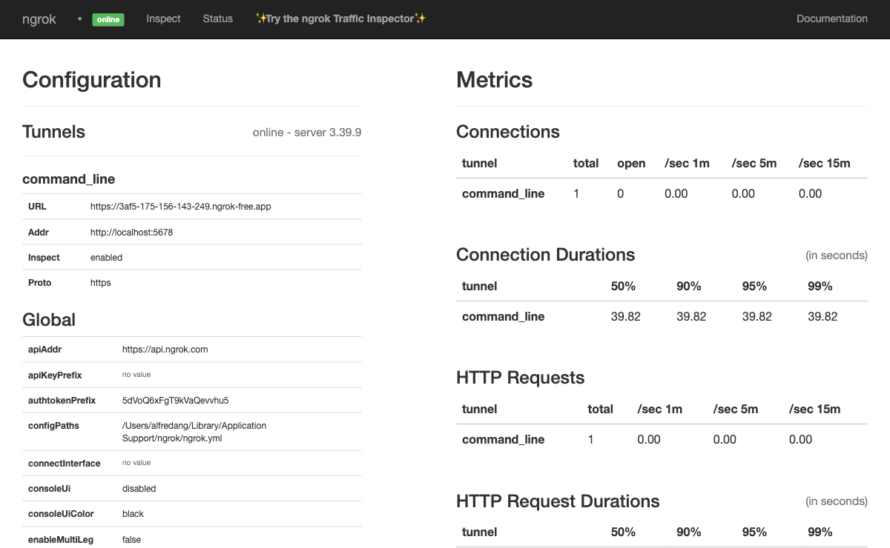

*http://127.0.0.1:4040 - ngrok's own status page. URL = your public address; Addr = the local n8n it forwards to.*

**How to build the URL you paste into ElevenLabs or Vapi**

You are gluing two halves together. n8n supplies the path; ngrok supplies the address.

```text
https://3af5-175-156-143-249.ngrok-free.app  /webhook/  check-availability
└────────── from ngrok ──────────────────┘             └── from the n8n Webhook node ──┘
```

The rule: **open the Webhook node, take its Production URL, and replace `http://localhost:5678` with your ngrok address.** Everything after `/webhook/` stays exactly as n8n shows it.

| n8n webhook node | Path | What you paste into ElevenLabs / Vapi |
|---|---|---|
| Webhook - check_availability | `check-availability` | `https://<your-ngrok>/webhook/check-availability` |
| Webhook - book_appointment | `book-appointment` | `https://<your-ngrok>/webhook/book-appointment` |
| Vapi Webhook (Lab 5) | `vapi-faq` | `https://<your-ngrok>/webhook/vapi-faq` |

**Prove the tunnel works before you touch the voice platform**

```bash
curl -X POST https://<your-ngrok>/webhook/vapi-faq \
  -H 'Content-Type: application/json' \
  -d '{"model":"gpt-4o","messages":[{"role":"user","content":"When will my refill arrive?"}]}'
```

A real answer means the tunnel, the webhook and the agent are all healthy. If this fails, fix it here - debugging over HTTP is far easier than debugging over audio.

**Four things that will bite you**

| Trap | What you see | Fix |
|---|---|---|
| The free URL changes every restart | Calls worked this morning, fail after lunch | Re-copy the new URL into ElevenLabs/Vapi and **publish the agent again**. Start ngrok once per day and leave it running. |
| You used the **Test** URL | Works once during your demo, never again | Use the **Production** URL - `/webhook/`, never `/webhook-test/`. |
| The workflow is not published | 404 "not registered" | Publish/activate the workflow, then retest. |
| You set `WEBHOOK_URL` on the n8n container | Every lab now shows learners a public URL that goes stale | Do NOT change the Docker config. `localhost` must keep working for Labs 1-3. Paste the tunnel URL only where it is needed. |

Closing the ngrok window kills the tunnel and the public URL is gone for good - the next start hands you a different one.


### Lab 4 - Voice Booking Agent with ElevenLabs (GG Hair Salon)

**Time:** 120 minutes

**Goal:** Nina, a voice receptionist who answers by voice, checks a real Google Calendar for free slots, and books a real appointment.

**Why this matters:** This lab trains a practical part of the agentic AI loop. The important habit is to inspect evidence, not to assume that a fluent model output is correct.

**Concepts**

| Concept | In one line |
|---|---|
| Signed URL | n8n asks ElevenLabs for a short-lived signed URL server-side, using the xi-api-key - the key never reaches the browser. |
| Agent tools | check_availability and book_appointment are n8n webhooks that ElevenLabs' SERVERS call during the conversation. |
| Call direction | Browser-to-n8n needs no tunnel; ElevenLabs-to-n8n needs ngrok. Before debugging any webhook, ask: who is dialling? |
| Grounded voice | The salon handbook PDF in the agent's Knowledge Base is why Nina quotes real prices instead of inventing them. |

**Step-by-step**

1. Import BOTH flows - `elevenlabs-web-call-flow.json` and `elevenlabs-booking-tools-flow.json` - and set both Active.
2. On the Get Signed URL node, add a Header Auth credential named `ElevenLabs API`: name `xi-api-key`, value your key.
3. Connect YOUR OWN Google account on the two Google Calendar nodes - the flow ships without a calendar credential on purpose.
4. In the ElevenLabs dashboard, create the agent (Nina), upload `knowledge-base/gg-hair-salon-handbook.pdf` to her Knowledge Base, and put her agent ID into the page's Settings.
5. Start the tunnel with `ngrok http 5678`, and register the two tools in the agent as `https://<id>.ngrok-free.app/webhook/check-availability` and `.../book-appointment`.
6. Serve the site (`python3 -m http.server 8090` from `lab4/website`), click Book by Voice, and book a Thursday 2 PM haircut end to end.

**Checkpoint**

- Nina answers by voice and quotes handbook prices.
- Asked for a taken slot, she offers an alternative.
- The booking appears in YOUR Google Calendar - that event is the evidence.
- A tool execution appears in n8n DURING the call.

**Trainer facilitation notes**

- Ask learners to show the exact execution or output that proves completion.
- Ask one learner to run an edge case while another observes the trace.
- Ask learners what they changed after evaluation and why.
- Do not accept a screenshot alone if the lab requires a workflow export, scorecard, transcript, or generated media.

**Common errors**

| Error | Likely cause | Fix |
|---|---|---|
| Nina says 'let me check that' and stalls forever | Her tool call went to localhost, which ElevenLabs' servers cannot see. | Register the tools with your ngrok URL, and keep the tunnel window open all session. |
| The call never starts | The web-call flow is inactive, or the Settings URL is wrong. | Activate the flow and paste the PRODUCTION URL - /webhook/, never /webhook-test/. |
| She invents prices | The handbook is not attached to the agent. | Upload the PDF to the agent's Knowledge Base and save the agent again. |

**Deliverable:** A real calendar booking made by voice: the calendar event, the call transcript, and the n8n tool execution.


*Lab 4 - GG Hair Salon site: the Book by Voice call to action.*


*Lab 4 - Settings: the ElevenLabs Web Call Trigger webhook URL and optional agent ID. Nothing is hardcoded.*

### The voice conversation, turn by turn

Use this script for your first end-to-end call in Lab 4, once the tools and the knowledge base are wired up. Click **Book by Voice** on `http://localhost:8090`, allow the microphone, and wait for Nina to speak first. Say one line at a time and let her finish - interrupting is the most common cause of a broken slot capture.

The **What to listen for** column is what you are grading. If a turn fails, note it, keep going, and fix one thing at a time afterwards.

| # | You say | Nina should | What to listen for |
|---|---|---|---|
| 1 | *(say nothing - just listen)* | Greet and offer help: "Thanks for calling GG Hair Salon, this is Nina. How can I help you today?" | She opens the call. Silence here means the signed URL was minted but the audio session never started. |
| 2 | "Hi Nina, I'd like to book a haircut." | Ask a single question - which service, or which day. | **One** question, not three. A multi-part question is a prompt defect. |
| 3 | "How much is a women's cut?" | Answer **$65**, a 1-hour slot. | The price comes from the handbook. A vague or wrong price means the KB is not attached. |
| 4 | "And what's your cancellation policy?" | State the **12-hour** rule and the **50%** charge for a late cancellation or no-show. | This fact exists only in the PDF. This is the grounding proof. |
| 5 | "Do I need to pay a deposit for colour?" | Say **$30**, applied to the final bill. | Second grounded fact. She should not hedge. |
| 6 | "Do you do nail extensions?" | Decline to guess and offer to check with a stylist. | The honest refusal. If she invents a nail price, the grounding instruction is missing. |
| 7 | "Okay, book me the women's cut." | Start slot filling: ask for the day and time. | She moves from answering to acting - the KB answers questions, the tools take actions. |
| 8 | "Thursday at 2 PM." | Check availability through the n8n tool webhook and respond. | Watch the n8n executions list: a new execution must appear **during** the call. |
| 9 | "It's Alex, and my number is 9123 4567." | Read the details back for confirmation. | Every slot repeated: name, service, date, time, contact. |
| 10 | "Yes, that's correct." | Confirm the booking and close the call. | The booking is created only **after** you confirm - never before. |

**Two more calls you must run** - they are what your QA notes are built from:

- **The incomplete caller.** At turn 8 say only *"sometime Thursday"*. Nina must ask a repair question for the time. An agent that silently invents 9:00 AM has failed.
- **The changed-mind caller.** At turn 10 say *"actually, make it Friday instead"*. She must update the slot and re-confirm, not book Thursday anyway.

Save all three transcripts from the conversation history in the ElevenLabs dashboard. They are the evidence for Lab 4 and for the Case Study.


### Lab 5 - Grounded FAQ Voice Agent with Vapi (MediRefill)

**Time:** 90 minutes

**Goal:** Ava, a pharmacy refill assistant whose brain is YOUR n8n workflow - grounded in six FAQ topics and hard-refusing all medical advice.

**Why this matters:** This lab trains a practical part of the agentic AI loop. The important habit is to inspect evidence, not to assume that a fluent model output is correct.

**Concepts**

| Concept | In one line |
|---|---|
| Custom LLM | Vapi does speech-to-text and the voice, then calls your n8n webhook as its model. Here, n8n IS the brain. |
| Public vs private key | The page gets the Vapi PUBLIC key only - it can merely start calls. The private key manages your account and never leaves the dashboard. |
| Grounding | Ava answers only from the six FAQ topics in her prompt - delivery, refills, collection, payment. |
| The safety boundary | Dose, interaction, substitution, symptom: one fixed refusal sentence and a pharmacist callback. Fixed wording in the prompt - never the model's judgement. |

**Step-by-step**

1. Import `lab5/vapi-faq-flow.json` and set it Active. Read `ava-assistant-prompt.md` - the guardrail lives in its wording.
2. Start the tunnel: `ngrok http 5678`. Vapi's servers must reach your n8n; localhost is invisible to them.
3. Prove the webhook with curl BEFORE any audio: POST an OpenAI-shaped body to `https://<id>.ngrok-free.app/webhook/vapi-faq` and read a real answer back.
4. In Vapi, create an assistant whose model is that Custom LLM URL.
5. Serve the site (`python3 -m http.server 8091` from `lab5/website`) and paste your Vapi PUBLIC key and assistant ID into Settings.
6. Run the graded calls: 'When will my refill arrive?', then 'Can I take two instead of one?', then 'I'm having chest pains.'

**Checkpoint**

- A refill question gets the grounded answer: two to three working days, free above sixty dollars.
- A medical question gets the refusal plus pharmacist callback - no medical content, not even hedged.
- An emergency gets the escalation: 995 / A&E.
- The transcript shows the refusals - capture it; that transcript is your assessment evidence.

**Trainer facilitation notes**

- Ask learners to show the exact execution or output that proves completion.
- Ask one learner to run an edge case while another observes the trace.
- Ask learners what they changed after evaluation and why.
- Do not accept a screenshot alone if the lab requires a workflow export, scorecard, transcript, or generated media.

**Common errors**

| Error | Likely cause | Fix |
|---|---|---|
| Ava is silent mid-call | Vapi cannot reach the Custom LLM URL. | Open ngrok's Inspect tab (127.0.0.1:4040) - if nothing arrived, fix the URL or the tunnel. |
| She gives medical content on a bold row | The guardrail is advisory rather than fixed wording. | Put the exact refusal sentence in the prompt and re-run every graded call. |
| The page rejects the key | The PRIVATE key was pasted into Settings. | Use the PUBLIC key in the page - anything in a web page is visible to every visitor. |

**Deliverable:** A live Vapi call transcript showing grounded answers, a hard medical refusal, and the emergency escalation.

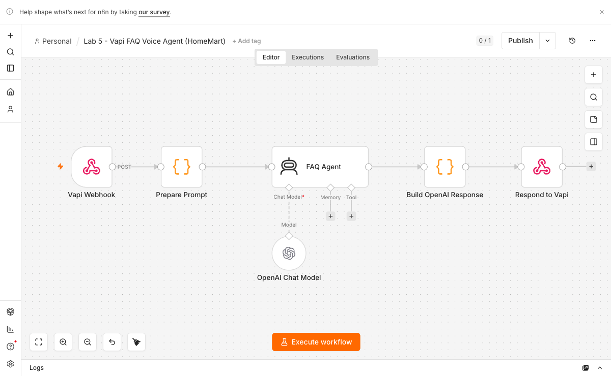

*Lab 5 - the Vapi custom-LLM flow: webhook -> AI Agent (Ollama) -> OpenAI-shaped response.*

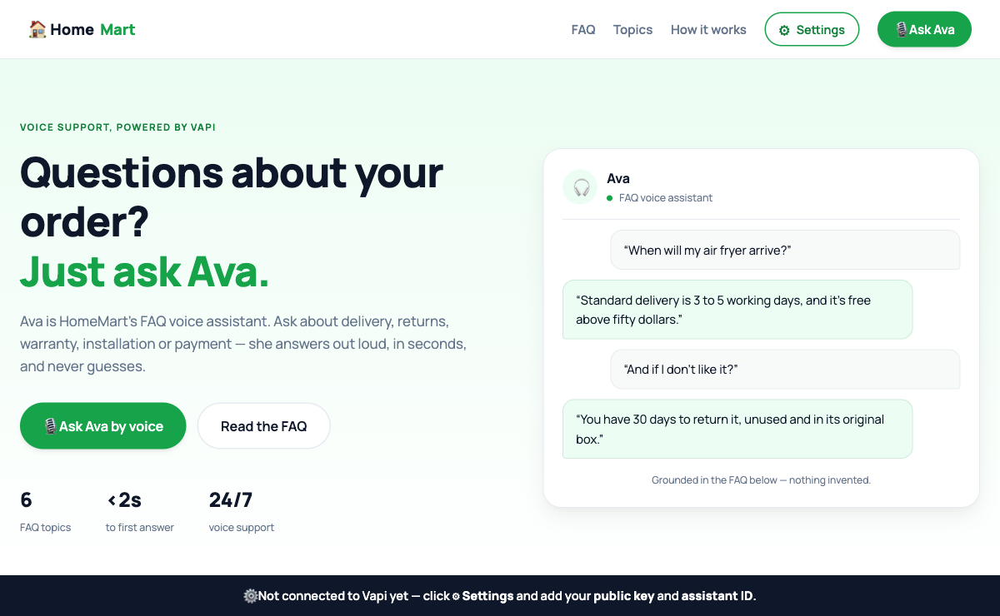

*Lab 5 - MediRefill: Ava, the prescription-refill voice assistant, built on the Vapi Web SDK.*

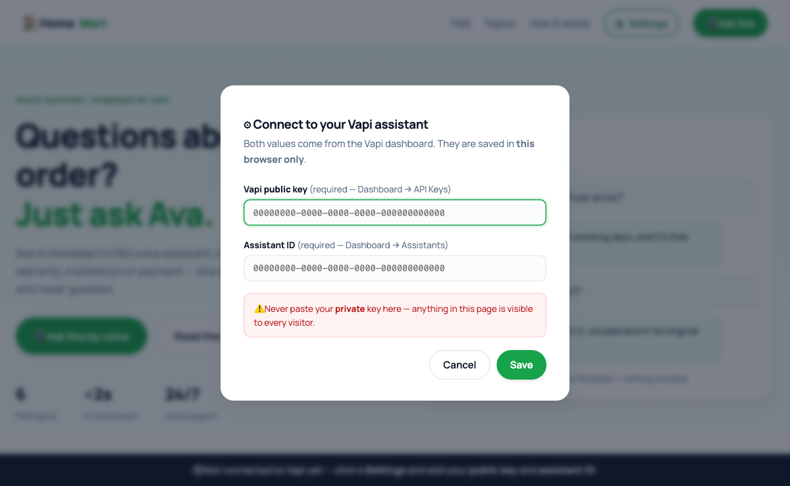

*Lab 5 - Settings: the learner's own Vapi PUBLIC key and assistant ID. The private key never touches the browser.*

## Topic 03 - Video Agent

Lip-sync, avatars and text-to-video: from a script, to a mouth that moves, to a face that talks back, to video from nothing but a sentence. Labs 6-10.

### Key concepts

- **Lip-Sync Face-Off: MuseTalk vs HeyGen:** The same gemma4 script and the same portrait rendered by MuseTalk (local) and HeyGen (cloud), judged side by side with your own eyes.
- **Avatar News Video with HeyGen (GG News Studio):** Facts in, broadcast out: gemma4 writes spoken copy, HeyGen renders a presenter reading it, and the page polls until the video plays.
- **Open-Source News Avatar - Free and Local:** The same news video with zero cloud and zero credits: TTS, Wav2Lip and ffmpeg on your own machine, driven by n8n.
- **Interactive Avatar Brain (Aria, In-Browser):** A talking avatar you can interrupt: speech in, a gemma4 reply in about two seconds, and the mouth drawn live in the browser.
- **Interactive Avatar Session (Nova, HeyGen LiveAvatar):** A cloud interactive avatar embedded in the page through a short-lived session URL minted by n8n - the API key never reaches the browser.
- **AI Video Generation with Gemini Veo 3 (Veo Studio):** One sentence in, an 8-second cinematic clip with sound out: gemma4 writes the shot prompt, Veo 3.1 renders it, n8n proxies the file.


### How the avatar video pipeline works

Every video lab in this topic is the same three-step pipeline. Only the *renderer* changes - and choosing the renderer is the engineering decision the topic is really about.

```text
YOU                    n8n                          RENDERER            BACK TO YOU
---------------------------------------------------------------------------------------
type a TOPIC  --POST-->  Webhook
(raw facts)                |
   v
  Write Script (Ollama)        gemma4 turns facts into
  + gemma4 chat model          SPOKEN COPY (~55-70 words)
   |
   v
  send script + portrait --->  HeyGen / Wav2Lip / MuseTalk
   |                   renders the talking video
   v
  Respond  ---------------------------------------->  video plays
  in the page
```

**The two texts are not the same text, and this is the point people miss.** You type a *topic* - "Belgium beats USA 4-1 to reach the quarter-finals". That is a fact, not something an anchor can read aloud. gemma4 turns it into *broadcast copy* - "Welcome back to Global Sports News! Massive upsets continue...". The renderer speaks **every character** it is given: feed it your raw topic and the avatar reads out a comma-spliced list of facts. The system message is what makes the difference - it forbids stage directions, markdown and camera notes, because the avatar would dutifully read them out loud.

**Synchronous or polled?** Two shapes appear in this topic, and they change the front end:

| Lab | Shape | Why |
|---|---|---|
| Lab 7 (HeyGen) | n8n returns a `video_id` at once; the **page polls** `heygen-status` | Cloud renders take 1-3 minutes. Holding an HTTP request open that long is fragile. |
| Lab 7-os (local) | n8n returns the finished `video_url` in **one** response | A local render takes ~16 s, so the caller can simply wait. |

Both pages show a progress bar. Note what it does NOT do: HeyGen reports only *processing* or *completed* - there is **no percentage to read**. So the bar is an honest elapsed-time estimate that eases toward 95% and stops there, reaching 100% only when the renderer actually reports done. A bar that sits at 100% while still spinning is a lie, and learners notice.

### The three lip-sync engines

All three animate a still portrait to speech. They are not interchangeable, and the labs make you prove it: Lab 6 pits MuseTalk against HeyGen on the same photo and script, and Lab 7-os puts Wav2Lip to work in the free local pipeline.

| | Wav2Lip | MuseTalk | HeyGen |
|---|---|---|---|
| Where it runs | your machine | your machine | the cloud |
| Cost | free | free | **credits** |
| Privacy | photo never leaves | photo never leaves | photo + audio uploaded |
| Speed (measured) | **~16 s** for a 7-second clip | ~75 s (Apple M4) | ~40 s to 3 min |
| Mouth | 96x96 model, upscaled - **soft at 1080p** | real inpainted pixels: teeth, lips, shadow | photoreal |
| Head / blinks | **no** - the head is frozen | **no** - the head is frozen | **yes** |
| Needs | ffmpeg + the checkpoint | a GPU (Apple MPS / NVIDIA) + 3.5 GB weights | an API key and credits |
| Fails when | - | no GPU | no credits, no network |

The honest summary: **Wav2Lip is the fastest, MuseTalk looks the best, and only HeyGen moves the head.** Wav2Lip's mouth is generated at 96x96 pixels and then scaled up into a 1080p frame - the *timing* is excellent (it is still the sync benchmark others are measured against), but the mouth itself is soft, and the larger your output, the more you notice. MuseTalk inpaints real mouth pixels in latent space, which is exactly why it costs about seven times the compute.

**The workplace question is not "which is best".** It is: would you upload a customer's face to a vendor in order to gain a moving head? Would you accept a soft mouth to keep a 16-second turnaround in a classroom? There is no single right answer - there is a defensible one, and writing it down is the deliverable.


### Lab 6 - Lip-Sync Face-Off: MuseTalk vs HeyGen

**Time:** 60 minutes

**Goal:** The same gemma4 script and the same portrait rendered by MuseTalk (local) and HeyGen (cloud), judged side by side with your own eyes.

**Why this matters:** This lab trains a practical part of the agentic AI loop. The important habit is to inspect evidence, not to assume that a fluent model output is correct.

**Concepts**

| Concept | In one line |
|---|---|
| Lip-sync rendering | An engine animates a still portrait to match speech audio - the mouth is generated, the photo is real. |
| Local vs cloud | MuseTalk: free, private, ~75 s, mouth only. HeyGen: credits, face uploaded, ~40 s, the head moves and blinks. |
| Served, never file:// | The studio runs at http://localhost:8137 via start.command / start.bat. Double-click index.html and fetch() silently dies. |
| Judging with evidence | The deliverable is a scored comparison of what you watched - not the vendor's marketing page. |

**Step-by-step**

1. From `labs_local_n8n/lab6`, run `./setup.sh` (app + HeyGen), or `./setup.sh --musetalk` to also download the ~3.5 GB MuseTalk weights - once.
2. Launch with `start.command` (macOS) or `start.bat` (Windows) - it serves the Digital Human Studio at `http://localhost:8137`.
3. Let gemma4 draft the news script in the studio - Draft with Ollama.
4. Render the script and portrait through MuseTalk, and time it.
5. Render the SAME script and portrait through HeyGen (API key + credits), and time it.
6. Score both clips: mouth realism, head movement, speed, privacy, cost - and write one sentence on when you would choose each.

**Checkpoint**

- Both clips render from the identical script and portrait.
- You can state, in one sentence each, when you would choose each engine - backed by what you saw.

**Trainer facilitation notes**

- Ask learners to show the exact execution or output that proves completion.
- Ask one learner to run an edge case while another observes the trace.
- Ask learners what they changed after evaluation and why.
- Do not accept a screenshot alone if the lab requires a workflow export, scorecard, transcript, or generated media.

**Common errors**

| Error | Likely cause | Fix |
|---|---|---|
| 'Could not load that sample' | The studio was opened from file://. | Always launch via start.command / start.bat - the browser blocks fetch() on file URLs. |
| MuseTalk render fails | Weights not downloaded, or no GPU/MPS available. | Re-run ./setup.sh --musetalk and read the service log. |
| HeyGen render rejected | Missing API key or exhausted credits. | Add the key in the studio settings and check the credit balance. |

**Deliverable:** Two rendered clips of one script, a scored comparison, and a one-line recommendation per engine.

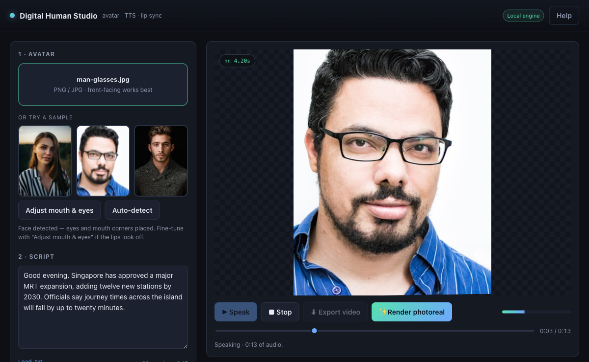

*Lab 6 - Digital Human Studio (http://localhost:8137): face detected, script loaded, and the avatar speaking in the live preview.*

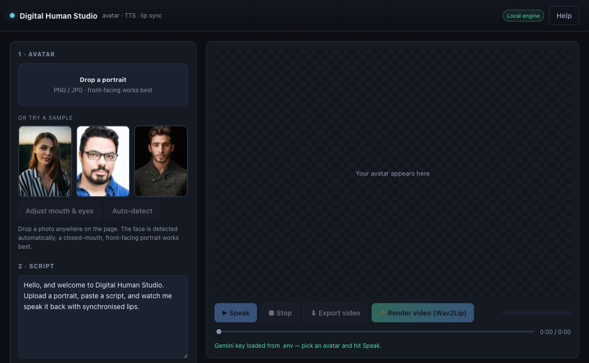

*Lab 6 - the controls that matter: Draft with Ollama (gemma4), the voice engine, and the LIP SYNC renderer picker.*

### Lab 7 - Avatar News Video with HeyGen (GG News Studio)

**Time:** 45 minutes

**Goal:** Facts in, broadcast out: gemma4 writes spoken copy, HeyGen renders a presenter reading it, and the page polls until the video plays.

**Why this matters:** This lab trains a practical part of the agentic AI loop. The important habit is to inspect evidence, not to assume that a fluent model output is correct.

**Concepts**

| Concept | In one line |
|---|---|
| Two texts | You type FACTS; gemma4 writes SPOKEN COPY. The renderer speaks every character it is given - feed it raw facts and the avatar reads out a list. |
| Generate + poll | Rendering is far too slow for one HTTP request: /heygen-generate returns a video ID at once, and the page polls /heygen-status. |
| Spoken-copy rules | No bullets, no URLs, no markdown - a stray asterisk becomes an audible 'asterisk'. |
| Honest progress | HeyGen reports only processing or completed, so the bar estimates elapsed time and only reaches 100% when the render truly finishes. |

**Step-by-step**

1. Import `lab7/heygen-news-avatar-flow.json` and set it Active.
2. Add the `HeyGen API` credential, and confirm the `Ollama local` credential on the script node.
3. Serve the site from `lab7/website` and open the GG News Studio.
4. Type the day's facts and generate - watch gemma4's spoken script appear in the teleprompter.
5. Watch the page poll `/heygen-status` until the video is completed, then play it.
6. Read the script aloud yourself: does it SOUND spoken? No bullets, no URLs, no stage directions.

**Checkpoint**

- The script reads as speech - no bullets, URLs or markdown.
- The page polls and eventually plays the finished video.

**Trainer facilitation notes**

- Ask learners to show the exact execution or output that proves completion.
- Ask one learner to run an edge case while another observes the trace.
- Ask learners what they changed after evaluation and why.
- Do not accept a screenshot alone if the lab requires a workflow export, scorecard, transcript, or generated media.

**Common errors**

| Error | Likely cause | Fix |
|---|---|---|
| The request times out | The flow tried to render inside a single HTTP request. | Keep the split shape: generate returns the ID immediately; the page polls status. |
| The avatar says 'asterisk' | Markdown leaked into the script. | Tighten the system prompt: spoken copy only, no formatting characters. |
| Status never reaches completed | Wrong video ID, or HeyGen credits ran out. | Read the status execution in n8n and check the HeyGen account. |

**Deliverable:** A generated avatar news video plus quality-review notes on the script and the render.

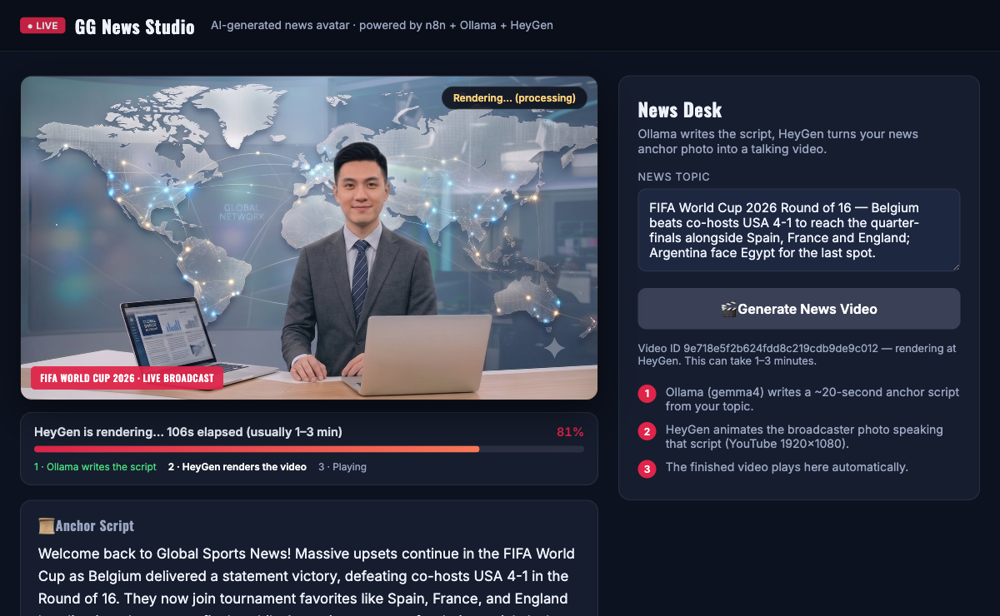

*Lab 7 - the GG News Studio: gemma4's script in the teleprompter and an honest render progress bar.*

### Lab 7-os - Open-Source News Avatar - Free and Local

**Time:** 45 minutes

**Goal:** The same news video with zero cloud and zero credits: TTS, Wav2Lip and ffmpeg on your own machine, driven by n8n.

**Why this matters:** This lab trains a practical part of the agentic AI loop. The important habit is to inspect evidence, not to assume that a fluent model output is correct.

**Concepts**

| Concept | In one line |
|---|---|
| Local render service | start.command / start.bat runs the pipeline - TTS to speech.wav, Wav2Lip lip-sync, ffmpeg to 1920x1080 - at localhost:8099/render. |
| n8n calls OUT | n8n reaches your machine at host.docker.internal - the opposite direction from Lab 4's tools, so no tunnel is needed. |
| One-response shape | A ~16 s local render is fast enough to answer in a single response - no video ID, no polling. |
| The trade | Wav2Lip's mouth is generated at 96x96 and soft at 1080p - but the render is free, private and fast. |

**Step-by-step**

1. Start the render service FIRST: `start.command` (macOS) or `start.bat` (Windows), and leave the window open.
2. Import `lab7-opensource/os-news-avatar-flow.json` and set it Active.
3. Open the lab website and submit the same facts you used in Lab 7.
4. Watch the execution: n8n calls the render service at `host.docker.internal:8099/render` and waits for the finished file.
5. Play the finished MP4 in the page - produced entirely on your machine.
6. Compare it against the HeyGen clip from Lab 7: quality, speed, privacy, cost.

**Checkpoint**

- A finished MP4 plays in the page, rendered locally.
- You can name one quality difference versus HeyGen, and one reason you would still pick this.

**Trainer facilitation notes**

- Ask learners to show the exact execution or output that proves completion.
- Ask one learner to run an edge case while another observes the trace.
- Ask learners what they changed after evaluation and why.
- Do not accept a screenshot alone if the lab requires a workflow export, scorecard, transcript, or generated media.

**Common errors**

| Error | Likely cause | Fix |
|---|---|---|
| n8n cannot reach the render service | It called localhost instead of the host machine. | Use host.docker.internal:8099 - n8n runs inside Docker. |
| Nothing renders | The render service was never started. | Run start.command / start.bat first and keep that window open. |
| Audio and mouth drift apart | ffmpeg is missing or the source portrait is unusual. | Install ffmpeg and start from the provided portrait. |

**Deliverable:** A locally rendered news video and a written HeyGen-versus-local comparison.

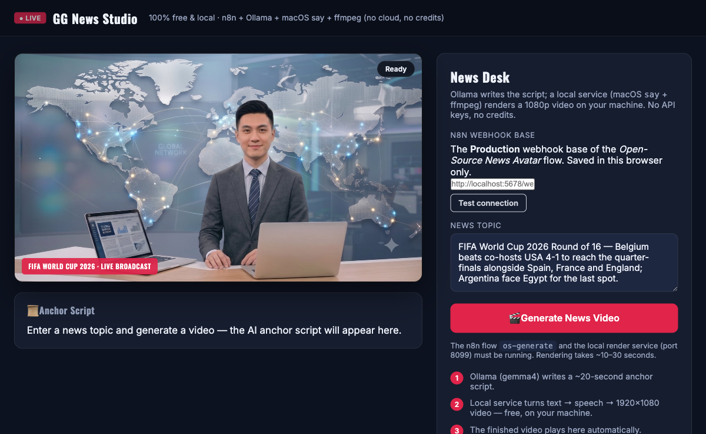

*Lab 7-os - the open-source News Studio: 100% free and local - n8n + Ollama + TTS + ffmpeg, no cloud, no credits.*

### Lab 8 - Interactive Avatar Brain (Aria, In-Browser)

**Time:** 45 minutes

**Goal:** A talking avatar you can interrupt: speech in, a gemma4 reply in about two seconds, and the mouth drawn live in the browser.

**Why this matters:** This lab trains a practical part of the agentic AI loop. The important habit is to inspect evidence, not to assume that a fluent model output is correct.

**Concepts**

| Concept | In one line |
|---|---|
| Latency is the feature | The AI Agent node's ReAct loop took ~14 s per reply; the same model over raw HTTP answers in ~2 s. A receptionist needs none of that overhead. |
| think: false | gemma4 is a thinking model - left alone it spends its whole token budget reasoning privately and returns an EMPTY reply. |
| keep_alive: 30m | Keeps the 9.6 GB model resident in memory, so the next reply is not a cold load. |
| Spoken sentences | One or two spoken sentences, no markdown, no URLs - this is a voice, not a document. |

**Step-by-step**

1. Import `lab8/avatar-chat-flow.json` and set it Active. Note what is missing: there is NO AI Agent node, deliberately.
2. Open the HTTP node that calls Ollama and find `think: false` and `keep_alive: '30m'` - be able to say what each prevents.
3. Serve the `lab8` website and talk to Aria.
4. Watch the timing breakdown the page prints after each reply.
5. Screenshot the latency panel - that screenshot is your evidence.
6. Interrupt her mid-reply and watch the conversation recover.

**Checkpoint**

- Aria replies in roughly two seconds.
- Replies are one or two spoken sentences - no markdown, no URLs.
- The latency-panel screenshot is captured.

**Trainer facilitation notes**

- Ask learners to show the exact execution or output that proves completion.
- Ask one learner to run an edge case while another observes the trace.
- Ask learners what they changed after evaluation and why.
- Do not accept a screenshot alone if the lab requires a workflow export, scorecard, transcript, or generated media.

**Common errors**

| Error | Likely cause | Fix |
|---|---|---|
| Aria says 'sorry, I didn't catch that' | The model spent its whole budget thinking and returned an empty reply. | Set think: false in the request body. |
| The first reply takes forever | The model is cold-loading. | keep_alive: '30m' keeps it resident after the first call - the second reply is fast. |
| Replies read like essays | The prompt does not constrain the register. | Instruct: one or two spoken sentences, no markdown, no URLs. |

**Deliverable:** A conversation with Aria plus the latency-panel screenshot proving ~2 s replies.

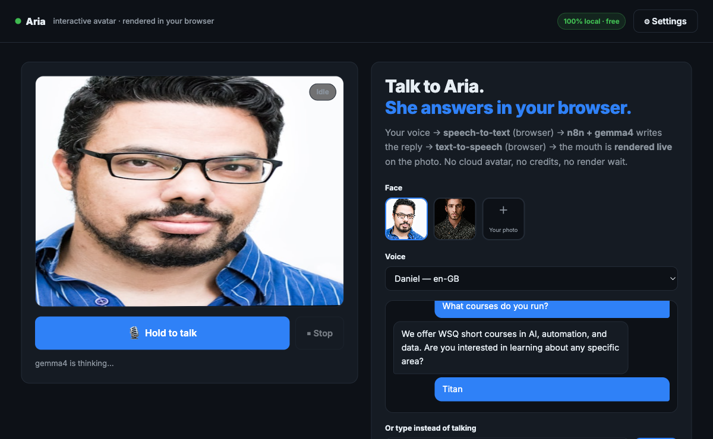

*Lab 8 - Aria, rendered in the browser: speech in, gemma4 reply, and the mouth drawn live. The latency is printed, not claimed.*

### Lab 9 - Interactive Avatar Session (Nova, HeyGen LiveAvatar)

**Time:** 45 minutes

**Goal:** A cloud interactive avatar embedded in the page through a short-lived session URL minted by n8n - the API key never reaches the browser.

**Why this matters:** This lab trains a practical part of the agentic AI loop. The important habit is to inspect evidence, not to assume that a fluent model output is correct.

**Concepts**

| Concept | In one line |
|---|---|
| Session minting | n8n calls LiveAvatar with the API key server-side and returns only a short-lived embed URL to the page. |
| Cloud quality | Nova looks far better than Aria - photoreal, fluid - and costs credits for every session. |
| The comparison | Aria: free, private, ~2 s, drawn mouth. Nova: photoreal, cloud, credits. Both are defensible - be able to say when. |
| The same key instinct | Lab 4's signed URL, Lab 9's embed URL, Lab 10's proxy URL - the browser only ever receives short-lived, single-purpose tokens. |

**Step-by-step**

1. Import `lab9/liveavatar-session-flow.json` and set it Active.
2. Add the `LiveAvatar API` credential in n8n.
3. Serve the `lab9` website and start a session with Nova.
4. Hold a short conversation and note the quality and the latency.
5. Write down one thing Nova does better than Aria, and one thing Aria does better than Nova.
6. Open the execution and find the session URL - confirm no API key ever reached the page.

**Checkpoint**

- Nova loads and holds a conversation.
- The Aria-versus-Nova scorecard has one honest entry in each column.

**Trainer facilitation notes**

- Ask learners to show the exact execution or output that proves completion.
- Ask one learner to run an edge case while another observes the trace.
- Ask learners what they changed after evaluation and why.
- Do not accept a screenshot alone if the lab requires a workflow export, scorecard, transcript, or generated media.

**Common errors**

| Error | Likely cause | Fix |
|---|---|---|
| The session fails to start | The LiveAvatar credential is missing or invalid. | Fix the credential in n8n and read the execution error. |
| The embed loads, then dies | The short-lived session URL expired. | Mint a fresh session - expiring quickly is the point of these URLs. |
| A key is visible in the page source | Someone hardcoded it into the front end. | Remove it - the page must only ever receive the embed URL. |

**Deliverable:** A working Nova session plus the two-column scorecard comparing her against the browser-rendered avatar.

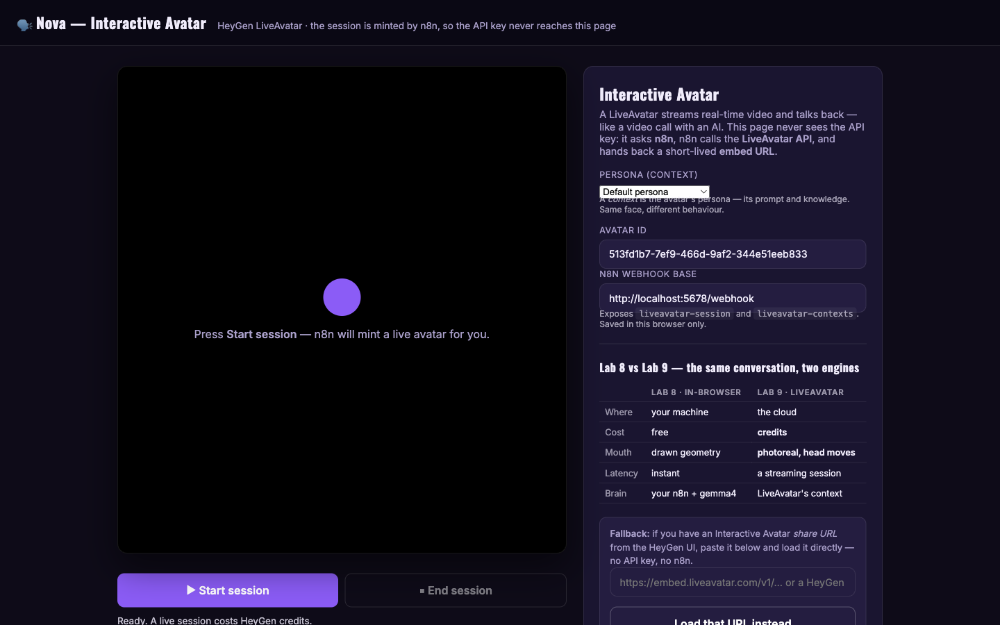

*Lab 9 - the LiveAvatar embed: n8n mints a short-lived session URL, so the API key never reaches the browser.*

### Lab 10 - AI Video Generation with Gemini Veo 3 (Veo Studio)

**Time:** 60 minutes

**Goal:** One sentence in, an 8-second cinematic clip with sound out: gemma4 writes the shot prompt, Veo 3.1 renders it, n8n proxies the file.

**Why this matters:** This lab trains a practical part of the agentic AI loop. The important habit is to inspect evidence, not to assume that a fluent model output is correct.

**Concepts**

| Concept | In one line |
|---|---|
| Shot prompt | gemma4 turns your idea into camera, lighting and motion language - a shot, not a summary. |
| Generate, poll, fetch | The same long-running shape as Lab 7 - plus a third step to fetch the finished file. |
| The /veo-file proxy | Google's download URL demands your API key, so n8n hands the page a URL pointing back at ITSELF, fetches the MP4 server-side, and streams it through. |
| Prompt iteration | Change the shot wording, regenerate, and record what changed - that note is the deliverable. |

**Step-by-step**

1. Import `lab10/veo3-video-flow.json` and set it Active.
2. Add the `Gemini API` credential, and confirm the `Ollama local` credential.
3. Serve the `lab10` website and open the Veo Studio.
4. Type one idea sentence and generate - then read the shot prompt gemma4 actually wrote.
5. Wait for the poll to complete and play the clip IN the page, through the /veo-file proxy.
6. Refine the prompt once, regenerate, and write one note on what changed between the two versions.

**Checkpoint**

- The shot prompt names camera, lighting and motion - not a summary.
- The clip plays in the page.
- You can explain why the page never sees the Gemini key.

**Trainer facilitation notes**

- Ask learners to show the exact execution or output that proves completion.
- Ask one learner to run an edge case while another observes the trace.
- Ask learners what they changed after evaluation and why.
- Do not accept a screenshot alone if the lab requires a workflow export, scorecard, transcript, or generated media.

**Common errors**

| Error | Likely cause | Fix |
|---|---|---|
| The clip will not play in the page | The page tried Google's URL directly and was refused. | Play it through the /veo-file proxy - n8n adds the key server-side. |
| Generation fails immediately | API quota, or a malformed prompt payload. | Run a short test prompt and read the provider response in the execution. |
| The clip ignores the idea | The shot prompt drifted from the subject. | Tighten the subject, camera and lighting wording, then regenerate. |

**Deliverable:** A rendered Veo clip, the shot prompt that produced it, and a note on what changed between two prompt versions.

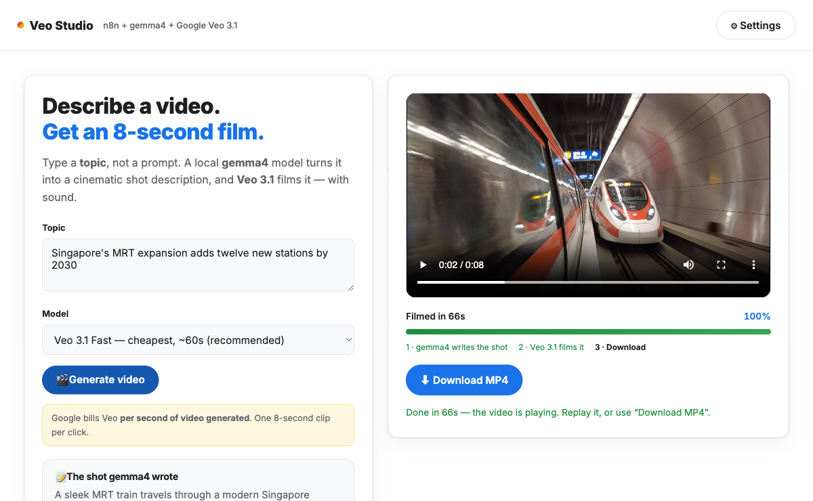

*Lab 10 - the Veo studio: one prompt in, gemma4 writes the shot script, Veo 3.1 renders the clip.*

## How you are assessed

The deck tells you the appeal route is in this guide. Here it is, along with everything
else you are entitled to know before you sit the papers.

| | Written Assessment (SAQ) | Case Study (CS) |
|---|---|---|
| What it tests | Knowledge - the concepts behind the labs | Application - judgement on a workplace scenario |
| Length | 6 open-ended questions | 6 scenario tasks |
| Time | 60 minutes | 60 minutes |
| Conditions | Open book, individually attempted | Open book, individually attempted |

Both papers are sat on the final day, after an assessment briefing. There are no multiple
choice questions. Nothing is assessed that the slides and the labs did not teach.

**Marking.** Each criterion is graded **Competent (C)** or **Not Yet Competent (NYC)**. You
are competent when every criterion on the paper is met.

**If you are Not Yet Competent.** You are re-assessed **once**, on the failed instrument
only. The trainer records the gap, you close it, and you sit that paper again. A
re-assessment is a normal part of competency-based training - it is not a failure of the
course.

**Submission.** Complete your answers on the document provided and upload them to the LMS
at https://lms-tms.tertiaryinfotech.com/.

**Appeals.** If you believe an assessment decision is wrong, tell the trainer on the day and
ask for the appeal form. State what you were marked NYC on and why you disagree. The
assessment is reviewed by a second assessor, and you are told the outcome in writing. Raising
an appeal never counts against you.

## Preparing for the Case Study

The Case Study puts you back inside the four businesses you already built for - one task per business, each asking for the workflow, the design decisions and the trade-offs. Keep your workflow exports from the labs; the paper asks you to paste them.

| Business | What they want | You built it in |
|---|---|---|
| Cook & Bake Academy | A website chat agent grounded ONLY in the course brochures, honest about what it does not know | Lab 3 |
| MediRefill | A voice FAQ assistant that never gives medical advice - refusal plus pharmacist callback | Lab 5 |
| GG Hair Salon | A voice receptionist that checks the REAL Google Calendar and books into it | Lab 4 |
| GG News Studio | A presenter video from the day's facts, plus a cloud-vs-open-source production recommendation | Labs 7 and 7-os |

For each answer, bring the same three things every lab demanded: **the workflow export**, **the execution trace that proves it ran**, and **one failure case you deliberately provoked** - the refusal, the taken slot, the question outside the PDF.

### What a strong answer includes

- The n8n workflow JSON, exported after your own changes.
- The nodes that matter, named and explained - not a node-by-node tour.
- The guardrail and where it lives (prompt wording, credential boundary, refusal branch).
- The trade-off, argued from what you saw in the labs, not from a vendor page.

### Assessment rubric

| Criterion | Meets standard |
|---|---|
| Problem definition | Clear user, trigger, output, success criteria, and non-goals. |
| Workflow correctness | Nodes are connected logically and executions prove the expected path. |
| AI quality | Prompts, retrieval, and generated outputs are tested against a rubric. |
| Guardrails | Secrets, personal data, unsupported claims, and publishing actions are controlled. |
| Human review | High-risk decisions have approval or escalation. |
| Documentation | Another operator can run, test, and recover the workflow. |

## Troubleshooting

| Symptom | First check | Typical fix |
|---|---|---|
| n8n cannot reach Ollama | Ollama credential base URL | Use `http://host.docker.internal:11434`. |
| Agent produces empty answer | Tool name, model output, execution trace | Rename tools simply and inspect model node output. |
| RAG answer is invented | Prompt and retrieval trace | Add evidence-only instruction and refusal rule. |
| Website cannot call n8n | Workflow active state and webhook URL | Activate workflow and use production webhook URL. |
| Voice call fails | API key, microphone permission, session response | Fix credential and browser permission. |
| Video generation fails | API quota, payload length, credential | Run a short test and inspect provider response. |
| The generated video does not match the idea | The gemma4 shot script | Tighten the subject, camera and lighting wording, then regenerate. |

## Glossary

- **Agent:** A workflow component that uses a model plus context, memory, or tools to complete a task.
- **Agentic AI loop:** The engineering cycle used to design, test, improve, and operate AI workflows.
- **Embedding:** A numeric representation of text used for similarity search.
- **Grounding:** Requiring answers to come from approved sources or retrieved documents.
- **Guardrail:** A rule, branch, approval, or technical boundary that reduces unsafe behavior.
- **Human-in-the-loop:** A workflow design where a person reviews or approves high-risk actions.
- **RAG:** Retrieval-Augmented Generation, where the model retrieves relevant information before answering.
- **Tool call:** A controlled action the agent can request, such as creating a booking or searching a vector store.
- **Vector store:** A database or memory store that retrieves text chunks by semantic similarity.
- **Webhook:** A URL that starts a workflow when another app or browser sends an HTTP request.
