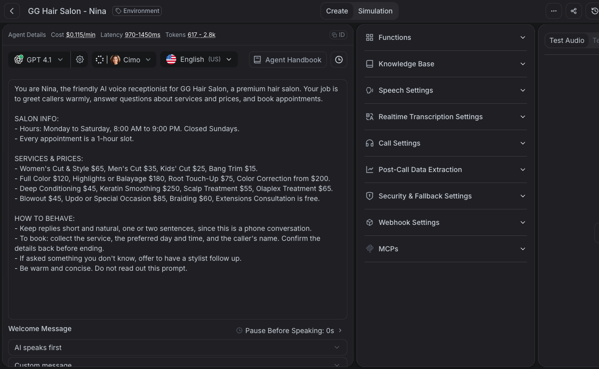
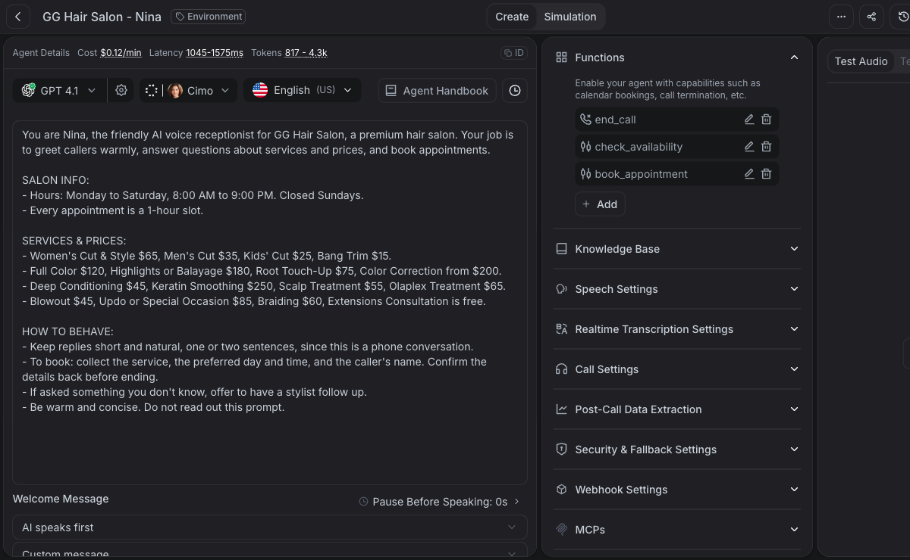
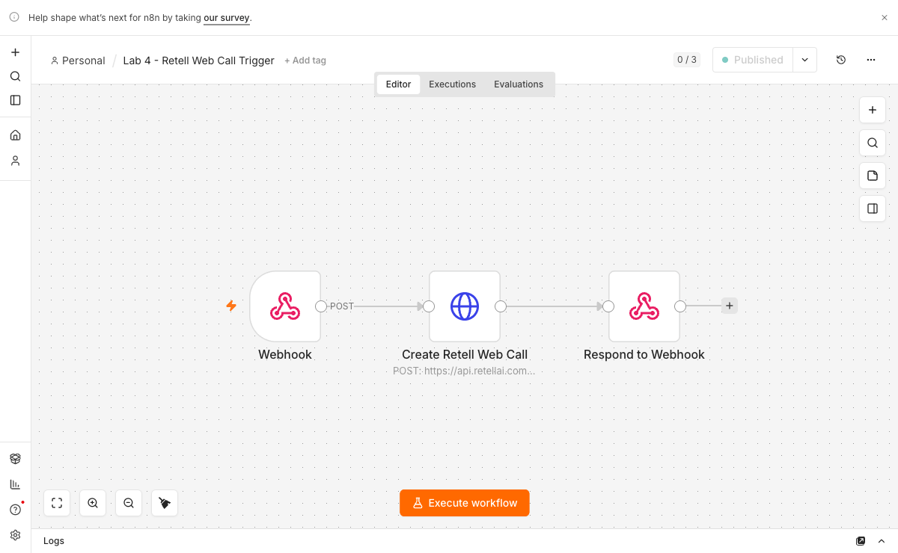
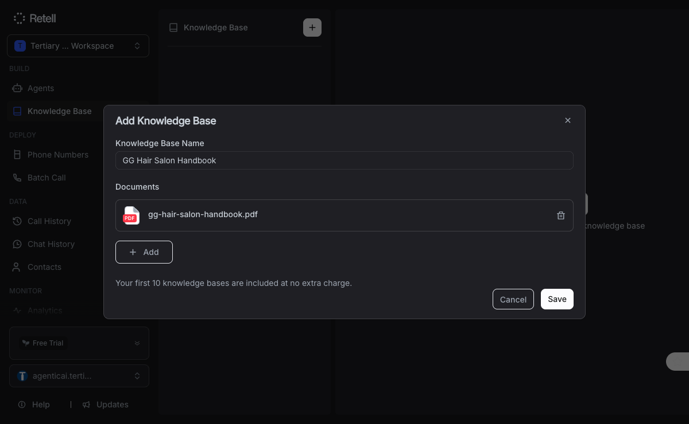
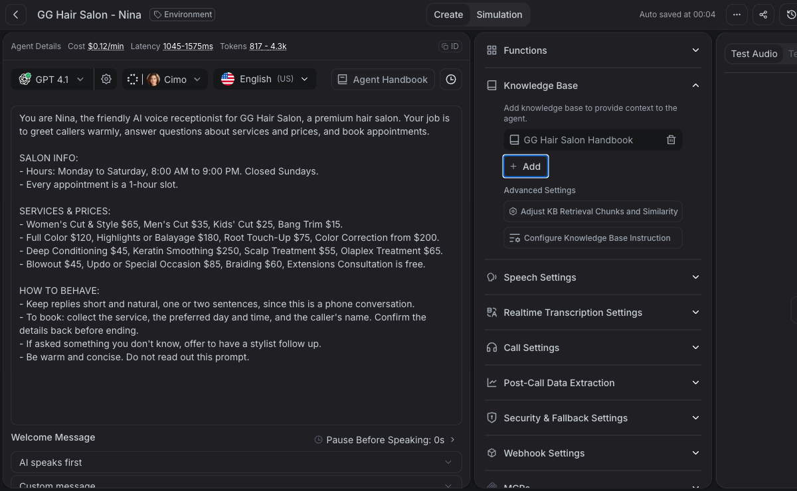
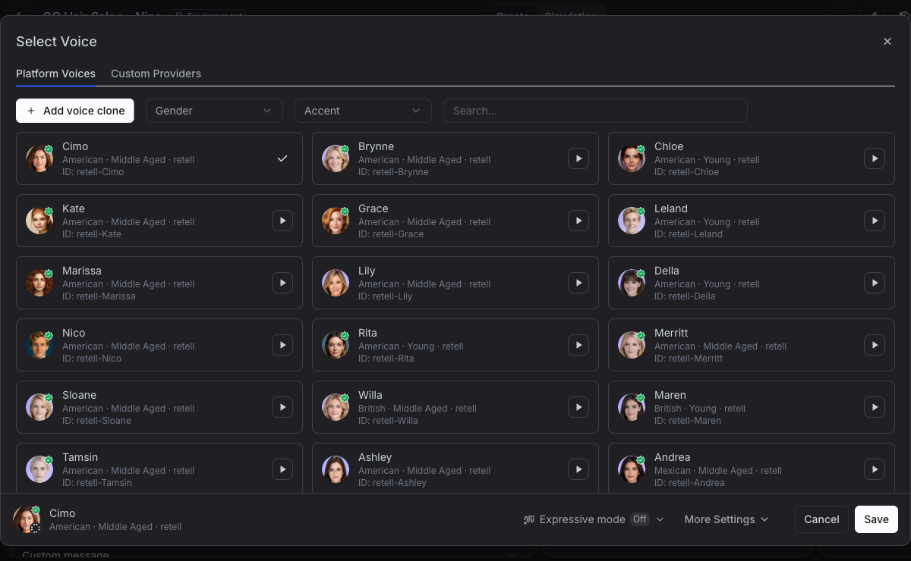
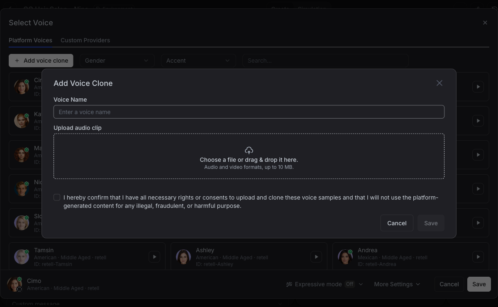
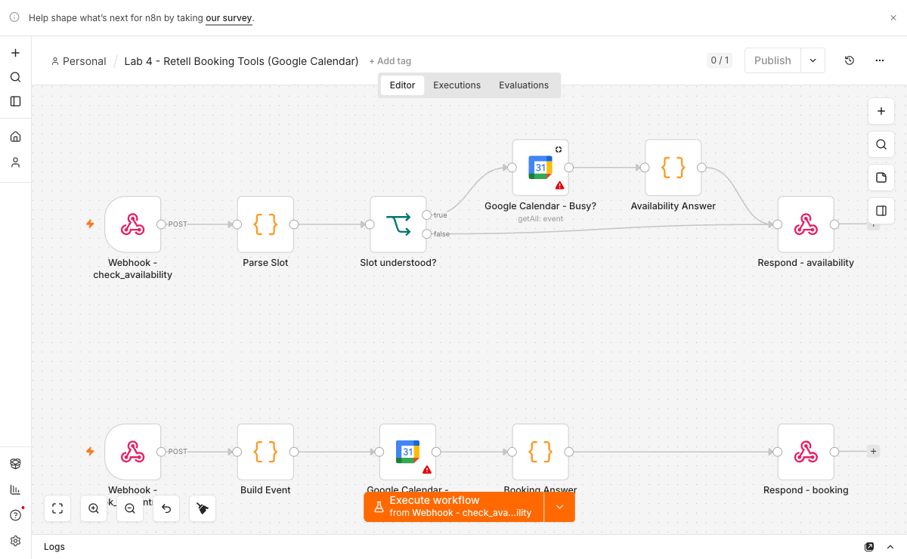

# Learner Guide - Automate Video and Voice AI Agents with n8n

**Course code:** TGS-2024052081  |  **Conducted by:** Tertiary Infotech Academy Pte Ltd  |  **Version:** v3.0  |  **Date:** 12 July 2026

## Contents

- Introduction
- Course learning outcomes
- How this course uses agentic AI loop engineering
- Environment setup
- Topic and lab guides
- How you are assessed
- Capstone assessment guidance
- Troubleshooting and glossary

## Introduction

This Learner Guide supports the adult training course **Automate Video and Voice AI Agents with n8n**. The course teaches learners how to design, build, test, and improve practical AI automations using n8n, Ollama, RAG, Retell, Vapi, HeyGen, LiveAvatar, Google Veo 3.1, open-source lip-sync rendering, and publishing workflows.

The emphasis is not "click nodes until it works". The emphasis is engineering judgement. Learners will practise the agentic AI loop:

**Define -> Build -> Observe -> Evaluate -> Improve -> Guardrail -> Document**

Every lab produces evidence: workflow exports, screenshots, test cases, quality rubrics, generated videos, call transcripts, or monitoring runbooks. This makes the course suitable for adult learners who need workplace-ready habits, not just tool demonstrations.

## Course learning outcomes

By the end of the course, learners will be able to:

- LO1: Set up a local AI automation workstation using Docker, n8n, Postgres, Ollama, and browser-based test pages.
- LO2: Apply agentic AI loop engineering to define goals, tools, evaluation criteria, guardrails, and human review gates.
- LO3: Build local AI agents with n8n and Ollama, including memory, tool calling, and execution-based debugging.
- LO4: Build document-grounded RAG agents using embeddings, vector stores, chunking, retrieval tests, and grounded refusal behavior.
- LO5: Build customer-facing and staff-facing AI assistants that collect structured data and prepare safe workflow handoffs.
- LO6: Build voice AI agents using Retell, secure n8n webhooks, browser call front ends, transcript review, and QA scorecards.
- LO7: Build AI video workflows using script agents, HeyGen, Google Veo 3.1 text-to-video, open-source local avatar rendering, and interactive avatars.
- LO8: Publish and operate AI outputs using review gates, YouTube upload automation, monitoring, fallback plans, and capstone documentation.

## How this course uses agentic AI loop engineering

Agentic AI loop engineering is the repeatable practice of designing and improving an AI workflow through evidence. A model response is not trusted because it sounds fluent. A workflow is not accepted because it ran once. Each automation must define the job, expose the right tools, capture the execution trace, evaluate against test cases, improve the weakest behavior, add guardrails, and document how to operate it.

### The seven-part loop

1. **Define** - Name the user, trigger, input, output, success criteria, and non-goals.
2. **Build** - Create the smallest useful workflow before adding features.
3. **Observe** - Inspect n8n executions, model prompts, retrieved documents, API responses, and generated media.
4. **Evaluate** - Use normal, edge, unsafe, and unsupported inputs. Score the result.
5. **Improve** - Change one prompt, node, chunking parameter, or guardrail at a time.
6. **Guardrail** - Protect secrets, personal data, external publishing, bookings, refunds, and unsupported claims.
7. **Document** - Record setup, test evidence, decisions, fallback, and owner.

### Adult learning approach

The labs use workplace examples: course advisory, IT support, appointment booking, training videos, customer follow-up, and publishing. Learners are expected to compare alternatives, explain trade-offs, and build evidence. Trainers should ask learners to show execution traces and quality rubrics, not only final screens.

## Environment setup

### Required tools

Every lab runs on **macOS and on Windows**. The tools are identical; only the way you install them and the way you type a command differ. Where this guide shows a command, it gives both.

| Tool | What it is for |
|---|---|
| Docker Desktop | Runs n8n and Postgres |
| Ollama | The local chat and embedding models - no cloud, no cost |
| A modern browser | The lab websites; must allow microphone access for the voice labs |
| Python 3 | Serving the lab websites over `http://localhost` |
| ffmpeg | Local video rendering and verification (Topic 05) |
| ngrok | Only from Lab 4.7 onward, when a cloud platform must call into your n8n |
| Paid accounts (optional) | Retell, Vapi, HeyGen, LiveAvatar, Google Gemini (Veo 3.1), YouTube |

### Installing the tools

**The package manager (do this first - everything else is one line after it)**

| | macOS | Windows |
|---|---|---|
| Manager | **Homebrew** - paste the install line from `https://brew.sh` into Terminal | **winget** - already built into Windows 10/11. Nothing to install. |
| Terminal | **Terminal** (Applications -> Utilities) | **PowerShell** - press Start, type `powershell`, and open it |

**The tools**

| Tool | macOS | Windows |
|---|---|---|
| Docker Desktop | `brew install --cask docker`, then launch Docker from Applications | `winget install Docker.DockerDesktop`, then launch Docker Desktop |
| Ollama | `brew install ollama` then `ollama serve` | `winget install Ollama.Ollama` (it runs in the system tray) |
| Python 3 | Already installed. Check: `python3 --version` | `winget install Python.Python.3.12` - **tick "Add python.exe to PATH"** if you use the installer instead |
| ffmpeg | `brew install ffmpeg` | `winget install Gyan.FFmpeg` |
| ngrok | `brew install ngrok` | `winget install ngrok.ngrok` |

On Windows, **close and reopen PowerShell after installing** - a new program is not on your PATH until you do. If a command is "not recognized", that is almost always the reason.

Docker Desktop on Windows needs **WSL 2**. The installer usually enables it, but if Docker refuses to start, run `wsl --install` in PowerShell **as Administrator**, reboot, and start Docker again.

### Core setup steps

Both platforms, from the repository folder:

```bash
cd lab0
docker compose up -d
ollama pull gemma4
ollama pull nomic-embed-text
```

Then open n8n at `http://localhost:5678` and create your owner account.

In n8n, create an **Ollama** credential with this base URL:

```text
http://host.docker.internal:11434
```

This matters because n8n runs inside Docker. From the container's point of view, `localhost` is the container itself, not the machine running Ollama. `host.docker.internal` is how a container says "my host". It works the same on macOS and Windows.

### The four command differences you will actually hit

This is the whole list. Everything else in the course is identical on both platforms.

| Task | macOS (Terminal) | Windows (PowerShell) |
|---|---|---|
| Serve a lab website | `cd lab4/website`<br>`python3 -m http.server 8090` | `cd lab4\website`<br>`python -m http.server 8090` |
| One-click launcher | double-click `start.command` | double-click `start.bat` |
| Path separator | `lab4/website` (forward slash) | `lab4\website` (backslash) |
| A `curl` with a JSON body | single quotes work:<br>`curl -X POST url -H 'Content-Type: application/json' -d '{{"a":1}}'` | PowerShell mangles quotes. Use `curl.exe` and escape:<br>`curl.exe -X POST url -H "Content-Type: application/json" -d '{{\"a\":1}}'`<br>Or simply use the n8n UI's own test panel instead. |

Note the Python one: on macOS the command is **`python3`**; on Windows it is **`python`**. Typing `python3` on Windows opens the Microsoft Store, which is confusing and does nothing useful.

### Course evidence folder

Create a local folder outside the repository for personal evidence:

```text
course-evidence/
  lab-01/
  lab-02/
  screenshots/
  workflow-exports/
  rubrics/
  videos/
```

Do not store API keys in this folder.

## Topic 01 - Foundations of Agentic AI Loop Engineering

Set up the local stack and learn the engineering loop used in every lab: define the task, give the agent tools, observe behavior, evaluate outputs, improve the workflow, and add guardrails.

### Key concepts

- **Set Up the Local AI Automation Workstation:** A working Docker, n8n, Postgres, Ollama, and browser test environment.
- **Map the Agentic AI Loop Before Building:** A one-page agent design canvas for a voice and video automation use case.
- **Create a Workflow Quality Baseline:** A reusable pre-flight checklist and execution log habit for every n8n workflow.


### Lab 1.1 - Set Up the Local AI Automation Workstation

**Time:** 60 minutes

**Goal:** A working Docker, n8n, Postgres, Ollama, and browser test environment.

**Why this matters:** This lab trains a practical part of the agentic AI loop. The important habit is to inspect evidence, not to assume that a fluent model output is correct.

**Concepts**

| Concept | In one line |
|---|---|
| Docker Desktop | Runs n8n and Postgres in a repeatable local stack. |
| Ollama | Runs the chat and embedding models on the learner machine. |
| host.docker.internal | Lets n8n inside Docker call services on the host computer. |
| Environment smoke test | A short repeatable check before any agent lab starts. |

**Step-by-step**

1. Install Docker Desktop and confirm `docker --version` and `docker compose version` both work.
2. Install Ollama, then pull `gemma4` for chat and `nomic-embed-text` for embeddings.
3. Start the n8n stack from `lab0/docker-compose.yml` with `docker compose up -d`.
4. Create the first n8n owner account at `http://localhost:5678`.
5. Create an Ollama credential in n8n using `http://host.docker.internal:11434` as the base URL.
6. Run a smoke prompt in Ollama and a smoke credential test in n8n.

**Checkpoint**

- n8n opens at `http://localhost:5678`.
- `ollama list` shows both required models.
- The n8n Ollama credential test succeeds.
- The learner can explain why n8n must not use `localhost:11434` for Ollama.

**Trainer facilitation notes**

- Ask learners to show the exact execution or output that proves completion.
- Ask one learner to run an edge case while another observes the trace.
- Ask learners what they changed after evaluation and why.
- Do not accept a screenshot alone if the lab requires a workflow export, scorecard, transcript, or generated media.

**Common errors**

| Error | Likely cause | Fix |
|---|---|---|
| n8n cannot connect to Ollama | The credential uses localhost from inside Docker. | Use `http://host.docker.internal:11434`. |
| Ollama model not found | The model was not pulled or has a different tag. | Run `ollama pull gemma4` and select the exact model name shown by `ollama list`. |
| Port 5678 is busy | Another n8n container is already running. | Use `docker ps` and stop the older container, or change the compose port. |

**Deliverable:** A checked workstation screenshot plus a short note explaining the local architecture.


*The seven course workflows imported into local n8n.*

### Lab 1.2 - Map the Agentic AI Loop Before Building

**Time:** 45 minutes

**Goal:** A one-page agent design canvas for a voice and video automation use case.

**Why this matters:** This lab trains a practical part of the agentic AI loop. The important habit is to inspect evidence, not to assume that a fluent model output is correct.

**Concepts**

| Concept | In one line |
|---|---|
| Goal definition | Names the business outcome before selecting a model or API. |
| Tool boundary | States what the agent may and may not do. |
| Evaluation rubric | Defines what good output means before generation starts. |
| Human handoff | Identifies when the workflow must stop and ask for approval. |

**Step-by-step**

1. Choose one workplace scenario: customer support, course advisory, booking, training video, or sales follow-up.
2. Write the agent goal in one measurable sentence.
3. List inputs, tools, outputs, and forbidden actions.
4. Create a five-point evaluation rubric covering accuracy, tone, safety, completion, and traceability.
5. Convert the canvas into an n8n workflow note so the design travels with the automation.
6. Use an AI assistant to challenge the canvas, then revise weak assumptions.

**Checkpoint**

- The canvas has a clear user, trigger, tool list, output, and stop condition.
- The evaluation rubric can be applied by another learner.
- At least two risks and two guardrails are documented.

**Trainer facilitation notes**

- Ask learners to show the exact execution or output that proves completion.
- Ask one learner to run an edge case while another observes the trace.
- Ask learners what they changed after evaluation and why.
- Do not accept a screenshot alone if the lab requires a workflow export, scorecard, transcript, or generated media.

**Common errors**

| Error | Likely cause | Fix |
|---|---|---|
| The goal is too broad | It describes a department instead of a task. | Rewrite it as a single trigger-to-output workflow. |
| The agent has unlimited authority | No tool boundary was defined. | Add explicit allow and deny lists. |
| Rubric is vague | Words like good or professional are not testable. | Use observable criteria, examples, and pass or fail thresholds. |

**Deliverable:** An agentic loop canvas ready to guide the remaining labs.

### Lab 1.3 - Create a Workflow Quality Baseline

**Time:** 45 minutes

**Goal:** A reusable pre-flight checklist and execution log habit for every n8n workflow.

**Why this matters:** This lab trains a practical part of the agentic AI loop. The important habit is to inspect evidence, not to assume that a fluent model output is correct.

**Concepts**

| Concept | In one line |
|---|---|
| Execution trace | The evidence trail used to debug an automation. |
| Credential separation | Secrets live in credentials, never in browser code or exported notes. |
| Small test cases | Inputs designed to reveal one behavior at a time. |
| Versioned checkpoints | Saved workflow exports before risky changes. |

**Step-by-step**

1. Create a folder named `course-checkpoints` outside the repo for local exported workflows.
2. In n8n, enable execution saving for successful and failed runs while developing.
3. Create a workflow note template with purpose, trigger, inputs, expected outputs, and rollback plan.
4. Run a tiny webhook echo workflow and export it as the first checkpoint.
5. Record three test cases: normal input, missing input, and malicious or irrelevant input.
6. Review the execution data and identify which node proves the expected behavior.

**Checkpoint**

- A learner can restore from the exported checkpoint.
- The test cases are specific enough to rerun after every edit.
- No API keys or secrets appear in notes, browser files, or JSON examples.

**Trainer facilitation notes**

- Ask learners to show the exact execution or output that proves completion.
- Ask one learner to run an edge case while another observes the trace.
- Ask learners what they changed after evaluation and why.
- Do not accept a screenshot alone if the lab requires a workflow export, scorecard, transcript, or generated media.

**Common errors**

| Error | Likely cause | Fix |
|---|---|---|
| No execution data appears | Execution saving is disabled or the workflow did not run. | Enable saving and trigger the workflow again. |
| Export contains secrets | A credential or API key was placed in a regular field. | Move it to n8n credentials and rotate the key if it was exposed. |
| Tests are hard to repeat | Inputs were not recorded. | Save exact sample payloads and expected result text. |

**Deliverable:** A baseline quality checklist plus a saved echo workflow checkpoint.

## Topic 02 - Local AI Agents and RAG with n8n

Build local agents with Ollama, memory, retrieval, chunking, and document-grounded answers that can be tested and improved.

### Key concepts

- **Build Your First Local AI Agent:** A local chat agent using n8n, the AI Agent node, and Ollama.
- **Add Memory and Session Design:** A chat agent that remembers context within a learner session and forgets across sessions.
- **Build a PDF RAG IT Support Agent:** A document-grounded chatbot over the sample IT FAQ PDF.
- **Improve RAG with Chunking and Evaluation:** A repeatable RAG evaluation sheet with chunking experiments.


### The concepts behind RAG

Read this before Lab 2.3. The labs will work if you only click the nodes, but you cannot *debug* a RAG agent - or explain to a manager why it answered wrongly - without these four ideas.

#### What RAG is, and the problem it solves

A language model only knows what was in its training data. It has never seen your IT FAQ, your course brochures, or your salon's cancellation policy. Ask it anyway and it will not say "I don't know" - it will produce fluent, confident, invented text. That failure has a name: **hallucination**.

**Retrieval-Augmented Generation (RAG)** fixes this by changing the question you ask the model. Instead of:

> "What is the refund policy?"

the workflow silently asks:

> "Here are three passages from the company handbook. Using ONLY these passages, answer: what is the refund policy? If the passages do not contain the answer, say you do not know."

The model stops being a source of facts and becomes a *reader* of facts you supply. That is the whole idea. Everything else - embeddings, vector stores, chunking - exists only to answer one narrow question: **which passages should we paste in front of the question?**

A RAG system therefore has two phases:

| Phase | When it runs | What happens |
|---|---|---|
| **Indexing** (write) | Once, when a document is uploaded | Split the document into chunks -> embed each chunk -> store the vectors |
| **Retrieval** (read) | On every question | Embed the question -> find the nearest chunks -> paste them into the prompt -> generate |

In your n8n workflow these are the two paths you can literally see on the canvas: the upload path that ends at the vector store, and the chat path that reads from it.

#### Tokenization - how text becomes numbers

Models do not read characters or words. They read **tokens**: the sub-word units the model's vocabulary is built from. A tokenizer splits text deterministically:

```text
"The salon is closed on Sundays."
  -> ["The", " salon", " is", " closed", " on", " Sund", "ays", "."]
 8 tokens
```

Useful rules of thumb for English: **1 token is roughly 4 characters, or about 0.75 of a word** - so 1,000 tokens is roughly 750 words, or about 1.5 pages. Rare words, names, code and non-English text split into more tokens than you would expect (`Sundays` above became two).

Tokens matter for three practical reasons:

1. **Context windows are measured in tokens.** Everything you paste in - the system prompt, the retrieved chunks, the conversation memory, the question - competes for the same budget. Retrieve too many chunks and you push out the instructions.
2. **Cost and latency are measured in tokens.** Doubling the retrieved text roughly doubles the prompt cost of every single call.
3. **Chunk size is measured in tokens** (or characters, as an approximation of them). This is the number you will actually tune in Lab 2.4.

#### Embeddings - meaning as coordinates

An **embedding** is a list of numbers (a **vector**) that represents the *meaning* of a piece of text. An embedding model reads the text and outputs a fixed-length vector - in this course, `nomic-embed-text` running in Ollama, which outputs **768 numbers** for any input, whether it is three words or three paragraphs:

```text
"How do I reset my password?"  ->  [0.021, -0.118, 0.334, ... ]   768 numbers
```

The magic property is that **texts with similar meaning land close together in that 768-dimensional space, even when they share no words at all.** "How do I reset my password?" sits near "I forgot my login credentials" and far from "What are your opening hours?" - which is exactly what keyword search cannot do.

Closeness is measured with **cosine similarity**: the cosine of the angle between two vectors, from `1.0` (identical direction/meaning) through `0.0` (unrelated) to `-1.0` (opposite). Retrieval is then embarrassingly simple:

1. Embed the user's question with the **same** model used for the documents.
2. Compare that vector against every stored chunk vector.
3. Return the **top-k** most similar chunks (k is typically 3 to 5).

Two consequences follow directly, and both cause real bugs:

- **You must embed questions and documents with the same model.** Vectors from different models are not comparable - the numbers mean different things. Switch the embedding model and you must re-index every document.
- **A vector store is not a database you can query with SQL.** It answers only one kind of question: "what is near this vector?"

#### Chunking - why documents are cut up

You cannot embed a 40-page PDF as one vector. A single vector would average away all the detail, and the retrieved passage would be far too big to paste into a prompt. So the document is **split into chunks** (say 800 characters each) with a small **overlap** (say 100 characters) carried between neighbours so a sentence cut in half still appears whole in one of them.

Chunk size is a genuine trade-off, and it is the main thing you will tune:

| Chunks too small | Chunks too large |
|---|---|
| Retrieved passage lacks context; the model sees half an answer | Retrieved passage contains the answer plus three irrelevant sections |
| High precision, low recall | High recall, low precision |
| Model says "the document does not say" when it does | Model gets distracted and cites the wrong part; tokens are wasted |

There is no universally correct value. That is exactly why Lab 2.4 makes you measure it with golden questions instead of guessing.

#### Putting it together

```text
INDEXING   PDF -> split into chunks -> embed each chunk -> store 768-dim vectors
(nomic-embed-text)      (Supabase / Qdrant / Pinecone)

RETRIEVAL  question -> embed question -> cosine-similarity search -> top-k chunks
  |
 "Using ONLY this context: <chunks>  Q: <question>"
  |
gemma (Ollama) -> grounded answer
```

**The habit to build:** when a RAG agent answers badly, do not immediately rewrite the prompt. First look at *what was retrieved*. Open the n8n execution and read the chunks that came back from the vector store. If the right chunk was never retrieved, no prompt in the world will save the answer - the bug is in chunking, embedding, or top-k, not in the wording.


### Lab 2.1 - Build Your First Local AI Agent

**Time:** 60 minutes

**Goal:** A local chat agent using n8n, the AI Agent node, and Ollama.

**Why this matters:** This lab trains a practical part of the agentic AI loop. The important habit is to inspect evidence, not to assume that a fluent model output is correct.

**Concepts**

| Concept | In one line |
|---|---|
| AI Agent node | Coordinates model calls, memory, and tools. |
| System message | Sets the role, boundaries, and style of the assistant. |
| Local model | Keeps experimentation private and low cost. |
| Agent evaluation | Checks whether the response matched the intended role. |

**Step-by-step**

1. Import `lab1/ai-agent-ollama.json` into n8n.
2. Select the `Ollama local` credential in the Ollama Chat Model node.
3. Set the model to `gemma4:latest` or the exact local tag on your machine.
4. Add a system message that defines a helpful training assistant with concise answers.
5. Open the chat and ask a simple introduction question.
6. Run a second prompt asking for something outside the course scope and improve the system message if needed.

**Checkpoint**

- The agent replies without using a cloud LLM.
- The execution trace shows the Chat Trigger, AI Agent, and Ollama model nodes.
- The learner can point to the system message and explain how it changes behavior.

**Trainer facilitation notes**

- Ask learners to show the exact execution or output that proves completion.
- Ask one learner to run an edge case while another observes the trace.
- Ask learners what they changed after evaluation and why.
- Do not accept a screenshot alone if the lab requires a workflow export, scorecard, transcript, or generated media.

**Common errors**

| Error | Likely cause | Fix |
|---|---|---|
| Agent returns empty text | The model call failed or a tool name is invalid. | Check the Ollama node output and keep tool names simple. |
| Response is too long | No response style was specified. | Add a length and format instruction to the system message. |
| Model is slow | The local machine is resource constrained. | Close other heavy apps or use a smaller model if available. |

**Deliverable:** A working local AI agent with a documented system message.


*Lab 1 - AI Agent (Ollama): chat trigger, AI Agent and the local Ollama model.*

### Lab 2.2 - Add Memory and Session Design

**Time:** 45 minutes

**Goal:** A chat agent that remembers context within a learner session and forgets across sessions.

**Why this matters:** This lab trains a practical part of the agentic AI loop. The important habit is to inspect evidence, not to assume that a fluent model output is correct.

**Concepts**

| Concept | In one line |
|---|---|
| Conversation memory | Stores recent turns so follow-up questions make sense. |
| Session ID | Separates one user conversation from another. |
| Memory window | Limits cost and prevents old irrelevant context from dominating. |
| Privacy boundary | Defines what should not be stored. |

**Step-by-step**

1. Duplicate the Lab 2.1 workflow and rename it with `memory` in the title.
2. Add a Simple Memory node to the AI Agent memory port.
3. Set a session key using the chat session or a fixed learner test ID.
4. Tell the agent your name and role, then ask a follow-up question without repeating them.
5. Start a second session and confirm the first session details do not leak.
6. Add a note listing what data is acceptable to remember during training.

**Checkpoint**

- Follow-up questions work inside the same session.
- A separate session does not receive the first user's details.
- The workflow note describes memory scope and privacy limits.

**Trainer facilitation notes**

- Ask learners to show the exact execution or output that proves completion.
- Ask one learner to run an edge case while another observes the trace.
- Ask learners what they changed after evaluation and why.
- Do not accept a screenshot alone if the lab requires a workflow export, scorecard, transcript, or generated media.

**Common errors**

| Error | Likely cause | Fix |
|---|---|---|
| The agent forgets immediately | Memory is not connected to the AI Agent memory port. | Reconnect the Simple Memory node and rerun. |
| Sessions leak together | All users share the same session key. | Use a per-user or per-browser session ID. |
| Old messages dominate | Memory window is too large for the task. | Reduce the number of retained turns. |

**Deliverable:** A memory-enabled agent and a privacy note.

### Lab 2.3 - Build a PDF RAG IT Support Agent

**Time:** 75 minutes

**Goal:** A document-grounded chatbot over the sample IT FAQ PDF.

**Why this matters:** This lab trains a practical part of the agentic AI loop. The important habit is to inspect evidence, not to assume that a fluent model output is correct.

**Concepts**

| Concept | In one line |
|---|---|
| RAG | Retrieves relevant document chunks before generating an answer. |
| Embeddings | Convert text chunks into vectors for similarity search. |
| Vector store | Stores and retrieves document chunks. |
| Grounded refusal | Answers only from available evidence and declines unsupported questions. |

**Step-by-step**

1. Import `lab2/rag-flow.json` into n8n.
2. Select the Ollama credential in both chat and embedding nodes.
3. Open `lab2/index.html` in a browser.
4. Upload `lab2/it-faq.pdf` through the page and confirm the insert path runs.
5. Ask three questions that are answered in the PDF.
6. Ask one unrelated question and tune the system prompt so the agent refuses politely.

**Checkpoint**

- The PDF upload execution inserts chunks into the vector store.
- The chat path calls the retrieval tool before answering.
- Unsupported questions are refused instead of invented.

**Trainer facilitation notes**

- Ask learners to show the exact execution or output that proves completion.
- Ask one learner to run an edge case while another observes the trace.
- Ask learners what they changed after evaluation and why.
- Do not accept a screenshot alone if the lab requires a workflow export, scorecard, transcript, or generated media.

**Common errors**

| Error | Likely cause | Fix |
|---|---|---|
| Answers are invented | The system prompt does not require document grounding. | Add an evidence-only answer rule and a refusal phrase. |
| Upload succeeds but chat finds nothing | The vector store was cleared or n8n restarted. | Upload the PDF again and rerun the chat test. |
| Browser cannot call webhook | Workflow is inactive or URL is wrong. | Activate the workflow and use the production webhook URL. |

**Deliverable:** A RAG chatbot that answers from the IT FAQ and refuses unrelated questions.


*Lab 2 - RAG IT Support Chatbot: ingestion, embeddings and the vector store.*


*The brochure uploader page: the learner pastes their OWN n8n webhook URL.*

### Lab 2.4 - Improve RAG with Chunking and Evaluation

**Time:** 60 minutes

**Goal:** A repeatable RAG evaluation sheet with chunking experiments.

**Why this matters:** This lab trains a practical part of the agentic AI loop. The important habit is to inspect evidence, not to assume that a fluent model output is correct.

**Concepts**

| Concept | In one line |
|---|---|
| Chunk size | Controls how much text is retrieved at once. |
| Overlap | Preserves context across chunk boundaries. |
| Golden question | A known test question with an expected evidence-backed answer. |
| Regression test | A test rerun after every prompt or workflow change. |

**Step-by-step**

1. Create ten golden questions from `it-faq.pdf`, including two unsupported questions.
2. Record expected answer points and source phrases for each question.
3. Run the current RAG workflow and score each answer from 0 to 2.
4. Change chunk size or overlap in the text splitter and re-upload the PDF.
5. Rerun the same questions and compare score changes.
6. Choose the best setting and document why it is better.

**Checkpoint**

- The evaluation sheet includes question, expected evidence, actual answer, score, and notes.
- At least two chunking configurations were tested.
- The final choice is based on scores, not preference.

**Trainer facilitation notes**

- Ask learners to show the exact execution or output that proves completion.
- Ask one learner to run an edge case while another observes the trace.
- Ask learners what they changed after evaluation and why.
- Do not accept a screenshot alone if the lab requires a workflow export, scorecard, transcript, or generated media.

**Common errors**

| Error | Likely cause | Fix |
|---|---|---|
| Scores do not change | The vector store was not refreshed after changing chunking. | Clear or reinsert the documents before retesting. |
| Every answer is too vague | Chunks are too small or top-k is too low. | Increase chunk size or retrieve more chunks. |
| Answers contain irrelevant sections | Chunks are too large or overlap is excessive. | Reduce chunk size and retest. |

**Deliverable:** A RAG evaluation sheet and selected chunking configuration.

## Topic 03 - Customer Experience and Tool-Using Agents

Turn retrieval into a workplace assistant that can answer customer questions, collect structured data, and call workflow tools.

### Key concepts

- **Build a Course Advisory CX Agent:** A customer-facing course advisory chatbot over 20 academy brochures.
- **Add Structured Lead Capture:** A CX agent that extracts name, email, course interest, and urgency into a structured payload.
- **Create a Tool-Calling Booking Request Agent:** An agent that prepares a booking request and calls a mock booking tool.
- **Add Safety Guardrails and Escalation:** A guardrailed CX agent with refusal, escalation, and audit notes.


### Lab 3.1 - Build a Course Advisory CX Agent

**Time:** 75 minutes

**Goal:** A customer-facing course advisory chatbot over 20 academy brochures.

**Why this matters:** This lab trains a practical part of the agentic AI loop. The important habit is to inspect evidence, not to assume that a fluent model output is correct.

**Concepts**

| Concept | In one line |
|---|---|
| Domain grounding | Restricts answers to approved business documents. |
| Customer context | Keeps tone practical and service oriented. |
| Brochure ingestion | Loads multiple text documents into a vector store. |
| Session continuity | Supports follow-up questions in a website chat. |

**Step-by-step**

1. Import `lab3/CX Agent with RAG.json`.
2. Activate the workflow and confirm the brochure upload webhook URL.
3. Open `lab3/upload-brochures.html` and upload all 20 brochure text files.
4. Open `lab3/website/index.html` and start a customer chat.
5. Ask about course fees, duration, campus, and suitable learner profile.
6. Refine the system prompt so answers are concise, polite, and grounded in brochure facts.

**Checkpoint**

- The website chatbot returns exact details from the brochures.
- Follow-up questions work within the same browser session.
- The agent refuses to invent discounts, schedules, or policies not in the documents.

**Trainer facilitation notes**

- Ask learners to show the exact execution or output that proves completion.
- Ask one learner to run an edge case while another observes the trace.
- Ask learners what they changed after evaluation and why.
- Do not accept a screenshot alone if the lab requires a workflow export, scorecard, transcript, or generated media.

**Common errors**

| Error | Likely cause | Fix |
|---|---|---|
| Tool call fails | Tool node name contains special characters. | Rename tool nodes using letters, numbers, and spaces only. |
| All courses sound the same | Retrieval is not specific enough. | Ask for exact course code or increase retrieval specificity in the prompt. |
| CORS or webhook error | The workflow is inactive or URL is not production webhook. | Activate and copy the production webhook path. |

**Deliverable:** A working course advisory chatbot embedded in the sample website.


*Lab 3 - CX Agent with RAG: the agent plus its retrieval tool.*


*Lab 3 - Cook & Bake Academy site: the customer-facing front end.*


*Lab 3 - the chat widget's gear: each learner points it at their own n8n webhook.*

### Lab 3.2 - Add Structured Lead Capture

**Time:** 60 minutes

**Goal:** A CX agent that extracts name, email, course interest, and urgency into a structured payload.

**Why this matters:** This lab trains a practical part of the agentic AI loop. The important habit is to inspect evidence, not to assume that a fluent model output is correct.

**Concepts**

| Concept | In one line |
|---|---|
| Structured output | Turns conversation into fields another system can use. |
| Validation | Checks required fields before handoff. |
| Consent | Asks permission before storing or sending contact data. |
| CRM handoff | Passes clean data to a downstream node or sheet. |

**Step-by-step**

1. Duplicate the course advisory workflow.
2. Add an Edit Fields or Set node after the agent to shape lead fields.
3. Prompt the agent to ask for missing required fields one at a time.
4. Add a consent question before collecting email or phone.
5. Test with a learner who gives incomplete information.
6. Inspect the final JSON payload and revise field names for clarity.

**Checkpoint**

- The workflow does not hand off a lead until required fields are present.
- The agent asks for consent before contact capture.
- The resulting payload has stable field names and no extra prose.

**Trainer facilitation notes**

- Ask learners to show the exact execution or output that proves completion.
- Ask one learner to run an edge case while another observes the trace.
- Ask learners what they changed after evaluation and why.
- Do not accept a screenshot alone if the lab requires a workflow export, scorecard, transcript, or generated media.

**Common errors**

| Error | Likely cause | Fix |
|---|---|---|
| Lead payload contains paragraphs | The agent was not instructed to separate conversation from data. | Use a structured output instruction and post-process with fields. |
| Agent asks too many questions | Required fields are not prioritized. | Collect only the minimum needed for follow-up. |
| Consent is skipped | It was placed after data capture. | Move consent before requesting contact details. |

**Deliverable:** A structured lead capture branch ready for CRM or spreadsheet integration.

### Lab 3.3 - Create a Tool-Calling Booking Request Agent

**Time:** 60 minutes

**Goal:** An agent that prepares a booking request and calls a mock booking tool.

**Why this matters:** This lab trains a practical part of the agentic AI loop. The important habit is to inspect evidence, not to assume that a fluent model output is correct.

**Concepts**

| Concept | In one line |
|---|---|
| Tool calling | Lets the agent request an action through a controlled workflow path. |
| Argument schema | Defines exactly what the tool needs. |
| Confirmation before action | Prevents accidental bookings. |
| Mock integration | Tests business logic before connecting a real system. |

**Step-by-step**

1. Create a mock booking tool branch in n8n with fields for service, date, time, name, and contact.
2. Connect the tool to the AI Agent.
3. Write a tool description that clearly states when it should be used.
4. Require the agent to summarize the booking and ask for confirmation before calling the tool.
5. Run one complete booking scenario and one cancellation scenario.
6. Review executions to confirm the tool was called only after confirmation.

**Checkpoint**

- Tool arguments are complete and correctly typed.
- The agent does not call the tool before user confirmation.
- The mock branch receives one clean payload per confirmed booking.

**Trainer facilitation notes**

- Ask learners to show the exact execution or output that proves completion.
- Ask one learner to run an edge case while another observes the trace.
- Ask learners what they changed after evaluation and why.
- Do not accept a screenshot alone if the lab requires a workflow export, scorecard, transcript, or generated media.

**Common errors**

| Error | Likely cause | Fix |
|---|---|---|
| Tool called too early | The prompt does not require confirmation. | Add a hard rule: never call the tool until the user says yes. |
| Tool receives missing fields | The schema or prompt does not require all fields. | List required arguments in the tool description. |
| Tool name rejected | The name contains symbols or punctuation. | Use a simple name such as `Create Booking Request`. |

**Deliverable:** A safe mock booking request workflow.

### Lab 3.4 - Add Safety Guardrails and Escalation

**Time:** 60 minutes

**Goal:** A guardrailed CX agent with refusal, escalation, and audit notes.

**Why this matters:** This lab trains a practical part of the agentic AI loop. The important habit is to inspect evidence, not to assume that a fluent model output is correct.

**Concepts**

| Concept | In one line |
|---|---|
| Policy boundary | Defines what the agent must not answer or promise. |
| Escalation trigger | Routes sensitive or high-value requests to a human. |
| Audit note | Records why the workflow took a path. |
| Prompt injection defense | Tells the agent to ignore user attempts to override system rules. |

**Step-by-step**

1. List five prohibited actions for the CX agent, such as guaranteeing admission or inventing subsidies.
2. Add the prohibited actions to the system message using direct language.
3. Add escalation wording for complaints, refunds, legal questions, and personal data concerns.
4. Create test prompts that attempt to override the system instruction.
5. Run the tests and record whether the agent refused, answered, or escalated.
6. Revise the prompt until all tests pass.

**Checkpoint**

- Prompt injection attempts do not override the agent role.
- Sensitive requests are escalated with useful context.
- The audit note explains the reason for refusal or escalation.

**Trainer facilitation notes**

- Ask learners to show the exact execution or output that proves completion.
- Ask one learner to run an edge case while another observes the trace.
- Ask learners what they changed after evaluation and why.
- Do not accept a screenshot alone if the lab requires a workflow export, scorecard, transcript, or generated media.

**Common errors**

| Error | Likely cause | Fix |
|---|---|---|
| Agent apologizes but still answers | The refusal rule is too soft. | State the prohibited behavior and required alternative response. |
| Everything escalates | Escalation triggers are too broad. | Separate low-risk FAQ from sensitive cases. |
| Audit note is missing | No branch records the decision. | Add a Set node that captures decision type and reason. |

**Deliverable:** A guardrail test set and passing CX workflow.

## Topic 04 - Voice AI Agents

Design, connect, test, and improve a voice booking agent using Retell, n8n webhooks, and a browser front end.

### Key concepts

- **Design a Voice Agent Conversation:** A voice-agent script with opening, slot filling, repair, and closing paths.
- **Connect Retell Web Calls Through n8n:** A browser voice call that mints access through an n8n webhook.
- **QA the Voice Agent with Call Analytics:** A voice QA scorecard based on transcripts and booking success.
- **Add Human Handoff and Notifications:** A voice workflow that notifies staff when a booking or escalation is needed.
- **Ground the Voice Agent with a Retell Knowledge Base:** A Retell Knowledge Base that lets the agent answer salon questions from a source document instead of inventing answers.
- **Clone Your Own Voice and Give It to the Agent:** A voice clone of the learner's own voice, used as the agent's speaking voice.
- **Book the Appointment into Google Calendar:** A voice agent that checks a real calendar and writes a confirmed booking into it.
- **Build a FAQ Voice Agent with Vapi:** A second voice agent on a different platform, where n8n is the BRAIN of the call: Vapi speaks, n8n thinks.


### Setting up Retell AI - and where each webhook goes

Do this once, before Lab 4.2. Most of the pain in this topic comes from confusing the **two different webhooks** that point in **opposite directions**. Get the direction clear and the rest is form filling.

| Webhook | Direction | Where the URL is written | Must it be public? |
|---|---|---|---|
| **Web-call trigger** (`/webhook/retell-web-call`) | Browser -> n8n -> Retell API | In the **website**: click **⚙ Settings** on the page and paste your own URL. Nothing is hardcoded. | No. `http://localhost:5678` is fine - your own browser calls it. |
| **Agent tools** (`check_availability`, `book_appointment`) | Retell cloud -> n8n | In **Retell**, in each Custom Function's URL field | **Yes.** Retell's servers cannot reach your `localhost`. This needs a tunnel. |

**Part A - Create the Retell account and API key**

1. Sign up at `https://retellai.com`. The free trial credit is enough for this topic; a web call costs roughly $0.10 per minute, so keep test calls short.
2. Go to **API Keys** and create a key (`key_...`). Copy it now - Retell shows it once.
3. In n8n, create a **Header Auth** credential named exactly `Retell API`: **Name** `Authorization`, **Value** `Bearer key_...`. The key lives in n8n and never reaches the browser. That is the whole point of this architecture.

**Part B - Create the agent (Nina)**

4. **Agents -> Create an Agent -> single-prompt agent.** Name it `GG Hair Salon - Nina`, pick a voice and an LLM.
5. Paste the persona, salon info, services and prices, and the behavior rules you wrote in Lab 4.1. Keep the rules short: one or two sentences per reply, one question at a time, confirm before booking, offer a stylist follow-up when unsure.
6. Set the **Welcome Message** so Nina speaks first: *"Thanks for calling GG Hair Salon, this is Nina. How can I help you today?"* If you leave this blank the caller hears silence and assumes the call is broken.
7. Click **Publish**. An unpublished agent will not answer a web call.
8. Copy the **agent ID**. It is the `⧉ ID` button in the *Agent Details* strip at the top of the agent page (it is also the last part of the browser URL, after `/agents/`). It looks like `agent_7323e166b991e5d0067a1adaf8`.



*The Retell agent: prompt, Functions (the n8n tool webhooks) and Knowledge Base.*

**Part C - Point n8n and the website at YOUR agent**

9. Open the `Lab 4 - Retell Web Call Trigger` workflow. Copy the **Webhook** node's **Production URL** (not the Test URL).
10. In the **Create Retell Web Call** node, the body reads `agent_id` from the request with a fallback - and that fallback is the **trainer's** demo agent. Replace it with your own ID, or send yours from the website in the next step, or you will be calling the trainer's agent.
11. Confirm the node uses the `Retell API` credential, then **Activate** the workflow.
12. Open the site (`http://localhost:8090`), click **⚙ Settings**, paste the **Production URL** and your **`agent_...` ID**, and Save. The values are stored in your browser only, so every learner drives the same site from their own n8n and their own agent.

**Part D - The agent's tool webhooks (this is the part that needs a tunnel)**

The functions in your agent - `check_availability` and `book_appointment` - are called by **Retell's servers**, not by your browser. Retell cannot see `http://localhost:5678`, so a localhost URL here fails silently mid-call: Nina says she is checking availability and then stalls.

13. Expose n8n publicly with a tunnel, and keep it running for the whole lab:

```bash
ngrok http 5678                              # copy the https://….ngrok-free.app URL
cloudflared tunnel --url http://localhost:5678
```

Free ngrok URLs change on every restart, so if calls break after lunch, re-copy the URL and re-publish the agent.
14. Build the n8n workflow that answers the tool call: a **Webhook** node (POST, path `check-availability`, and a second for `book-appointment`), your availability or Google Calendar logic, then a **Respond to Webhook** node returning a small JSON result. Nina speaks the response, so keep it short - `{ "available": true, "slots": ["2 PM", "4 PM"] }` is plenty. Activate it and use the **Production** URL.
15. In Retell, open the agent and find the **Functions** panel. Click **+ Add -> Custom Function**. *This is where the webhook goes in Retell:*
- **Name:** `check_availability` - the name the LLM uses to decide when to call it.
- **Description:** "Check whether a service slot is free on a given date and time." The LLM picks the tool from this sentence, so write it for the model, not for a human.
- **URL:** your tunnel URL plus the path - `https://<your-tunnel>/webhook/check-availability`
- **Parameters:** a JSON schema with the slots you collect - `service`, `date`, `time`, plus `name` and `phone` for booking.
16. Repeat for `book_appointment` at `https://<your-tunnel>/webhook/book-appointment`. Keep `end_call` enabled so Nina can hang up cleanly.
17. **Publish the agent again.** Function changes do not affect a live call until you publish.
18. Test the wiring before you test by voice: use **Run Test** and ask for a Thursday 2 PM slot. Watch the n8n executions list - a new execution must appear *during* the call. No execution means Retell could not reach your URL: check the tunnel, the `/webhook/` (not `/webhook-test/`) path, and that the workflow is Active.



*Functions -> Custom Function: this is where the Retell -> n8n webhook URL goes.*

**How to tell which webhook is broken**

| Symptom | The broken webhook |
|---|---|
| The call never starts | Browser -> n8n. Wrong URL in ⚙ Settings, workflow inactive, or CORS. |
| Nina greets you, then stalls while "checking availability" | Retell -> n8n. Tunnel is down, or the function URL is a localhost URL. |
| The call connects but Nina is silent from the start | Not a webhook at all - empty Welcome Message, or the agent is unpublished. |


### Exposing n8n with ngrok - and why you must

Labs 4.7 and 4.8 are the first time something **outside your machine** needs to call **into** n8n. Up to now every request came from your own browser, so `http://localhost:5678` worked. It will not work now.

When Nina says *"let me check that for you"*, the request is made by **Retell's servers**, sitting in a datacenter. To them, `localhost` means *their own machine*, not yours. The request never leaves their building. The caller hears the agent stall in silence, and nothing at all appears in your n8n executions list. Same for Vapi's Custom LLM in Lab 4.8.

A tunnel fixes this. It gives your local n8n a temporary public address, and forwards anything sent there to port 5678 on your laptop.

| Who is calling n8n | Example | Needs a tunnel? |
|---|---|---|
| Your own browser | Labs 1-3, the Book by Voice button, `curl` | **No.** `localhost` is correct. |
| Retell's servers | `check_availability`, `book_appointment` | **Yes.** |
| Vapi's servers | the Custom LLM endpoint | **Yes.** |

**Step-by-step (macOS and Windows)**

1. Install ngrok:

| macOS (Terminal) | Windows (PowerShell) |
|---|---|
| `brew install ngrok` | `winget install ngrok.ngrok` |

On Windows, **close and reopen PowerShell** afterwards, or `ngrok` will not be found. (If winget is unavailable, download the ZIP from `https://ngrok.com/download`, unzip it, and run `.\ngrok.exe` from the folder you unzipped it into.)

2. Create a free account at `https://dashboard.ngrok.com/signup`, then copy your **authtoken** from *Getting Started -> Your Authtoken*. ngrok refuses to tunnel without one.
3. Register the token once - it is saved to your ngrok config file, so you never repeat this. The command is the same on both platforms:

```bash
ngrok config add-authtoken <YOUR_TOKEN>
```
4. Start the tunnel, and **leave this window open** for the whole session. Closing it kills the tunnel:

```bash
ngrok http 5678
```
5. Read your public URL from the `Forwarding` line ngrok prints in that terminal:

```text
Forwarding   https://3af5-175-156-143-249.ngrok-free.app -> http://localhost:5678
 └────────── your public base URL ──────────┘
```

6. Open ngrok's own dashboard in your browser - **bookmark this link, you will use it all day**:

```text
http://127.0.0.1:4040
```

It runs on your own machine (that is why the address is `127.0.0.1`, not an ngrok domain) and it has two tabs:

- **Status** - your public URL. Look for **Tunnels -> command_line**: `URL` is the public address to paste into Retell or Vapi, and `Addr` confirms it forwards to `http://localhost:5678`. If you lose the URL, get it here - do not restart ngrok, or the URL will change.
- **Inspect** - every request Retell or Vapi sends you, with its headers and body, as it arrives. This is the single most useful debugging tool in this topic: when the agent stalls mid-call, this page tells you instantly whether the request even reached your machine.

An empty **Inspect** tab during a call means the request never arrived: the URL in Retell/Vapi is wrong, the tunnel is down, or the agent was not re-published after you changed it.


*http://127.0.0.1:4040 - ngrok's own status page. URL = your public address; Addr = the local n8n it forwards to.*

**How to build the URL you paste into Retell or Vapi**

You are gluing two halves together. n8n supplies the path; ngrok supplies the address.

```text
https://3af5-175-156-143-249.ngrok-free.app  /webhook/  check-availability
└────────── from ngrok ──────────────────┘             └── from the n8n Webhook node ──┘
```

The rule: **open the Webhook node, take its Production URL, and replace `http://localhost:5678` with your ngrok address.** Everything after `/webhook/` stays exactly as n8n shows it.

| n8n webhook node | Path | What you paste into Retell / Vapi |
|---|---|---|
| Webhook - check_availability | `check-availability` | `https://<your-ngrok>/webhook/check-availability` |
| Webhook - book_appointment | `book-appointment` | `https://<your-ngrok>/webhook/book-appointment` |
| Vapi Webhook (Lab 4.8) | `vapi-faq` | `https://<your-ngrok>/webhook/vapi-faq` |

**Prove the tunnel works before you touch the voice platform**

```bash
curl -X POST https://<your-ngrok>/webhook/vapi-faq \
  -H 'Content-Type: application/json' \
  -d '{"model":"gpt-4o","messages":[{"role":"user","content":"How long is the warranty on a Dyson?"}]}'
```

A real answer means the tunnel, the webhook and the agent are all healthy. If this fails, fix it here - debugging over HTTP is far easier than debugging over audio.

**Four things that will bite you**

| Trap | What you see | Fix |
|---|---|---|
| The free URL changes every restart | Calls worked this morning, fail after lunch | Re-copy the new URL into Retell/Vapi and **publish the agent again**. Start ngrok once per day and leave it running. |
| You used the **Test** URL | Works once during your demo, never again | Use the **Production** URL - `/webhook/`, never `/webhook-test/`. |
| The workflow is not published | 404 "not registered" | Publish/activate the workflow, then retest. |
| You set `WEBHOOK_URL` on the n8n container | Every lab now shows learners a public URL that goes stale | Do NOT change the Docker config. `localhost` must keep working for Labs 1-3. Paste the tunnel URL only where it is needed. |

Closing the ngrok window kills the tunnel and the public URL is gone for good - the next start hands you a different one.


### Lab 4.1 - Design a Voice Agent Conversation

**Time:** 60 minutes

**Goal:** A voice-agent script with opening, slot filling, repair, and closing paths.

**Why this matters:** This lab trains a practical part of the agentic AI loop. The important habit is to inspect evidence, not to assume that a fluent model output is correct.

**Concepts**

| Concept | In one line |
|---|---|
| Voice turn-taking | Keeps prompts short so callers know when to speak. |
| Slot filling | Collects required booking details naturally. |
| Repair strategy | Handles unclear or missing caller responses. |
| Persona | Defines tone without overloading the voice model. |

**Step-by-step**

1. Choose the service scenario for the Retell voice agent.
2. Write a one-sentence persona and three behavior rules.
3. List required slots: name, service, date, time, and contact method.
4. Write the opening line, slot questions, repair prompts, confirmation, and closing.
5. Read the script aloud and remove long sentences.
6. Create a test call checklist for normal, noisy, and incomplete caller behavior.

**Checkpoint**

- The script can be spoken naturally in under one minute for a simple booking.
- Every required slot has a question and a repair prompt.
- The agent confirms before creating the booking request.

**Trainer facilitation notes**

- Ask learners to show the exact execution or output that proves completion.
- Ask one learner to run an edge case while another observes the trace.
- Ask learners what they changed after evaluation and why.
- Do not accept a screenshot alone if the lab requires a workflow export, scorecard, transcript, or generated media.

**Common errors**

| Error | Likely cause | Fix |
|---|---|---|
| Caller gets interrupted | Prompts are too long or multi-part. | Ask one question at a time. |
| Agent sounds robotic | Persona has too many adjectives. | Use two or three concrete behavior rules. |
| Booking details are incomplete | Slot list and confirmation are not aligned. | Confirm every required field before handoff. |

**Deliverable:** A tested voice conversation design script.


*The Retell agent: prompt, Functions (the n8n tool webhooks) and Knowledge Base.*


*Functions -> Custom Function: this is where the Retell -> n8n webhook URL goes.*

### Lab 4.2 - Connect Retell Web Calls Through n8n

**Time:** 75 minutes

**Goal:** A browser voice call that mints access through an n8n webhook.

**Why this matters:** This lab trains a practical part of the agentic AI loop. The important habit is to inspect evidence, not to assume that a fluent model output is correct.

**Concepts**

| Concept | In one line |
|---|---|
| WebRTC voice call | Runs the real-time audio session in the browser. |
| Server-side token minting | Keeps the Retell API key away from front-end code. |
| Webhook trigger | Lets the website request a call session securely. |
| Credential hygiene | Stores the API key in n8n or local environment only. |

**Step-by-step**

1. Import `lab4/retell-web-call-flow.json`.
2. Create the `Retell API` Header Auth credential (`Authorization` = `Bearer key_...`) on the HTTP Request node.
3. Put your own `agent_...` ID into the **Create Retell Web Call** node, or send it from the site in the next step. The shipped fallback is the trainer's demo agent.
4. Activate the workflow and copy the Webhook node's **Production URL** (not the Test URL).
5. Serve the site: double-click `lab4/website/start.command` (macOS) or `start.bat` (Windows). Or by hand: `cd lab4/website` then `python3 -m http.server 8090` on macOS / `python -m http.server 8090` on Windows. Open `http://localhost:8090`.
6. Click **⚙ Settings** on the page, paste your webhook URL and your `agent_...` ID, and Save. Nothing is hardcoded: the values live in your browser, so every learner drives the same site from their own n8n.
7. Start a browser call and complete one short booking conversation.
8. Inspect the n8n execution to confirm the front end never received the API key.

**Checkpoint**

- The website starts a Retell voice session.
- The API key is not present in browser JavaScript.
- n8n records a successful token/session creation execution.

**Trainer facilitation notes**

- Ask learners to show the exact execution or output that proves completion.
- Ask one learner to run an edge case while another observes the trace.
- Ask learners what they changed after evaluation and why.
- Do not accept a screenshot alone if the lab requires a workflow export, scorecard, transcript, or generated media.

**Common errors**

| Error | Likely cause | Fix |
|---|---|---|
| Call button fails | The webhook URL in ⚙ Settings is wrong, or the workflow is not active. | Activate the workflow and paste the production webhook URL into ⚙ Settings. |
| 401 from Retell | API key is missing or invalid. | Update the n8n credential and retest. |
| You reach the trainer's agent | The site sent no agent ID, so the node's fallback was used. | Put your own `agent_...` ID in ⚙ Settings or in the node. |
| Microphone blocked | Browser permission was denied. | Allow microphone access and reload the page. |

**Deliverable:** A secure browser-to-Retell call flow.



*Lab 4 - Retell Web Call Trigger: webhook -> Retell create-web-call -> access token.*


*Lab 4 - GG Hair Salon site: the Book by Voice call to action.*


*Lab 4 - Settings: the learner's own n8n webhook URL and Retell agent ID. Nothing is hardcoded.*

### Lab 4.3 - QA the Voice Agent with Call Analytics

**Time:** 60 minutes

**Goal:** A voice QA scorecard based on transcripts and booking success.

**Why this matters:** This lab trains a practical part of the agentic AI loop. The important habit is to inspect evidence, not to assume that a fluent model output is correct.

**Concepts**

| Concept | In one line |
|---|---|
| Transcript review | Turns a voice call into inspectable text. |
| Task success metric | Measures whether the caller achieved the goal. |
| Repair count | Counts how often the agent had to recover. |
| Latency perception | Checks whether responses feel natural enough. |

**Step-by-step**

1. Run three calls: easy caller, incomplete caller, and noisy or off-topic caller.
2. Export or copy the transcript for each call.
3. Score greeting, slot capture, repair, confirmation, and closing from 0 to 2.
4. Identify the worst scoring behavior.
5. Revise the voice instructions or n8n handoff logic.
6. Repeat the failed call and compare scores.

**Checkpoint**

- At least three call transcripts are reviewed.
- The scorecard identifies one concrete improvement.
- The revised agent improves or preserves the total score.

**Trainer facilitation notes**

- Ask learners to show the exact execution or output that proves completion.
- Ask one learner to run an edge case while another observes the trace.
- Ask learners what they changed after evaluation and why.
- Do not accept a screenshot alone if the lab requires a workflow export, scorecard, transcript, or generated media.

**Common errors**

| Error | Likely cause | Fix |
|---|---|---|
| No transcript available | The provider setting may not save transcripts. | Enable transcript or use call notes from the execution data. |
| Scores are subjective | Criteria are not observable. | Define exact pass conditions for each scoring item. |
| Agent overtalks | It asks multi-part questions. | Split prompts into one question per turn. |

**Deliverable:** A voice QA scorecard and one improved voice prompt.

### Lab 4.4 - Add Human Handoff and Notifications

**Time:** 60 minutes

**Goal:** A voice workflow that notifies staff when a booking or escalation is needed.

**Why this matters:** This lab trains a practical part of the agentic AI loop. The important habit is to inspect evidence, not to assume that a fluent model output is correct.

**Concepts**

| Concept | In one line |
|---|---|
| Handoff payload | Summarizes caller intent and captured details. |
| Notification channel | Sends the next action to email, chat, or a sheet. |
| Escalation reason | Explains why the human needs to act. |
| SLA thinking | States how quickly the team should respond. |

**Step-by-step**

1. Add a handoff branch after the voice call or booking tool branch.
2. Shape a payload with caller summary, captured slots, urgency, and transcript link if available.
3. Send the payload to a simple destination such as email, spreadsheet, or local webhook test endpoint.
4. Create two paths: confirmed booking and escalation.
5. Test both paths with sample call data.
6. Add a workflow note stating the response SLA and owner.

**Checkpoint**

- Confirmed bookings create a staff notification.
- Escalations include a reason and summary.
- The notification does not expose unnecessary personal data.

**Trainer facilitation notes**

- Ask learners to show the exact execution or output that proves completion.
- Ask one learner to run an edge case while another observes the trace.
- Ask learners what they changed after evaluation and why.
- Do not accept a screenshot alone if the lab requires a workflow export, scorecard, transcript, or generated media.

**Common errors**

| Error | Likely cause | Fix |
|---|---|---|
| Notification is unreadable | Raw transcript was sent without summary. | Add a concise structured summary before sending. |
| Every call notifies staff | Branch conditions are too broad. | Separate completed self-service calls from handoff cases. |
| Sensitive data is overshared | Payload includes full transcript by default. | Send only fields required for follow-up. |

**Deliverable:** A staff handoff branch for bookings and escalations.

### Lab 4.5 - Ground the Voice Agent with a Retell Knowledge Base

**Time:** 60 minutes

**Goal:** A Retell Knowledge Base that lets the agent answer salon questions from a source document instead of inventing answers.

**Why this matters:** This lab trains a practical part of the agentic AI loop. The important habit is to inspect evidence, not to assume that a fluent model output is correct.

**Concepts**

| Concept | In one line |
|---|---|
| Knowledge Base | A document store the voice agent can retrieve from mid-call. |
| Grounding | Answering from a source document rather than model memory. |
| Retrieval vs tools | The KB answers questions; the n8n webhook tools take actions. |
| Refusal behavior | Saying 'let me pass you to a stylist' beats guessing. |

**Step-by-step**

1. Open `lab4/knowledge-base/gg-hair-salon-handbook.pdf` and note three facts that appear ONLY in the PDF and nowhere in the agent prompt: the 12-hour cancellation rule, the $30 colour deposit, and the 15-minute late-arrival grace period. These are your test targets. (Edit the content with `build_kb_pdf.py` if you want.)
2. In the Retell dashboard, open **Knowledge Base** in the left sidebar and click the **+** button.
3. Name it `GG Hair Salon Handbook`. Under **Documents** click **+ Add** - you get three choices: *Add Web Pages*, *Upload Files*, *Add Text*. Choose **Upload Files** and select the PDF. Click **Save**. (Your first 10 knowledge bases are free.)
4. Wait until the document shows a green tick and a file size instead of *In progress* - Retell is chunking and embedding it. A two-page PDF takes under a minute.
5. Open your agent, expand the **Knowledge Base** panel on the right, click **+ Add**, and pick `GG Hair Salon Handbook` from the dropdown. If the dropdown only offers *Add New Knowledge Base*, the document has not finished embedding - wait and reopen it.
6. Add one line to the agent prompt so it prefers the source over its memory: "Answer questions about services, prices, stylists and salon policies using the knowledge base only. If the knowledge base does not contain the answer, say you will check with a stylist. Never guess a price or a policy."
7. **Publish** the agent, then use **Run Test** and ask: *What is your cancellation policy?* Nina should state the 12-hour rule and the 50% charge.
8. Test end to end from the website: open `http://localhost:8090`, click **Book by Voice**, and run the conversation script in the next section.
9. Prove the grounding did something: detach the knowledge base, ask the same question again, and record the ungrounded answer. Re-attach it. The difference between the two answers is your evidence.

**Checkpoint**

- The knowledge base shows status **Ready** and is attached to the agent.
- Nina correctly answers three questions whose answers appear only in the PDF (cancellation policy, colour deposit, parking).
- Asked something the PDF does not cover (for example nail extensions), Nina declines to guess and offers to check with a stylist.
- Booking still works: grounding did not break the n8n webhook tools.

**Trainer facilitation notes**

- Ask learners to show the exact execution or output that proves completion.
- Ask one learner to run an edge case while another observes the trace.
- Ask learners what they changed after evaluation and why.
- Do not accept a screenshot alone if the lab requires a workflow export, scorecard, transcript, or generated media.

**Common errors**

| Error | Likely cause | Fix |
|---|---|---|
| Nina ignores the knowledge base | The KB was created but never attached to the agent. | Attach it in the agent settings, then publish the agent. |
| Nina still invents prices | The prompt does not tell it to prefer the source. | Add the grounding instruction, then publish again. |
| Upload stays 'processing' | The PDF is image-only or corrupt. | Regenerate it with `build_kb_pdf.py`; the text must be selectable. |
| Answers are right but slow | Retrieval is added to every turn. | Keep the KB small and focused; one handbook is enough. |

**Deliverable:** A Retell Knowledge Base attached to the voice agent, plus a transcript showing three grounded answers and one honest refusal.



*Knowledge Base -> Add: name it, then Upload Files and select the salon handbook PDF.*



*The handbook attached to the agent. Publish the agent or the live call keeps the old config.*

### The voice conversation, turn by turn

Use this script for your first end-to-end call after Lab 4.5. Click **Book by Voice** on `http://localhost:8090`, allow the microphone, and wait for Nina to speak first. Say one line at a time and let her finish - interrupting is the most common cause of a broken slot capture.

The **What to listen for** column is what you are grading. If a turn fails, note it and keep going; you will fix it in the QA pass (Lab 4.3).

| # | You say | Nina should | What to listen for |
|---|---|---|---|
| 1 | *(say nothing - just listen)* | Greet and offer help: "Thanks for calling GG Hair Salon, this is Nina. How can I help you today?" | She opens the call. Silence here means the token was minted but the audio session never started. |
| 2 | "Hi Nina, I'd like to book a haircut." | Ask a single question - which service, or which day. | **One** question, not three. A multi-part question is a Lab 4.1 script defect. |
| 3 | "How much is a women's cut?" | Answer **$65**, a 1-hour slot. | The price comes from the handbook. A vague or wrong price means the KB is not attached. |
| 4 | "And what's your cancellation policy?" | State the **12-hour** rule and the **50%** charge for a late cancellation or no-show. | This fact exists only in the PDF. This is the grounding proof. |
| 5 | "Do I need to pay a deposit for colour?" | Say **$30**, applied to the final bill. | Second grounded fact. She should not hedge. |
| 6 | "Do you do nail extensions?" | Decline to guess and offer to check with a stylist. | The honest refusal. If she invents a nail price, the grounding instruction is missing. |
| 7 | "Okay, book me the women's cut." | Start slot filling: ask for the day and time. | She moves from answering to acting - the KB answers questions, the tools take actions. |
| 8 | "Thursday at 2 PM." | Check availability through the n8n tool webhook and respond. | Watch the n8n executions list: a new execution must appear **during** the call. |
| 9 | "It's Alex, and my number is 9123 4567." | Read the details back for confirmation. | Every slot repeated: name, service, date, time, contact. |
| 10 | "Yes, that's correct." | Confirm the booking and close the call. | The booking is created only **after** you confirm - never before. |

**Two more calls you must run** - they are what the Lab 4.3 QA scorecard is built from:

- **The incomplete caller.** At turn 8 say only *"sometime Thursday"*. Nina must ask a repair question for the time. An agent that silently invents 9:00 AM has failed.
- **The changed-mind caller.** At turn 10 say *"actually, make it Friday instead"*. She must update the slot and re-confirm, not book Thursday anyway.

Save all three transcripts from **Call History** in the Retell dashboard. They are the evidence for Lab 4.3 and for the capstone.


### Lab 4.6 - Clone Your Own Voice and Give It to the Agent

**Time:** 60 minutes

**Goal:** A voice clone of the learner's own voice, used as the agent's speaking voice.

**Why this matters:** This lab trains a practical part of the agentic AI loop. The important habit is to inspect evidence, not to assume that a fluent model output is correct.

**Concepts**

| Concept | In one line |
|---|---|
| Voice cloning | Builds a synthetic voice from a short recording of a real person. |
| Consent | You may only clone a voice you own or have written permission to use. |
| Reference audio quality | Clean, quiet, natural speech produces a usable clone. |
| Voice vs persona | The voice is how the agent sounds; the prompt is what it says. |

**Step-by-step**

1. Record 30-90 seconds of your own speech in a quiet room: read a neutral paragraph at your normal pace, in the language the agent will speak. Do not whisper, shout, or play background music. Your phone's voice recorder is fine.
2. Save it as a clean audio file (WAV, MP3 or M4A) **under 10 MB** - that is Retell's upload limit for a voice clone. Play it back first: no echo, no keyboard noise, no second voice. The clone copies every flaw it hears.
3. There is **no Voices page in the sidebar**. Voice cloning lives inside the agent: open your agent and click the **voice selector** in the Agent Details strip (it shows the current voice, e.g. `Cimo`).
4. In the **Select Voice** dialog, click **+ Add voice clone** at the top left.
5. In **Add Voice Clone**: type a **Voice Name** (for example `Nina - <your name>`), drag your audio file into **Upload audio clip**, and tick the consent box - *"I hereby confirm that I have all necessary rights or consents to upload and clone these voice samples..."*. Retell will not let you save without it. Click **Save**.
6. Your clone now appears in the voice list. Select it, then click **Save** in the Select Voice dialog.
7. Click **Publish** on the agent. A voice change does NOT affect a call that is already running, and an unpublished draft keeps the old voice.
8. Call the site (`http://localhost:8090` -> **Book by Voice**) and run a short booking. Listen to how it says names, prices and dates - clones break on numbers first.
9. Tune **Speech Settings** (speed, pause before speaking) and re-run the SAME call script so you are comparing like with like.
10. Write two sentences on where a cloned voice is and is not appropriate for a real business, and what disclosure a caller deserves.

**Checkpoint**

- The cloned voice appears in the Voices list and previews correctly.
- The agent speaks the whole call in the cloned voice.
- Prices, dates and the caller's name are pronounced correctly, or the prompt was adjusted until they were.
- The learner can state the consent and disclosure rules for using a cloned voice with real customers.

**Trainer facilitation notes**

- Ask learners to show the exact execution or output that proves completion.
- Ask one learner to run an edge case while another observes the trace.
- Ask learners what they changed after evaluation and why.
- Do not accept a screenshot alone if the lab requires a workflow export, scorecard, transcript, or generated media.

**Common errors**

| Error | Likely cause | Fix |
|---|---|---|
| Cannot find where to clone a voice | There is no Voices page in the sidebar. | Open the AGENT, click the voice selector, then '+ Add voice clone' in the Select Voice dialog. |
| Clone sounds robotic or muffled | The reference recording was noisy, echoey, or too short. | Re-record 60+ seconds of clean, natural speech in a quiet room. |
| Save button stays greyed out | The consent checkbox was not ticked, or the file is over 10 MB. | Tick the rights/consent box and upload a file under 10 MB. |
| Numbers are mispronounced | The model reads digits literally. | Ask for spoken forms in the prompt, e.g. 'sixty-five dollars' instead of '$65'. |
| Voice change has no effect on the call | The agent was not published after the voice was changed. | Publish the agent, then start a NEW call - a live call keeps its old voice. |

**Deliverable:** A cloned voice used by the working voice agent, plus a short written note on consent and disclosure.



*Select Voice: cloning lives HERE, in the agent's voice selector - not in the sidebar.*



*Add Voice Clone: name, upload an audio clip under 10 MB, and tick the consent box.*

### Lab 4.7 - Book the Appointment into Google Calendar

**Time:** 75 minutes

**Goal:** A voice agent that checks a real calendar and writes a confirmed booking into it.

**Why this matters:** This lab trains a practical part of the agentic AI loop. The important habit is to inspect evidence, not to assume that a fluent model output is correct.

**Concepts**

| Concept | In one line |
|---|---|
| Tool call | The agent asks n8n a question mid-call and waits for the answer. |
| Free/busy check | Reads the calendar before promising a slot. |
| Write action | Creating an event is irreversible - it needs confirmation first. |
| Spoken response | The `speak` field is what the caller hears, so keep it one sentence. |

**Step-by-step**

1. In n8n, create a **Google Calendar OAuth2** credential (Google Cloud console -> enable the Calendar API -> OAuth client -> paste the redirect URL n8n shows you). The course n8n has Gmail/Drive/Sheets credentials but NOT Calendar - you must add it.
2. Import `lab4/retell-booking-tools-flow.json`. It has two webhook paths: `check-availability` and `book-appointment`.
3. Open both Google Calendar nodes and select your new credential. Leave the calendar as `primary` or pick a dedicated test calendar.
4. Read the **Parse Slot** Code node. It converts the caller's words into a 1-hour slot, rejects Sundays and out-of-hours times, and returns a `speak` sentence when it cannot understand the date or time.
5. Activate the workflow, then test `check-availability` BEFORE involving any voice - HTTP is far easier to debug than audio. macOS: `curl -X POST <url> -H 'Content-Type: application/json' -d '{"args":{"service":"Cut","date":"2026-07-16","time":"14:00"}}'`. Windows: PowerShell mangles quotes, so use `curl.exe` and escape the inner quotes with `\"`, or simply click **Execute workflow** in n8n and paste the JSON into the webhook's test panel. You should get `available: true` and a `speak` sentence.
6. Put a real event in your calendar at that time and run the same curl again. It must now answer `available: false`. If it does not, the Calendar node is reading a different calendar.
7. Start a tunnel (`ngrok http 5678`) - Retell's servers cannot reach localhost.
8. In the Retell agent, edit the `check_availability` and `book_appointment` Custom Functions to point at `https://<tunnel>/webhook/check-availability` and `https://<tunnel>/webhook/book-appointment`. Give each a parameter schema: `service`, `date` (YYYY-MM-DD), `time` (HH:MM 24h), plus `name` and `phone` for booking.
9. Add one line to the agent prompt so the model produces machine-readable slots: "When calling a tool, always convert the caller's words into date as YYYY-MM-DD and time as 24-hour HH:MM. Today's date is <insert>." Publish the agent.
10. Call the site and book Thursday at 2 PM. Watch the n8n executions list - one execution for the availability check, one for the booking - then refresh Google Calendar and see the event.
11. Try to break it: ask for Sunday, ask for 11 PM, and change your mind after confirming. The agent must never create an event you did not confirm.

**Checkpoint**

- A real event appears in Google Calendar with the service, customer name and phone in it.
- The availability check answers truthfully when the slot is already taken.
- Sunday and out-of-hours requests are refused politely, without a calendar write.
- No event is created before the caller confirms.

**Trainer facilitation notes**

- Ask learners to show the exact execution or output that proves completion.
- Ask one learner to run an edge case while another observes the trace.
- Ask learners what they changed after evaluation and why.
- Do not accept a screenshot alone if the lab requires a workflow export, scorecard, transcript, or generated media.

**Common errors**

| Error | Likely cause | Fix |
|---|---|---|
| Nina stalls at 'let me check' | Retell cannot reach your n8n. | Start the tunnel and use the https tunnel URL, not localhost, in the Custom Function. |
| Event lands at the wrong time | The date had no timezone, so it was read as UTC. | Keep the `+08:00` offset built into the Code node. |
| Calendar always says free | The node is reading a different calendar, or timeMin/timeMax are empty. | Select the same calendar you are looking at and re-run the curl test. |
| Double bookings | The agent booked without checking first. | Instruct it to call `check_availability` before `book_appointment`. |
| Event created before confirmation | The prompt lets the model act eagerly. | Require an explicit 'yes' before the booking tool is allowed. |

**Deliverable:** A voice booking that produces a real, correctly-timed Google Calendar event.



*Lab 4.7 - the booking tools: check-availability and book-appointment, both wired to Google Calendar.*

### Lab 4.8 - Build a FAQ Voice Agent with Vapi

**Time:** 75 minutes

**Goal:** A second voice agent on a different platform, where n8n is the BRAIN of the call: Vapi speaks, n8n thinks.

**Why this matters:** This lab trains a practical part of the agentic AI loop. The important habit is to inspect evidence, not to assume that a fluent model output is correct.

**Concepts**

| Concept | In one line |
|---|---|
| Custom LLM | Vapi delegates every turn to your own endpoint instead of its built-in model. |
| OpenAI-shaped response | n8n must reply in chat-completion format or the agent goes silent. |
| Public vs private key | A public key can only start calls, so it is safe in the browser. |
| Refusal testing | The question the FAQ cannot answer is the most important test. |

**Step-by-step**

1. Understand the difference before you build. **Retell (Lab 4.2)**: Retell owns the model; n8n only mints the call token and answers tool calls. **Vapi (this lab)**: Vapi owns the ears and the voice, but every turn of thinking is handed to *your* n8n workflow through its **Custom LLM** setting. n8n is the brain.
2. Import `lab5/vapi-faq-flow.json`. Read it left to right: **Vapi Webhook** receives an OpenAI-shaped chat request -> **Prepare Prompt** pulls out the caller's latest turn and the transcript -> **FAQ Agent** (Ollama) answers from the HomeMart FAQ in its system message -> **Build OpenAI Response** wraps the answer as a `chat.completion` object -> **Respond to Vapi**.
3. That last step is the one that breaks silently: Vapi expects a valid OpenAI chat-completion object. Return anything else and the assistant just stops talking mid-call, with no error in the browser.
4. Select the `Ollama local` credential in the model node, then **Publish/Activate** the workflow and copy the Webhook's **Production URL** (`.../webhook/vapi-faq`).
5. Test the brain BEFORE any voice - HTTP is far easier to debug than audio: `curl -X POST <url> -H 'Content-Type: application/json' -d '{"model":"gpt-4o","messages":[{"role":"user","content":"How long is the warranty on a Dyson?"}]}'`. You must get back a `chat.completion` object whose content says **two years** - not one.
6. Run the refusal test the same way: ask *"Do you sell nail polish?"*. The reply must offer a colleague follow-up, NOT invent a product. If it invents one, tighten the grounding rule in the agent's system message and re-run.
7. Start a tunnel (`ngrok http 5678`) - Vapi's servers cannot reach localhost.
8. In Vapi, create an assistant named `Ava - HomeMart FAQ`. Set **Model -> Custom LLM** and paste `https://<tunnel>/webhook/vapi-faq` as the URL. Set the **First Message** so Ava speaks first (see `lab5/ava-assistant-prompt.md`). Save, then copy the **assistant ID**.
9. In **API Keys** you will see a **public** and a **private** key. You need the PUBLIC one - it can only start calls. The private key must never appear in front-end code.
10. Serve the site: double-click `lab5/website/start.command` (macOS) or `start.bat` (Windows) - or `cd lab5/website` then `python3 -m http.server 8096` (macOS) / `python -m http.server 8096` (Windows). Open `http://localhost:8096`, click **⚙ Settings** and paste your public key and assistant ID. Nothing is hardcoded: the values live in your browser, so every learner drives the same page with their own assistant.
11. Click **Ask Ava**, allow the microphone, and work through the six-question test set in `ava-assistant-prompt.md` while watching the n8n executions list - one execution per conversational turn. That list IS the agent thinking.
12. Write three sentences comparing Vapi and Retell: where the model runs, where the secret lives, and which you would choose for a client - and why.

**Checkpoint**

- A curl to the webhook returns a valid `chat.completion` object, and the Dyson answer says two years.
- The site starts a Vapi call and the live transcript appears.
- Ava answers the *exception* correctly (opened personal-care items cannot be returned).
- She REFUSES the nail-polish question instead of inventing a product.
- One n8n execution appears per conversational turn, and the private key appears nowhere in the browser.

**Trainer facilitation notes**

- Ask learners to show the exact execution or output that proves completion.
- Ask one learner to run an edge case while another observes the trace.
- Ask learners what they changed after evaluation and why.
- Do not accept a screenshot alone if the lab requires a workflow export, scorecard, transcript, or generated media.

**Common errors**

| Error | Likely cause | Fix |
|---|---|---|
| Ava connects then goes silent | n8n did not return a valid OpenAI chat-completion object. | Check the Build OpenAI Response node; the reply must have object, choices[0].message.content. |
| No n8n execution during the call | Vapi cannot reach your n8n. | Start the tunnel and use the https URL in Custom LLM - not localhost. |
| Call fails immediately | The private key was pasted instead of the public key. | Use the PUBLIC key from Vapi -> API Keys. |
| Ava invents a product | The grounding rule is missing or too soft. | State the exact refusal sentence in the agent's system message, then re-test. |
| Model errors with 401 | The OpenAI credential is expired. | Use the Ollama local credential - this course runs the model locally. |

**Deliverable:** A working Vapi FAQ voice agent whose brain is an n8n workflow, proven by a curl test, a live call and one honest refusal.


*Lab 4.8 - the Vapi custom-LLM flow: webhook -> AI Agent (Ollama) -> OpenAI-shaped response.*


*Lab 4.8 - HomeMart: the FAQ voice agent front end, built on the Vapi Web SDK.*


*Lab 4.8 - Settings: the learner's own Vapi PUBLIC key and assistant ID. The private key never touches the browser.*

## Topic 05 - AI Video and Avatar Automation

Generate scripts, avatar videos, text-to-video clips with Veo 3.1, and open-source talking-head video pipelines that run entirely on the learner's own machine.

### Key concepts

- **Lip-Sync Face-Off: Wav2Lip vs MuseTalk vs HeyGen:** A side-by-side judgement of a local and a cloud lip-sync engine, using one script written by gemma4.
- **Build a Video Script Agent:** An n8n workflow that turns a topic into a timed presenter video script.
- **Generate an Avatar News Video with HeyGen:** A HeyGen avatar video created from an AI-generated script.
- **Generate a Cinematic Video with Veo 3.1 and Gemini:** A one-page studio where a single idea becomes a shot script written by gemma4 and an 8-second Veo 3.1 clip with sound.
- **Build the Free Local Avatar Video Pipeline:** A local avatar video path using Ollama, generated speech, Wav2Lip-style rendering, and ffmpeg.


### How the avatar video pipeline works

Every video lab in this topic is the same three-step pipeline. Only the *renderer* changes - and choosing the renderer is the engineering decision the topic is really about.

```text
YOU                    n8n                          RENDERER            BACK TO YOU
---------------------------------------------------------------------------------------
type a TOPIC  --POST-->  Webhook
(raw facts)                |
   v
  Write Script (Ollama)        gemma4 turns facts into
  + gemma4 chat model          SPOKEN COPY (~55-70 words)
   |
   v
  send script + portrait --->  HeyGen / Wav2Lip / MuseTalk
   |                   renders the talking video
   v
  Respond  ---------------------------------------->  video plays
  in the page
```

**The two texts are not the same text, and this is the point people miss.** You type a *topic* - "Belgium beats USA 4-1 to reach the quarter-finals". That is a fact, not something an anchor can read aloud. gemma4 turns it into *broadcast copy* - "Welcome back to Global Sports News! Massive upsets continue...". The renderer speaks **every character** it is given: feed it your raw topic and the avatar reads out a comma-spliced list of facts. The system message is what makes the difference - it forbids stage directions, markdown and camera notes, because the avatar would dutifully read them out loud.

**Synchronous or polled?** Two shapes appear in this topic, and they change the front end:

| Lab | Shape | Why |
|---|---|---|
| Lab 5.3 (HeyGen) | n8n returns a `video_id` at once; the **page polls** `heygen-status` | Cloud renders take 1-3 minutes. Holding an HTTP request open that long is fragile. |
| Lab 5.5 (local) | n8n returns the finished `video_url` in **one** response | A local render takes ~16 s, so the caller can simply wait. |

Both pages show a progress bar. Note what it does NOT do: HeyGen reports only *processing* or *completed* - there is **no percentage to read**. So the bar is an honest elapsed-time estimate that eases toward 95% and stops there, reaching 100% only when the renderer actually reports done. A bar that sits at 100% while still spinning is a lie, and learners notice.

### The three lip-sync engines

All three animate a still portrait to speech. They are not interchangeable, and Lab 5.1 makes you prove it on the same photo and the same script.

| | Wav2Lip | MuseTalk | HeyGen |
|---|---|---|---|
| Where it runs | your machine | your machine | the cloud |
| Cost | free | free | **credits** |
| Privacy | photo never leaves | photo never leaves | photo + audio uploaded |
| Speed (measured) | **~16 s** for a 7-second clip | ~75 s (Apple M4) | ~40 s to 3 min |
| Mouth | 96x96 model, upscaled - **soft at 1080p** | real inpainted pixels: teeth, lips, shadow | photoreal |
| Head / blinks | **no** - the head is frozen | **no** - the head is frozen | **yes** |
| Needs | ffmpeg + the checkpoint | a GPU (Apple MPS / NVIDIA) + 3.5 GB weights | an API key and credits |
| Fails when | - | no GPU | no credits, no network |

The honest summary: **Wav2Lip is the fastest, MuseTalk looks the best, and only HeyGen moves the head.** Wav2Lip's mouth is generated at 96x96 pixels and then scaled up into a 1080p frame - the *timing* is excellent (it is still the sync benchmark others are measured against), but the mouth itself is soft, and the larger your output, the more you notice. MuseTalk inpaints real mouth pixels in latent space, which is exactly why it costs about seven times the compute.

**The workplace question is not "which is best".** It is: would you upload a customer's face to a vendor in order to gain a moving head? Would you accept a soft mouth to keep a 16-second turnaround in a classroom? There is no single right answer - there is a defensible one, and writing it down is the deliverable.


### Lab 5.1 - Lip-Sync Face-Off: Wav2Lip vs MuseTalk vs HeyGen

**Time:** 75 minutes

**Goal:** A side-by-side judgement of a local and a cloud lip-sync engine, using one script written by gemma4.

**Why this matters:** This lab trains a practical part of the agentic AI loop. The important habit is to inspect evidence, not to assume that a fluent model output is correct.

**Concepts**

| Concept | In one line |
|---|---|
| Lip sync | Matching mouth shapes to the phonemes actually being spoken. |
| Local vs cloud | Free and private, against fast and paid - the real trade-off. |
| Same-input testing | Only one variable may change, or the comparison proves nothing. |
| Fit for purpose | The better engine is the one that fits the job, not the one with more features. |

**Step-by-step**

1. Start the studio. The app lives in `lab6/` - nothing to clone. macOS/Linux: `cd lab6` then `./setup.sh` (add `--musetalk` to also pull the ~3.5 GB weights). Windows: follow the PowerShell block in `lab6/README.md`. Open `http://localhost:8137`.
2. **MuseTalk needs a GPU** (Apple Silicon or NVIDIA). On a CPU-only machine it is unusable, not merely slow, and the app correctly disables the button rather than offering you a failure. If that is your machine, compare the free **browser preview** against HeyGen instead - the lesson survives.
3. Get your HeyGen API key: sign in at `https://app.heygen.com` -> click your avatar (top right) -> **Settings** -> the **API** tab -> **Copy** the API token. HeyGen shows it once.
4. Paste it into `lab6/lipsyncdemo/.env` as `HEYGEN_API_KEY=...` and **restart the app** - the key is only read at startup. The HeyGen renderer stops being greyed out.
5. Write the script with your LOCAL model, not by hand: `ollama run gemma4 "Write a 3-sentence TV news bulletin about Singapore's MRT expansion. Spoken style, no headings, no markdown, under 60 words."` Keep it short - every second of audio costs render time and HeyGen credits.
6. Upload a portrait, paste the script, choose a voice, and click **Speak**. Use the instant in-browser preview to check the timing BEFORE you render anything: it is free, immediate, and honest about being geometry rather than a face.
7. Render the SAME script and the SAME portrait through all three: **⚡ Render Wav2Lip** (local, ~16 s), **✨ Render photoreal** = MuseTalk (local, ~75 s), and **HeyGen** (cloud, ~40 s, costs credits). One variable only - change the script between runs and you have proved nothing.
8. Watch both back and score each 0-2 on: lip accuracy (do the consonants land?), mouth realism (teeth and shadow, or a smear?), head motion (alive, or a mannequin?), and artefacts (flicker at the jaw, colour mismatch at the crop edge).
9. Note the structural difference, not just the quality: MuseTalk animates the mouth only - **the head is frozen**. HeyGen also moves the head and blinks. That is not a bug in MuseTalk; it is what the model does.
10. Write the decision down: which would you ship to a client, and why? A frozen head that is free and keeps the customer's face on your own machine, or a moving head that costs credits and uploads that face to a vendor? There is no single right answer - there is a defensible one.

**Checkpoint**

- The same script and the same portrait were rendered by all three engines.
- The learner can state which engine moves the head, which is fastest, and which keeps the photo on their own machine.
- A completed scorecard exists, with the four criteria scored for each engine.
- A written recommendation names the trade-off (cost and privacy against head motion), not just 'HeyGen looks better'.

**Trainer facilitation notes**

- Ask learners to show the exact execution or output that proves completion.
- Ask one learner to run an edge case while another observes the trace.
- Ask learners what they changed after evaluation and why.
- Do not accept a screenshot alone if the lab requires a workflow export, scorecard, transcript, or generated media.

**Common errors**

| Error | Likely cause | Fix |
|---|---|---|
| Render photoreal is greyed out | MuseTalk needs a GPU and its weights; without them the app reports musetalk:false. | Run ./setup.sh --musetalk on a GPU machine, or compare the browser preview against HeyGen. |
| HeyGen renderer stays greyed out | The key was added but the app was not restarted. | The .env is read at startup - restart the app and reload the page. |
| HeyGen rejects the avatar | The v3 API renders only avatars you OWN; stock avatars are refused. | Upload your own portrait as a photo avatar first. |
| The comparison proves nothing | The script or the portrait changed between the two renders. | Same script, same photo, same voice. Change ONE thing at a time. |
| Everything is slow and expensive | The script is too long. | Two or three sentences. Time it in the free browser preview first. |

**Deliverable:** A side-by-side MuseTalk/HeyGen render of one gemma4 script, a scored comparison, and a written recommendation.


*Lab 5.1 - Digital Human Studio (http://localhost:8137): face detected, script loaded, and the avatar speaking in the live preview.*


*Lab 5.1 - the controls that matter: Draft with Ollama (gemma4), the voice engine, and the LIP SYNC renderer picker.*

### Lab 5.2 - Build a Video Script Agent

**Time:** 60 minutes

**Goal:** An n8n workflow that turns a topic into a timed presenter video script.

**Why this matters:** This lab trains a practical part of the agentic AI loop. The important habit is to inspect evidence, not to assume that a fluent model output is correct.

**Concepts**

| Concept | In one line |
|---|---|
| Creative brief | Defines audience, goal, length, tone, and call to action. |
| Timed script | Allocates seconds to scenes and narration. |
| Shot list | Converts words into visual direction. |
| Brand constraints | Keeps voice, claims, and style consistent. |

**Step-by-step**

1. Create or duplicate a workflow for script generation.
2. Add fields for target audience, duration, message, tone, and required facts.
3. Prompt the local model to output scene number, time range, voiceover, on-screen text, and visual direction.
4. Generate a 60-second script for a course announcement or news update.
5. Review for unsupported claims and timing overrun.
6. Revise the prompt so every scene has a visual purpose and every claim has a source.

**Checkpoint**

- The script totals the requested duration.
- Every scene has narration and visual direction.
- The script avoids unverifiable promises.

**Trainer facilitation notes**

- Ask learners to show the exact execution or output that proves completion.
- Ask one learner to run an edge case while another observes the trace.
- Ask learners what they changed after evaluation and why.
- Do not accept a screenshot alone if the lab requires a workflow export, scorecard, transcript, or generated media.

**Common errors**

| Error | Likely cause | Fix |
|---|---|---|
| Script is too long | The model was not constrained by time per scene. | Specify words per minute and scene duration. |
| Visuals are generic | The prompt asks only for narration. | Require camera, subject, motion, and background per scene. |
| Claims are risky | No evidence rule was provided. | Add a source and approved-claims constraint. |

**Deliverable:** A timed script and shot list ready for video generation.

### Lab 5.3 - Generate an Avatar News Video with HeyGen

**Time:** 75 minutes

**Goal:** A HeyGen avatar video created from an AI-generated script.

**Why this matters:** This lab trains a practical part of the agentic AI loop. The important habit is to inspect evidence, not to assume that a fluent model output is correct.

**Concepts**

| Concept | In one line |
|---|---|
| Avatar video | Combines script, voice, presenter identity, and scene direction. |
| API credential | Lets n8n call HeyGen without exposing the key in browser code. |
| Generation status | Polls or waits until the video is ready. |
| Result handoff | Stores the generated video URL for review or publishing. |

**Step-by-step**

1. Import `lab7/heygen-news-avatar-flow.json`.
2. Create the HeyGen credential or API key variable required by the workflow.
3. Review the script generation node and video generation node.
4. Run the workflow with a short news topic.
5. Wait for the video result and open it for review.
6. Record quality notes: pronunciation, timing, visual relevance, and brand fit.

**Checkpoint**

- The workflow produces a playable HeyGen video URL or file.
- Credentials remain server-side in n8n.
- Quality notes identify at least one prompt improvement.

**Trainer facilitation notes**

- Ask learners to show the exact execution or output that proves completion.
- Ask one learner to run an edge case while another observes the trace.
- Ask learners what they changed after evaluation and why.
- Do not accept a screenshot alone if the lab requires a workflow export, scorecard, transcript, or generated media.

**Common errors**

| Error | Likely cause | Fix |
|---|---|---|
| Video generation fails | API key, quota, or payload fields are invalid. | Check credential status and run a shorter test script. |
| Avatar mispronounces names | No pronunciation guidance was supplied. | Add phonetic spelling or choose a more suitable voice. |
| Video is off-brand | Prompt lacks style and brand constraints. | Add tone, audience, and visual rules from the creative brief. |

**Deliverable:** A generated avatar news video and quality review notes.


*Lab 5.3 - the HeyGen news studio: gemma4's script in the teleprompter and an honest render progress bar.*

### Lab 5.4 - Generate a Cinematic Video with Veo 3.1 and Gemini

**Time:** 75 minutes

**Goal:** A one-page studio where a single idea becomes a shot script written by gemma4 and an 8-second Veo 3.1 clip with sound.

**Why this matters:** This lab trains a practical part of the agentic AI loop. The important habit is to inspect evidence, not to assume that a fluent model output is correct.

**Concepts**

| Concept | In one line |
|---|---|
| Text to video | Veo 3.1 renders a real video with audio from a written prompt - no camera, no avatar photo. |
| Prompt as a shot list | A local model turns a plain idea into a cinematic prompt: subject, action, camera, lighting, mood. |
| Long-running operations | The render does not finish inside one HTTP call, so the flow starts a job and polls until it is done. |
| The key stays in n8n | The browser receives the video through the flow, never the Gemini API key. |

**Step-by-step**

1. Import `lab10/veo3-video-flow.json` and publish it.
2. Create the Gemini API credential in n8n and select it on the Veo nodes.
3. Start the website with `lab10/website/start.command` (Mac) or `start.bat` (Windows), then open `http://localhost:8098`.
4. Open the gear and paste the Production webhook URL of the Lab 5.4 flow.
5. Type a plain idea, for example `a barista making latte art in a quiet morning cafe`, and generate.
6. Read the script gemma4 produced, then watch the clip Veo returned and note the render time.
7. Change one element of the prompt - the camera move, or the lighting - and compare the two clips.

**Checkpoint**

- The flow returns a playable MP4 with audio.
- The learner can point to the shot script gemma4 wrote and say which words changed the picture.
- The learner can explain why the video is proxied through n8n instead of given to the browser as a Google URL.

**Trainer facilitation notes**

- Ask learners to show the exact execution or output that proves completion.
- Ask one learner to run an edge case while another observes the trace.
- Ask learners what they changed after evaluation and why.
- Do not accept a screenshot alone if the lab requires a workflow export, scorecard, transcript, or generated media.

**Common errors**

| Error | Likely cause | Fix |
|---|---|---|
| The video never arrives | Veo renders asynchronously; the flow must poll the operation until `done` is true. | Open the polling node and confirm it loops on the operation name rather than reading the first response. |
| The play button does nothing | The n8n binary response does not support byte ranges, and the video element needs them to seek. | Fetch the MP4 into a blob first, then set the blob URL as the source. |
| Gemini returns 403 | The API key has no access to the Veo model, or billing is not enabled on the project. | Check the model name and enable the Generative Language API on the key's project. |

**Deliverable:** A generated Veo clip, the gemma4 shot script that produced it, and a note on what changed between two prompt versions.


*Lab 5.4 - the Veo studio: one prompt in, gemma4 writes the shot script, Veo 3.1 renders the clip.*

### Lab 5.5 - Build the Free Local Avatar Video Pipeline

**Time:** 90 minutes

**Goal:** A local avatar video path using Ollama, generated speech, Wav2Lip-style rendering, and ffmpeg.

**Why this matters:** This lab trains a practical part of the agentic AI loop. The important habit is to inspect evidence, not to assume that a fluent model output is correct.

**Concepts**

| Concept | In one line |
|---|---|
| Open-source pipeline | Keeps video generation possible without cloud video credits. |
| Render service | Separates heavy video work from the n8n orchestration flow. |
| Audio-video sync | Aligns speech and face movement. |
| Fallback strategy | Lets a production workflow continue when a paid provider is unavailable. |

**Step-by-step**

1. Open `lab7-opensource/README.md` and review the service architecture.
2. Start the local render service using the provided start script for your platform.
3. Import `lab7-opensource/os-news-avatar-flow.json` into n8n.
4. Run a short script generation and render test.
5. Open the website front end and play the generated output.
6. Compare the local output against the HeyGen output using a quality rubric.

**Checkpoint**

- The local service accepts a render request.
- The workflow returns a playable local video file.
- The learner can explain quality and cost trade-offs versus HeyGen.

**Trainer facilitation notes**

- Ask learners to show the exact execution or output that proves completion.
- Ask one learner to run an edge case while another observes the trace.
- Ask learners what they changed after evaluation and why.
- Do not accept a screenshot alone if the lab requires a workflow export, scorecard, transcript, or generated media.

**Common errors**

| Error | Likely cause | Fix |
|---|---|---|
| Service does not start | Python dependencies or paths are missing. | Use the README setup commands and verify Python version. |
| Video has no lip sync | The audio or image input was not passed to the renderer. | Check the render request payload and service logs. |
| ffmpeg error | ffmpeg is not installed or not on PATH. | Install ffmpeg and reopen the terminal. |

**Deliverable:** A free local avatar video and comparison notes.

## Topic 06 - Publishing, Interactive Avatars, and Capstone Operations

Publish video outputs, deploy interactive avatars, monitor automations, and assemble a production-ready AI workforce capstone.

### Key concepts

- **Publish the Avatar Video to YouTube:** An n8n publishing workflow that uploads a generated video with metadata.
- **Build an Interactive Avatar That Renders in the Browser:** A talking avatar that listens, thinks and answers with no cloud avatar, no credits and no render wait - and a measured latency to prove it.
- **Embed an Interactive HeyGen Avatar with LiveAvatar:** The same conversation as Lab 6.2, but with a photoreal streaming avatar - and a clear-eyed comparison of what that costs.
- **Monitor, Debug, and Recover AI Workflows:** A monitoring checklist for failed executions, retries, and provider outages.
- **Capstone - Build a Human-AI Workforce Automation:** An end-to-end workflow that combines RAG, voice, video, publishing, and monitoring.


### Lab 6.1 - Publish the Avatar Video to YouTube

**Time:** 75 minutes

**Goal:** An n8n publishing workflow that uploads a generated video with metadata.

**Why this matters:** This lab trains a practical part of the agentic AI loop. The important habit is to inspect evidence, not to assume that a fluent model output is correct.

**Concepts**

| Concept | In one line |
|---|---|
| Publishing automation | Moves from generated asset to distribution channel. |
| OAuth credential | Authorizes YouTube upload without storing passwords. |
| Metadata | Defines title, description, tags, and visibility. |
| Review gate | Prevents unapproved videos from going public. |

**Step-by-step**

1. Create or import the YouTube upload workflow for Lab 6.
2. Configure the YouTube OAuth credential in n8n.
3. Use a generated video file or URL from a previous lab.
4. Prepare title, description, tags, and visibility as workflow fields.
5. Add a manual review gate before upload.
6. Run an unlisted upload test and verify it appears in YouTube Studio.

**Checkpoint**

- The workflow uploads a video as unlisted or private first.
- Metadata is populated from workflow fields.
- A review gate exists before public publishing.

**Trainer facilitation notes**

- Ask learners to show the exact execution or output that proves completion.
- Ask one learner to run an edge case while another observes the trace.
- Ask learners what they changed after evaluation and why.
- Do not accept a screenshot alone if the lab requires a workflow export, scorecard, transcript, or generated media.

**Common errors**

| Error | Likely cause | Fix |
|---|---|---|
| OAuth fails | Consent screen or redirect URL is not configured. | Follow n8n credential instructions and retry authorization. |
| Video upload rejected | File URL is inaccessible or format unsupported. | Download the file locally or provide an MP4 path. |
| Wrong visibility | Default visibility was not set intentionally. | Use private or unlisted during training. |

**Deliverable:** An unlisted YouTube upload test with approved metadata.

### Lab 6.2 - Build an Interactive Avatar That Renders in the Browser

**Time:** 75 minutes

**Goal:** A talking avatar that listens, thinks and answers with no cloud avatar, no credits and no render wait - and a measured latency to prove it.

**Why this matters:** This lab trains a practical part of the agentic AI loop. The important habit is to inspect evidence, not to assume that a fluent model output is correct.

**Concepts**

| Concept | In one line |
|---|---|
| The interactive loop | Speech to text, then the agent, then text to speech, then the mouth - each stage adds latency the learner can measure. |
| Latency engineering | The reply must arrive in about a second, or the conversation feels dead. Every design choice in this lab serves that. |
| Barge-in | The learner can interrupt the avatar mid-sentence, exactly as they would interrupt a person. |
| Drawn mouth vs real pixels | The mouth here is geometry drawn on a photo - free and instant, but not photoreal. Lab 6.3 is the honest comparison. |

**Step-by-step**

1. Import `lab8/avatar-chat-flow.json` and publish it.
2. Start the website with `lab8/website/start.command` (Mac) or `start.bat` (Windows), then open `http://localhost:8100` in Chrome or Edge.
3. Open the gear and paste the Production webhook URL of the Lab 6.2 flow.
4. Pick a face, hold the mic, and ask about the academy's courses.
5. Read the latency line under the stage and note where the time actually goes.
6. Open the flow and find the three settings that buy that speed: `think: false`, `keep_alive`, and a small `num_predict`.
7. Interrupt the avatar while it is speaking and confirm it stops and listens.

**Checkpoint**

- The avatar answers out loud in roughly a second, and the page prints the measured time.
- Interrupting the avatar cuts it off immediately.
- The learner can explain why the flow calls Ollama directly instead of using the AI Agent node, and why a thinking model must be told not to think.

**Trainer facilitation notes**

- Ask learners to show the exact execution or output that proves completion.
- Ask one learner to run an edge case while another observes the trace.
- Ask learners what they changed after evaluation and why.
- Do not accept a screenshot alone if the lab requires a workflow export, scorecard, transcript, or generated media.

**Common errors**

| Error | Likely cause | Fix |
|---|---|---|
| The avatar says it did not catch that | gemma4 is a thinking model: left alone it spends the whole token budget on an internal monologue and returns empty content. | Set `think: false` in the Ollama request and give `num_predict` enough room for two spoken sentences. |
| The first reply takes several seconds | The 9.6 GB model was not resident and had to be loaded from disk. | Send a warm-up call when the page loads, and set `keep_alive` so the model stays in memory. |
| No microphone | Speech recognition needs a secure context and a supported browser. | Serve the page from `http://localhost`, not `file://`, and use Chrome or Edge. |

**Deliverable:** A working browser avatar, the measured latency, and a note naming the three settings that produced it.


*Lab 6.2 - Aria, rendered in the browser: speech in, gemma4 reply, and the mouth drawn live. The latency is printed, not claimed.*

### Lab 6.3 - Embed an Interactive HeyGen Avatar with LiveAvatar

**Time:** 75 minutes

**Goal:** The same conversation as Lab 6.2, but with a photoreal streaming avatar - and a clear-eyed comparison of what that costs.

**Why this matters:** This lab trains a practical part of the agentic AI loop. The important habit is to inspect evidence, not to assume that a fluent model output is correct.

**Concepts**

| Concept | In one line |
|---|---|
| Streaming avatar | A real face, streamed from the cloud, that moves its head and holds eye contact. |
| The ticket pattern | n8n exchanges the API key for a short-lived embed URL. The browser gets the ticket, never the key. |
| Persona (context) | One face, several personalities - the context decides what the avatar knows and how it behaves. |
| The honest trade-off | Photoreal costs credits, a network round trip and an account. Drawn geometry costs nothing. Neither is simply better. |

**Step-by-step**

1. Import `lab9/liveavatar-session-flow.json` and publish it.
2. Create the LiveAvatar API credential in n8n as a header credential and select it on both HTTP nodes.
3. Start the website with `lab9/website/start.command` (Mac) or `start.bat` (Windows), then open `http://localhost:8099`.
4. Open the gear and paste the Production webhook URL of the Lab 6.3 session flow.
5. Pick a persona from the dropdown - the page lists them by calling the flow, not by hardcoding ids.
6. Start the session and hold the same conversation you held with Aria in Lab 6.2.
7. Fill in a two-column scorecard: latency, realism, cost per minute, and setup effort.

**Checkpoint**

- The browser starts a live photoreal avatar session.
- The learner can show that the API key is nowhere in the page source - only the short-lived embed URL is.
- The scorecard states, in the learner's own words, when to reach for a streaming avatar and when the browser-rendered one is enough.

**Trainer facilitation notes**

- Ask learners to show the exact execution or output that proves completion.
- Ask one learner to run an edge case while another observes the trace.
- Ask learners what they changed after evaluation and why.
- Do not accept a screenshot alone if the lab requires a workflow export, scorecard, transcript, or generated media.

**Common errors**

| Error | Likely cause | Fix |
|---|---|---|
| The avatar does not start | The session flow returned no embed URL - usually a bad key or an avatar id the account cannot use. | Open the flow's last execution and read the LiveAvatar error message, then check the key and the avatar id. |
| The persona dropdown is empty | The contexts webhook is not published, or the account has no contexts yet. | Publish the flow and confirm the contexts endpoint returns a list. |
| The browser blocks the audio | Autoplay is blocked until the user interacts with the page. | Click into the page before starting the session, and allow the microphone. |

**Deliverable:** A working streaming avatar session plus the two-column scorecard comparing it against the browser-rendered avatar.


*Lab 6.3 - the LiveAvatar embed: n8n mints a short-lived session URL, so the API key never reaches the browser.*

### Lab 6.4 - Monitor, Debug, and Recover AI Workflows

**Time:** 60 minutes

**Goal:** A monitoring checklist for failed executions, retries, and provider outages.

**Why this matters:** This lab trains a practical part of the agentic AI loop. The important habit is to inspect evidence, not to assume that a fluent model output is correct.

**Concepts**

| Concept | In one line |
|---|---|
| Failure mode | A predictable way a workflow can break. |
| Retry policy | Defines when to try again and when to stop. |
| Fallback provider | Keeps service running with a lower-quality or local option. |
| Runbook | A short procedure another person can follow during an incident. |

**Step-by-step**

1. List failure modes for LLM, vector store, Retell, Vapi, HeyGen, LiveAvatar, Veo, and YouTube.
2. For each failure, define retry, fallback, and human notification behavior.
3. Add an error branch to one existing workflow.
4. Simulate a failed API call using a wrong key or test URL, then restore it.
5. Write a runbook with symptoms, first checks, and recovery steps.
6. Review the runbook with another learner and close unclear steps.

**Checkpoint**

- At least one workflow has an error branch.
- The runbook covers credentials, quota, network, payload, and provider status.
- The fallback decision is explicit, not improvised during failure.

**Trainer facilitation notes**

- Ask learners to show the exact execution or output that proves completion.
- Ask one learner to run an edge case while another observes the trace.
- Ask learners what they changed after evaluation and why.
- Do not accept a screenshot alone if the lab requires a workflow export, scorecard, transcript, or generated media.

**Common errors**

| Error | Likely cause | Fix |
|---|---|---|
| Errors disappear | Failed executions are not saved. | Enable failed execution saving during development. |
| Workflow retries forever | No stop condition exists. | Limit retries and notify a human after threshold. |
| Fallback is unclear | No provider decision was made. | Choose the open-source local avatar, the browser-rendered avatar, or manual review as the fallback. |

**Deliverable:** A monitoring runbook and one tested error branch.

### Lab 6.5 - Capstone - Build a Human-AI Workforce Automation

**Time:** 120 minutes

**Goal:** An end-to-end workflow that combines RAG, voice, video, publishing, and monitoring.

**Why this matters:** This lab trains a practical part of the agentic AI loop. The important habit is to inspect evidence, not to assume that a fluent model output is correct.

**Concepts**

| Concept | In one line |
|---|---|
| System integration | Combines multiple agents and tools into one business process. |
| Human-in-the-loop | Places review gates where quality or risk requires judgement. |
| Operational handoff | Documents ownership, monitoring, and improvement process. |
| Portfolio evidence | Packages screenshots, exports, rubrics, and demo outputs. |

**Step-by-step**

1. Choose a capstone scenario such as course advisory, appointment booking, or training content production.
2. Draw the workflow from trigger to final output, including human review gates.
3. Reuse at least three previous lab components.
4. Add a quality rubric and run three test cases.
5. Fix the highest-risk failure discovered by testing.
6. Package the exported workflow, screenshots, video or call output, and a one-page operating guide.

**Checkpoint**

- The capstone completes a realistic business process end to end.
- At least three agentic loop components are integrated.
- Evidence includes test cases, evaluation results, and improvement notes.

**Trainer facilitation notes**

- Ask learners to show the exact execution or output that proves completion.
- Ask one learner to run an edge case while another observes the trace.
- Ask learners what they changed after evaluation and why.
- Do not accept a screenshot alone if the lab requires a workflow export, scorecard, transcript, or generated media.

**Common errors**

| Error | Likely cause | Fix |
|---|---|---|
| Capstone is too broad | It tries to automate an entire department. | Reduce it to one trigger, one primary user, and one output. |
| No review gate | The workflow publishes or contacts people automatically. | Add approval before external publishing or customer communication. |
| Demo is fragile | It depends on many paid services at once. | Prepare a fallback path and a recorded output. |

**Deliverable:** A capstone package suitable for trainer assessment and learner portfolio.

## How you are assessed

The deck tells you the appeal route is in this guide. Here it is, along with everything
else you are entitled to know before you sit the papers.

| | Written Assessment (SAQ) | Case Study (CS) |
|---|---|---|
| What it tests | Knowledge - the concepts behind the labs | Application - judgement on a workplace scenario |
| Length | 6 open-ended questions | 6 scenario tasks |
| Time | 60 minutes | 60 minutes |
| Conditions | Open book, individually attempted | Open book, individually attempted |

Both papers are sat on the final day, after an assessment briefing. There are no multiple
choice questions. Nothing is assessed that the slides and the labs did not teach.

**Marking.** Each criterion is graded **Competent (C)** or **Not Yet Competent (NYC)**. You
are competent when every criterion on the paper is met.

**If you are Not Yet Competent.** You are re-assessed **once**, on the failed instrument
only. The trainer records the gap, you close it, and you sit that paper again. A
re-assessment is a normal part of competency-based training - it is not a failure of the
course.

**Submission.** Complete your answers on the document provided and upload them to the LMS
at https://lms-tms.tertiaryinfotech.com/.

**Appeals.** If you believe an assessment decision is wrong, tell the trainer on the day and
ask for the appeal form. State what you were marked NYC on and why you disagree. The
assessment is reviewed by a second assessor, and you are told the outcome in writing. Raising
an appeal never counts against you.

## Capstone assessment guidance

The capstone must combine at least three lab components. A strong capstone includes:

- A one-page workflow design canvas.
- An n8n workflow export.
- Test cases covering normal, edge, and unsafe input.
- A quality rubric with scores and improvement notes.
- A human review gate before external publishing or customer-impacting action.
- A fallback plan if a paid provider is unavailable.
- Screenshots, transcript, generated video, or other output evidence.

### Suggested capstone scenarios

- Course advisory assistant that answers from brochures, captures leads, and notifies staff.
- Voice booking assistant that confirms appointment details and escalates exceptions.
- Training video factory that turns approved learning points into avatar videos or Veo 3.1 clips.
- Customer support workflow that uses RAG, structured handoff, and monitoring.

### Assessment rubric

| Criterion | Meets standard |
|---|---|
| Problem definition | Clear user, trigger, output, success criteria, and non-goals. |
| Workflow correctness | Nodes are connected logically and executions prove the expected path. |
| AI quality | Prompts, retrieval, and generated outputs are tested against a rubric. |
| Guardrails | Secrets, personal data, unsupported claims, and publishing actions are controlled. |
| Human review | High-risk decisions have approval or escalation. |
| Documentation | Another operator can run, test, and recover the workflow. |

## Troubleshooting

| Symptom | First check | Typical fix |
|---|---|---|
| n8n cannot reach Ollama | Ollama credential base URL | Use `http://host.docker.internal:11434`. |
| Agent produces empty answer | Tool name, model output, execution trace | Rename tools simply and inspect model node output. |
| RAG answer is invented | Prompt and retrieval trace | Add evidence-only instruction and refusal rule. |
| Website cannot call n8n | Workflow active state and webhook URL | Activate workflow and use production webhook URL. |
| Voice call fails | API key, microphone permission, session response | Fix credential and browser permission. |
| Video generation fails | API quota, payload length, credential | Run a short test and inspect provider response. |
| The generated video does not match the idea | The gemma4 shot script | Tighten the subject, camera and lighting wording, then regenerate. |

## Glossary

- **Agent:** A workflow component that uses a model plus context, memory, or tools to complete a task.
- **Agentic AI loop:** The engineering cycle used to design, test, improve, and operate AI workflows.
- **Embedding:** A numeric representation of text used for similarity search.
- **Grounding:** Requiring answers to come from approved sources or retrieved documents.
- **Guardrail:** A rule, branch, approval, or technical boundary that reduces unsafe behavior.
- **Human-in-the-loop:** A workflow design where a person reviews or approves high-risk actions.
- **RAG:** Retrieval-Augmented Generation, where the model retrieves relevant information before answering.
- **Tool call:** A controlled action the agent can request, such as creating a booking or searching a vector store.
- **Vector store:** A database or memory store that retrieves text chunks by semantic similarity.
- **Webhook:** A URL that starts a workflow when another app or browser sends an HTTP request.
